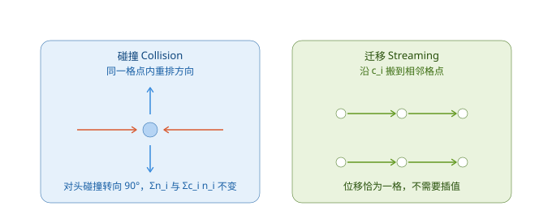
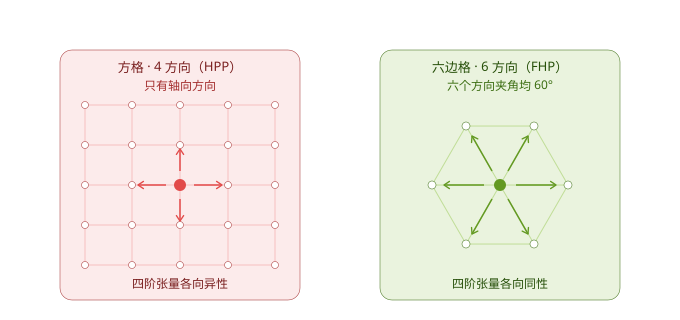

# 格子气自动机

## **思路**

[动理学基础](Boltzmann.md) 把描述从宏观量降到了分布函数。**格子气自动机**（lattice gas automaton, LGA）再往下离散三层：

|被离散的对象|连续形式|格子气形式|
|---|---|---|
|空间位置|\\(\mathbf{x} \in \mathbb{R}^D\\)|只取格点|
|速度|\\(\boldsymbol{\xi} \in \mathbb{R}^D\\)|只取有限个方向 \\(\{\mathbf{c}_i\}\\)|
|分布函数|实数 \\(f\\)|布尔值 \\(n_i \in \{0,1\}\\)|

\\(n_i(\mathbf{x},t)\\) 表示"从格点 \\(\mathbf{x}\\) 沿方向 \\(\mathbf{c}_i\\) 的连线上是否有粒子"。每条连线最多容纳一个粒子，这就是格子的**排他原理**。

经过这三层离散，整个模型只剩下一个固定格点和一套局部规则，结构上就是一个标准元胞自动机。

## **两步演化**

一格时间步内做两件事，全部格点同步执行。

### 碰撞（Collision）

在格点上按规则把粒子重排到新的方向。规则必须满足两条守恒：

\\[\sum_i n_i = \text{const}, \qquad \sum_i \mathbf{c}_i n_i = \text{const}\\]

也就是碰撞前后粒子数守恒、总动量守恒。

### 迁移（Streaming）

每个粒子沿新方向移动到相邻格点：

\\[n_i(\mathbf{x}, t+\Delta t) = n_i(\mathbf{x} - \mathbf{c}_i\Delta t, t)\\]

迁移不需要插值：当 \\(|\mathbf{c}_i|\Delta t\\) 恰好等于格间距时，粒子精确地从一个格点走到相邻格点。

## **HPP 模型（1973）**

Hardy、Pomeau、de Pazzis 提出的第一个格子气模型：**二维方格，4 个轴向方向**。

碰撞规则很简洁：只有**对头碰撞**（两个粒子沿相反方向迎面而来）会各自转向 90°，其余情况（单个粒子、三个粒子、四个粒子）维持原状。

**问题**：方格晶格的对称性不足，宏观方程中的粘性张量依赖方向，得到的不是各向同性的 Navier-Stokes 方程。**HPP 无法正确模拟流体。**

## **FHP 模型（1986）**

Frisch、Hasslacher、Pomeau 把晶格换成**六边格，6 个方向**（可加静止粒子），各向同性得以恢复，首次正确再现了不可压 Navier-Stokes 方程。

### 各向同性的判据

晶格是否可用，取决于速度方向的**四阶张量**是否各向同性：

\\[\sum_i c_{i\alpha} c_{i\beta} c_{i\gamma} c_{i\delta} = K\left(\delta_{\alpha\beta}\delta_{\gamma\delta} + \delta_{\alpha\gamma}\delta_{\beta\delta} + \delta_{\alpha\delta}\delta_{\beta\gamma}\right)\\]

其中 \\(D\\) 为维数、\\(b\\) 为方向数时 \\(K = \dfrac{b}{D(D+2)}\\)。二阶矩同样需要满足 \\(\sum_i c_{i\alpha}c_{i\beta} = \dfrac{b}{D}\delta_{\alpha\beta}\\)。

- **六边格**（\\(D=2\\)，\\(b=6\\)）：\\(K = 3/4\\)，两个条件都满足。
- **方格**（\\(D=2\\)，\\(b=4\\)，只有轴向）：\\(\sum_i c_{i1}^4 = 2\\)，而需要的值是 \\(3K = 3/2\\)；\\(\sum_i c_{i1}^2 c_{i2}^2 = 0\\)，而需要的值是 \\(K = 1/2\\)。**两条都不满足。**

> &#x1F50E; U. Frisch, B. Hasslacher, Y. Pomeau, *Lattice-Gas Automata for the Navier-Stokes Equation*, Phys. Rev. Lett. 56, 1505 (1986).

## **格子气的三个致命问题**

尽管 FHP 在理论上成立，它作为实用方法很快被淘汰：

|问题|原因|
|---|---|
|统计噪声大|\\(n_i\\) 是布尔值，宏观量必须做系综平均；涨落按 \\(1/\sqrt{N}\\) 衰减，要得到平滑的速度场需要极大的平均量|
|伽利略不变性破坏|平衡分布是 Fermi-Dirac 型而非 Maxwell-Boltzmann 型，动量通量中出现依赖速度的非线性因子|
|偏差随密度增大|排他原理使分布偏离 Maxwell-Boltzmann 分布，密度越高偏差越大|

这三个问题的根源是同一个：**状态是布尔的。** 解决方向只有一条——把状态换成实数。

---------------------------------------
> 本文出自CaterpillarStudyGroup，转载请注明出处。
>
> https://caterpillarstudygroup.github.io/GAMES103_mdbook/
