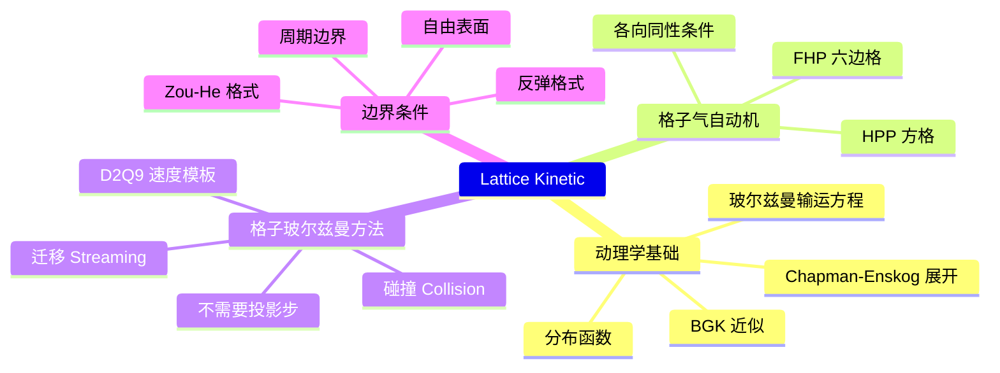

# Topics for the Day

前面几章在网格上求解的是**连续统形式**的流体方程：先离散 Navier-Stokes 方程的空间导数，再用投影法解泊松方程强制不可压。

本章介绍的**格子动理学方法**（lattice kinetic method）走另一条路：它不直接离散 Navier-Stokes 方程，而是离散**玻尔兹曼输运方程**，让速度分布函数在格点上做局部的**迁移**与**碰撞**，密度与速度由分布函数的矩给出。

# Reference

|ID|Year|Name|解决了什么痛点|主要贡献是什么|Tags|Link|
|---|---|---|---|---|---|---|
||1973|Time evolution of a two-dimensional classical lattice system|需要一种完全离散、天然并行的流体模型|- 提出 HPP 格子气自动机（二维方格，4 方向） - 首次用离散格点动力学模拟流体 - 方格晶格各向异性，无法正确再现 Navier-Stokes||
||1986|Lattice-Gas Automata for the Navier-Stokes Equation|HPP 因方格各向异性得不到正确的 Navier-Stokes 方程|- 改用六边格与六方向，四阶速度张量恢复各向同性 - 首次正确再现不可压 Navier-Stokes（FHP 模型）|里程碑|
||1986|Cellular Automaton Fluids 1: Basic Theory|格子气缺少系统的理论分析框架|- 独立提出六边格格子气 - 用玻尔兹曼近似方法导出格子气的宏观方程||
||1988|Use of the Boltzmann Equation to Simulate Lattice-Gas Automata|格子气的布尔占据数带来严重统计噪声|- 用实数分布函数替代布尔占据数作为演化变量 - 提出格子玻尔兹曼方程 - 统计噪声归零|里程碑|
||1989|Boltzmann Approach to Lattice Gas Simulations|碰撞算子仍是逐条枚举的散射规则，难以推广|- 线性化碰撞算子，写成矩阵形式 - 用平衡分布的展开式简化碰撞||
||1992|Lattice BGK Models for Navier-Stokes Equation|需要统一、简洁、易于实现的碰撞模型|- 提出 DdQq 速度模板系列（D2Q9 / D3Q19 等） - 提出单松弛 BGK 碰撞算子 - 现代 LBM 的标准形式|里程碑|
||1997|A Priori Derivation of the Lattice Boltzmann Equation|LBM 与连续玻尔兹曼方程的联系缺乏严格证明|- 从 BGK 玻尔兹曼方程出发，经离散速度与离散时空严格导出 LBM - 确立 LBM 的动理学基础||
||1998|Lattice Boltzmann Method for Fluid Flows|缺少一篇权威综述供后续研究引用|- Annual Review of Fluid Mechanics 综述 - 系统整理理论、边界条件与应用|综述|
||2001|The Lattice Boltzmann Equation for Fluid Dynamics and Beyond|缺少系统专著|- 第一本 LBM 系统专著 - 覆盖理论、边界条件、多相与扩展模型|专著|

> &#x1F50E; 图形学中的 LBM 应用（自由表面水体、GPU 实时模拟）出自 Thürey 等人的系列工作，具体文献出处待补。

# 本章结构

- [动理学基础](Boltzmann.md)：从连续统到玻尔兹曼输运方程
- [格子气自动机](LatticeGas.md)：HPP 与 FHP 的成败
- [格子玻尔兹曼方法](LatticeBoltzmann.md)：D2Q9、迁移与碰撞
- [边界条件](BoundaryConditions.md)：反弹、Zou-He、曲面边界
- [Summary](Summary.md)

---------------------------------------
> 本文出自CaterpillarStudyGroup，转载请注明出处。
>
> https://caterpillarstudygroup.github.io/GAMES103_mdbook/
