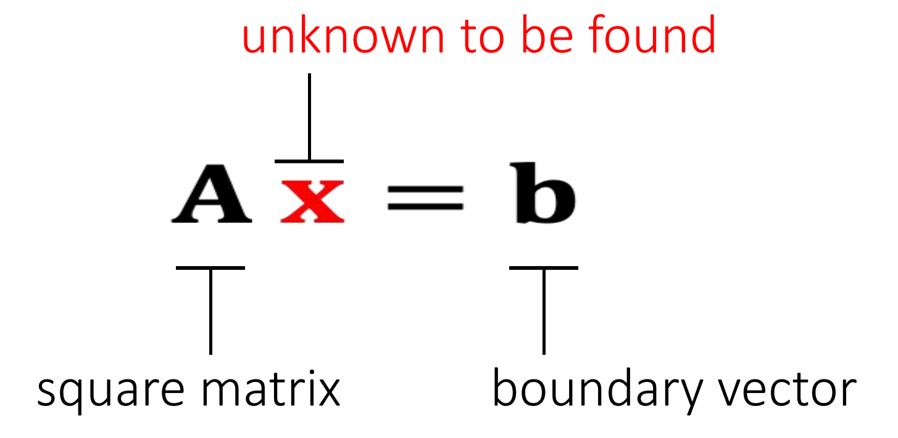

P36
# Linear Solver    

Many numerical problems are ended up with solving a linear system:   

It's expensive to compute \\(\mathbf{A^{-1}} \\), especially if \\(\mathbf{A} \\) is large and sparse. So we cannot simply do:\\(\mathbf{x = A^{-1}b}\\).     

1. 当 \\(\mathbf{A}\\) 是稀疏时. \\(\mathbf{A}^{-1}\\)通常不是稀疏。 如果 \\(\mathbf{A}\\) 很大，\\(\mathbf{A}^{-1}\\)会占用大量空间。  
2. 计算\\(\mathbf{A}^{-1}\\)非常耗时

P25   
## An Incomplete Summary    

There are two popular linear solver approaches: direct and iterative.   

 - Direct Solvers (LU, LDLT, Cholesky, Intel MKL PARDISO)    
    - One shot, expensive but worthy if you need exact solutions.    
    - Little restriction on \\(\mathbf{A}\\)    
    - Mostly suitable on CPUs     

 - Iterative Solvers（ Jacobbi. Gauss-Seidel，共轭梯度）     
    - Expensive to solve exactly, but controllable    
    - Convergence restriction on \\(\mathbf{A}\\), typically positive definiteness    
    - Suitable on both CPUs and GPUs    
    - Easy to implement    
    - Accelerable: Chebyshev, Nesterov, <u>Conjugate Gradient</u>

P37   
## Direct Linear Solver    

### 方法

A direct solver is typically based LU factorization, or its variant: Cholesky, \\(\mathrm{LDL^\top } \\), etc…    

> &#x2705; \\(\mathbf{LU}\\) 可用于非对称矩阵。  
Cholesky 和 \\( \mathbf{LDL^\top}\\) 仅用于对称矩阵，但内存消耗更少。  
这里不介绍如何做\\(\mathbf{LU}\\)分解   

$$
\mathbf{A=LU=} \begin{bmatrix}
 l_{00} & \Box  & \Box \\\\
  l_{10} &  l_{11} & \Box \\\\
  \vdots & \cdots  &\ddots 
\end{bmatrix}\begin{bmatrix}
 \ddots  & \cdots  &\vdots  \\\\
  \Box&u_{n−1,n−1}  &u_{n−1,n} \\\\
 \Box & \Box &u_{n,n}
\end{bmatrix}
$$
\\(\quad\quad\quad\quad\quad\quad\quad\\)lower triangular   \\(\quad\quad\\) upper triangular

P38
### 分析 

 - When \\(\mathbf{A}\\)  is sparse, \\(\mathbf{L}\\) and \\(\mathbf{U}\\) are not so sparse. Their sparsity depends on the permutation.(See matlab)     

> &#x2705; \\(\mathbf{L}、\mathbf{U}\\) 和稀疏性与行列顺序有关，因此通常在\\(\mathbf{LU}\\) 分解之前做 permutation,使得到比较好的顺序。

 - lt contains two steps: factorization and solving. lf we must solve many linear systems with the same \\(\mathbf{A}\\) , we can factorize it only once.        

> &#x2705; \\(\mathbf{LU}\\) 分解是计算量的大头，只做一次 \\(\mathbf{LU}\\) 分解，能省去大量计算。 

 - Cannot be easily parallelized:Intel MKL PARDISO     

P39
## Iterative Linear Solver    

An iterative solver has the form:   

Why does it work?    

$$
\begin{matrix}
 \mathbf{b−Ax} ^{[k+1]} =\mathbf{b−Ax} ^{[k]}−\mathbf{αAM} ^{−1}(\mathbf{b−Ax} ^{[k]}) \\\\
\quad\quad\quad\quad\quad\quad\quad\quad\quad\quad=(\mathbf{I−αAM} ^{−1})(\mathbf{b−Ax} ^{[k]}) =(\mathbf{I−αAM} ^{−1})^{k+1}(\mathbf{b−Ax} ^ {[0]})
\end{matrix}
$$

So,

\\(\mathbf{b−Ax} ^{[k+1]}→0\\), if \\(ρ(\mathbf{I−αAM} ^{−1})<1.\\)    

> &#x2705;\\(\mathbf{b-Ax}^{[k＋1]}\\) 代表下一时的残差，迭代要想收敛，\\(\mathbf{b-Ax}^{[k+1]}\\) 应趋于0    

\\(\rho\\):矩阵的spectral radius (the largest absolute value of the eigenvalues)     

> &#x2705; 不会真的去算 \\(\rho\\),而是调\\(α\\),试错。 因为求特征值的代价比较大   

 
P40     
\\(\mathbf{M}\\) must be easier to solve:    

| \\(\mathbf{M} =\mathrm{diag} (\mathbf{A} )\\)    Jacobi Method |
|---|    

\\(\quad\\)

| \\(\mathbf{M} =\mathrm{lower} (\mathbf{A} )\\)  Gauss-Seidel Method  |        
|---|    

The convergence can be accelerated: Chebyshev, Conjugate Gradient, … (Omitted here.)    

优点：
- simple
- fast for inexact solution
- paralleable

缺点：
- convergence condition
> &#x2705; 例如要求M是正定的或对角占优的

- slow for exact solution

P24  

### The Jacobi Method    

We can use the Jacobi method to solve \\(\mathbf{A}∆\mathbf{x}  = \mathbf{b} \\).   

    

The vanilla Jacobi method (\\(α\\) = 1) has a tight convergence requirement on \\(\mathbf{A}\\), i.e., being diagonal dominant.    

The use of \\(α\\) allows the method to converget even when \\(\mathbf{A}\\) is positive definite only.    

P26   
### The Jacobi Method with Chebyshev Acceleration    

We can use the accelerated Jacobi method to solve \\(\mathbf{A}∆\mathbf{x} =\mathbf{b} \\).    

> The Accelerated Jacobi Method    
> \\(∆\mathbf{x}  \longleftarrow \mathbf{0} \\)    
> last_\\(∆\mathbf{x}  \longleftarrow \mathbf{0}\\)   
> For \\(k=0\dots \mathbf{K}\\)   
\\(\mathbf{r}  \longleftarrow \mathbf{b} −\mathbf{A} ∆\mathbf{x}\\)    
If \\(||\mathbf{r} ||<\omega \quad\\)	break     
If  \\(k=0	\quad\quad\quad \omega =1\\)   
Else If \\( k=1 \quad \quad\quad\omega =2/(2-\rho^2)\\)    
Else \\(\quad\quad\quad\omega =4/(4-\rho ^2\omega )\\)      
old_\\(∆ \mathbf{x} \longleftarrow ∆ \mathbf{x}\\)    
\\(∆\mathbf{x} ⟵∆\mathbf{x} +\mathbf{αD} ^{−1}\mathbf{r}\\)   
\\(∆\mathbf{x} \longleftarrow \omega ∆ \mathbf{x} +(1−\omega)\\)last_∆\\(\mathbf{x}  \\)   
last_\\(∆\mathbf{x} \longleftarrow \\) old_\\(∆\mathbf{x}\\)    

\\(\rho  (\rho <1)\\) is the estimated spectral radius of the iterative matrix.  

## 课后答疑  
问题二：怎么加速？  
答：用 Jacobian 可以在 GPU 上加速、直接法比迭代法慢。  
问题三：共轭梯度    
共轭梯度的效率很大程度上取决于 precondition,但在GPU上能使用的precondition 比较受限、 CPU 上一般选择 Incomplete LU 分解。   
问题四：支持的维度    
直接法比较占内存，因此支持的维度不如迭代法大。  