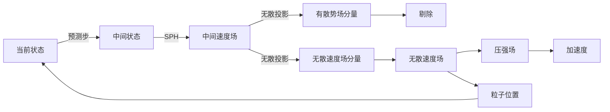

# Divergenc-Fre SPH(DFSPH)    

IISPH 使用“密度不变约束”达到速度无散的效果，但 DFSPH 直接使用速度无散约束。    
DFSPH 沿用“预测-修正”方法，也无须解泊松方程。 

 
IISPH：密度不变 → 间接速度无散    
DFSPH：直接速度无散 → 自然密度守恒    
 
无散投影使用亥姆霍兹分解，过程中求解标量势 \\(\phi\\) 的泊松方程，而不是压强 \\(P\\) 的泊松方程，计算量更小。   
 
DFSPH 的特点    
 
1. 无散投影的密度误差低，长期模拟几乎无体积漂移    
2. 解标量势 \\(\phi\\) 的泊松方程，与“IISPH的求解线性方程组”计算量相当，但DFSPH精度更高    
3. 适用于高保真流体模拟、大形变场景。    
 

---------------------------------------
> 本文出自CaterpillarStudyGroup，转载请注明出处。
>
> https://caterpillarstudygroup.github.io/GAMES103_mdbook/
