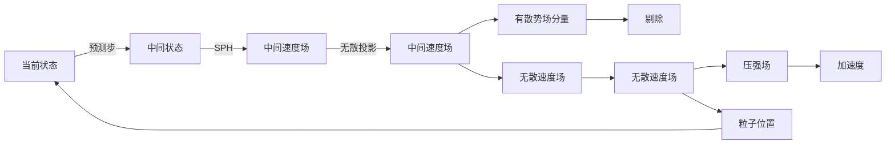
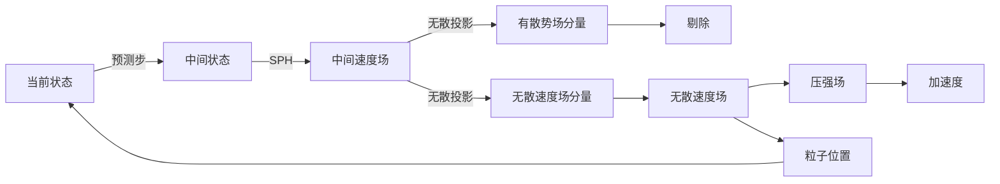

# Divergenc-Fre SPH(DFSPH)    

E & C[恒定的期望密度] --> F[修正压力]

提取文字：
 
@新页面  DFSPH
① Divergence-Free SPH（DFSPH）
 
IISPH使用“密度不变约束”达到速度无散的效果，但DFSPH直接使用速度无散约束。
DFSPH沿用“预测-修正”方法，也无须解泊松方程。
 
plaintext
  
当前状态 ──预测步──→ 中间状态* ──中间速度场──无散投影──→ 无散速度场
          ↑                           ↓
          └──────────────────────────┘
               加速度 ← 压强场 ← 无散速度场
                                   ↓
                             粒子位置
 
 
（右侧标注：无散速度场→有散的场量→剔除）
 
IISPH：密度不变 → 间接速度无散
DFSPH：直接速度无散 → 自然密度守恒
 
无散投影使用亥姆霍兹分解，过程中求解标量势\phi的泊松方程，而不是压强p的泊松方程，计算量更小。
 
DFSPH的特点
 
1. 无散投影的密度误差差低，长期模拟几乎无体积漂移
2. 解标量势\phi的泊松方程，与IISPH的求解线性方程组计算量相当，但DFSPH精度更高
3. 适用于高保真流体模拟、大形变等
 
 
 
要不要我帮你整理一份DFSPH与IISPH的核心区别对比表，让你一眼看清两者的约束方式、计算特点和适用场景？

---------------------------------------
> 本文出自CaterpillarStudyGroup，转载请注明出处。
>
> https://caterpillarstudygroup.github.io/GAMES103_mdbook/
