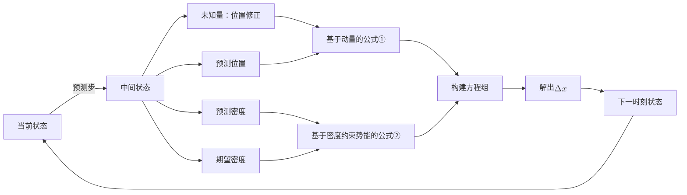

# Implicit Imcompressible     

优化目标：   
不可压缩条件下的动量守恒    

$$
E = \text{动能} + \lambda \cdot \text{约束项}
$$

(1)      

$$
\frac{\partial E}{\partial x} = \frac{\partial \text{动能}}{\partial x} + \lambda \cdot \frac{\partial \text{约束项}}{\partial x} = 0
$$

(2)     
$$
\frac{\partial E}{\partial \lambda } = \text{约束项} = 0
$$

$$
\frac{\partial \text{动能}}{\partial x} = \int \rho u \frac{\partial u}{\partial t} dV 动能= \frac{1}{2} \int \rho u^2 dV (3)
$$

$$
\frac{\partial \text{约束项}}{\partial x} = \nabla \cdot \text{约束项} = \nabla \cdot u (4)
$$
 
(3) 化简得到NS方程的变分形式，即
 
$$
\rho \frac{D\boldsymbol{u}}{Dx} = -\nabla p - \rho (\boldsymbol{u} \cdot \nabla)\boldsymbol{u} \quad (5)
$$
 
将公式(4)(5)离散化，得到方程：    
方程组中有两个未知量：\\(\lambda, \boldsymbol{\nabla x}\\)         
求解这个线性方程组 (不是泊松方程)     

(4) 是 ISPH 的约束项的定义   
而IISPH的约束项的定义应该是：   
 
$$
\rho^{n+1} = \rho^0
$$
 
IISPH 避开解泊松方程，但又使用了隐式积分和密度不变约束，在稳定性、精度、效率方面达到平衡。    

---------------------------------------
> 本文出自CaterpillarStudyGroup，转载请注明出处。
>
> https://caterpillarstudygroup.github.io/GAMES103_mdbook/

