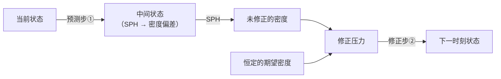

# Predictive-Corrective Icompressible SPH(PCISPH)

## 一、预测-修正框架（Predictive-Corrective）

①预测步：基于外力的物理仿真 （不考虑内力约束）      
②这一步是WCSPH和PCISPH的关键差别     

## 二、WCSPH 与 PCISPH 的关键区别
1.  **WCSPH**
    $$
    F_{\text{压力}} = F(P)
    $$
    - 每次仅更新一次压力，无迭代修正
    - 密度误差大（通常 >1%），易出现体积漂移

2.  **PCISPH**
    $$
    F_{\text{压力}} = F(\Delta P)
    $$
    - 多次迭代修正压力，直到密度偏差 $\Delta P$ 满足阈值（如 <0.1%）
    - 密度约束更强，震荡更小（1% → 0.1%）
    - 基于可压缩连续性方程推导，无需求解不可压缩泊松方程

## 三、IISPH 补充

- 隐式离散格式，无需求解泊松方程，效率更高
- 推导基于可压缩连续性方程，而非不可压缩泊松方程

---------------------------------------
> 本文出自CaterpillarStudyGroup，转载请注明出处。
>
> https://caterpillarstudygroup.github.io/GAMES103_mdbook/