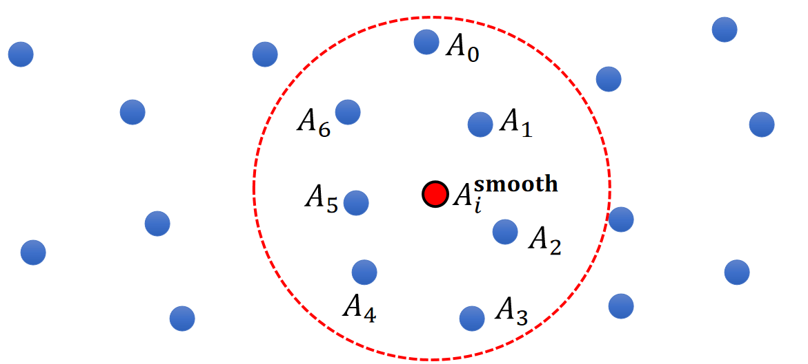
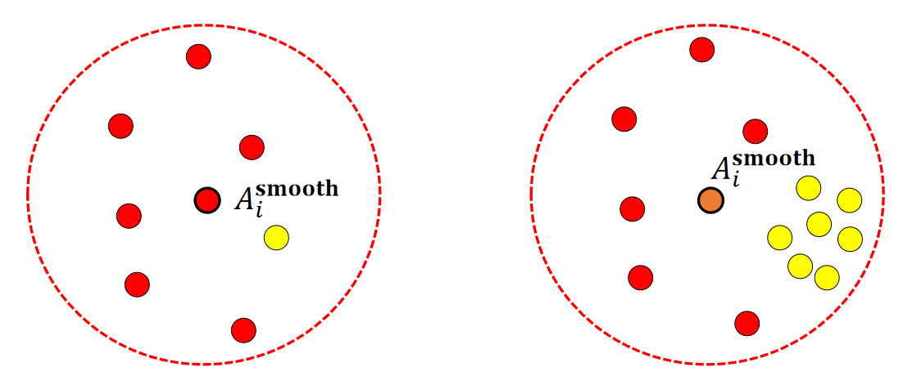
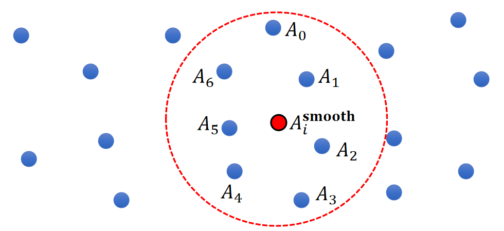
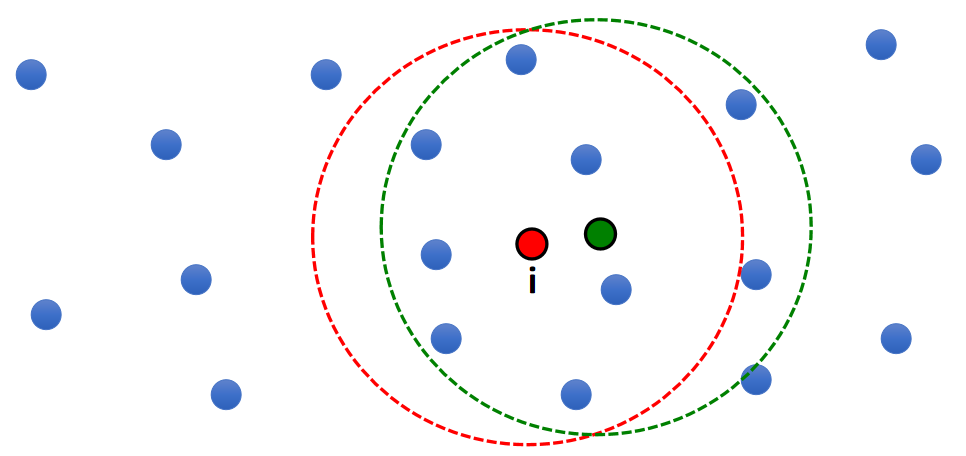
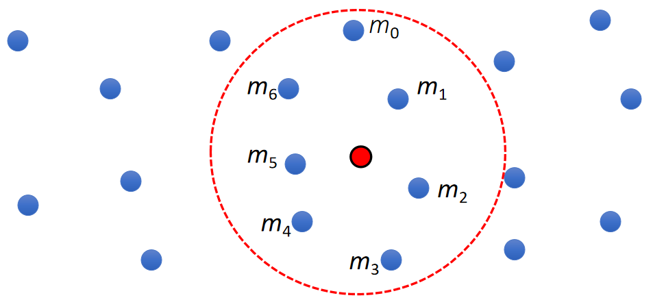
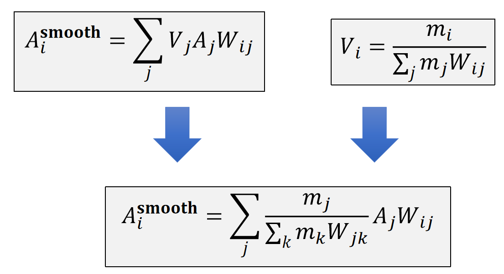
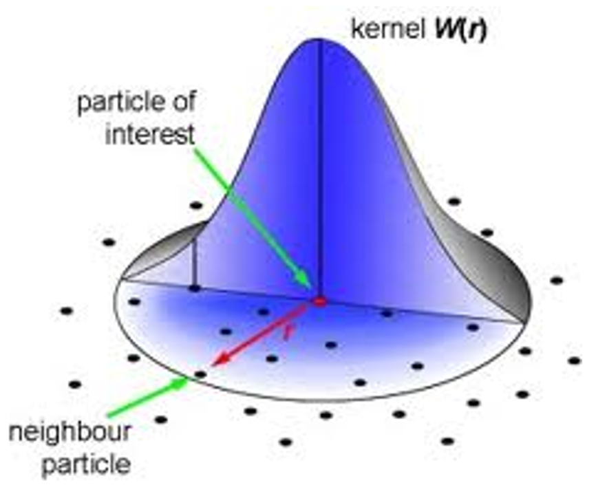

# SPH Model

> &#x2705; SPH = Smoothed Particle Hydrodynamics     

P5   
## 原理   

 - Suppose each particle j has a physical quantity \\(A_j\\).   
 - The quantity can be: velocity, pressure, density, temperature….   
 - How to estimate the quantity at a new location \\(\mathbf{x}_i\\)?   

> &#x2705; 空间中有很多带有物理量的粒子，求任意位置上的物理量。这是插值问题，关键是要插值结果平滑。    

    

A 可以是任何随空间变化的物理量。   
SPH 适用于模拟自由表面流体。(简单理解为有表面，但不需要 Mesh 来描述表面)。      
烟不属于自由表面流体，因为没有表面。    
 

## 模型

|||
|--|--|
| 属性 | 符号 |
| 体积 | \\( V \\)  |
| 密度 | \\( \rho \\)  |
| 其它非仿真属性 | \\( A \\) |

### A Simple Model

$$
\begin{matrix}
 A_i^{\mathbf{smooth}}=\frac{1}{n}\sum _jA_j & \text{ For } ||\mathbf{x}_i−\mathbf{x}_j||<R
\end{matrix}
$$

   

> &#x2705; 假设空间是一个关于 \\(A\\) 的场，粒子是空间中的采样。    
> &#x2705; 根据 \\(i\\) 附近范围内采样出的 \\(A\\) 值预测 \\(i\\) 点处的 \\(A\\) 值。

#### 存在的问题

   

> &#x2705; 取平均的方式没有考虑粒子的分布。  

P7  
### A Better Model  

 - Let us assume each one represents a volume \\(V_j\\).    
 - So a better solution is:    

$$
\begin{matrix}
 A_i^{\mathbf{smooth} }=\frac{1}{n}\sum_jV_jA_j  & \text{  For }  ||\mathbf{x} _i−\mathbf{x} _j||<R
\end{matrix}
$$

   

> &#x2705; 体积 \\(V-i\\) 的计算在后面介绍。这里先假设 \\(V-i\\) 已知。   
> &#x2705; 公式假设总球的体积是1，球内的粒子瓜分这些体积。所以\\(\sum _jV_j=1\\)    

P8   
#### 存在的问题  

 - One problem of this solution:

$$
\begin{matrix}
 A_i^{\mathbf{smooth} }=\frac{1}{n}\sum_jV_jA_j  & \text{  For }  ||\mathbf{x} _i−\mathbf{x} _j||<R
\end{matrix}
$$

 - Not smooth!  (7 -> 9!)

   

> &#x2705; 微小的移动，圆内多了两个点，导致结果突变。   

P9   
### Final Solution   

解决方法：根据 \\(j\\) 到 \\(i\\) 的距离来决定 \\(j\\) 对 \\(i\\) 的影响权重。      
 
$$
\begin{matrix}
 A_i^{\mathbf{smooth}}=\sum _ j V_jA_jW_{ij}  & \text {  For } ||\mathbf{x} _ i− \mathbf{x} _j||< R
\end{matrix}
$$

 - \\(W_{ij}\\) is called smoothing kernel.   
 - When \\(||\mathbf{x} _ i − \mathbf{x} _ j||\\) is large, \\(W_{ij}\\) is small.    
 - When \\(||\mathbf{x} _ i−\mathbf{x} _ j||\\) is small, \\(W_{ij}\\) is large.   

P10   
## Particle Volume Estimation    

 - But how do we get the volume of particle \\(i\\)?    
$$
V_i=\frac{m_i}{ρ_i}
$$

$$
ρ_i^ \mathbf{smooth} =\sum _ j V_ j ρ_ j W _ {ij}= \sum _ jm_jW_{ij}
$$

|  $$V_i=\frac{m_i}{ρ_i^\mathbf{smooth} }=\frac{m_i}{∑_jm_jW_{ij}}$$ |  
|----|

   

> &#x2705; 粒子在运动过程中，疏密会有变化，因此体积不是常数，要实时计算。    
> &#x2705; 公式中的\\(\rho \\)不是指水的密度，而是粒子分布的密度。   
> &#x2705; 把密度当作粒子的物理量。用同样的方法插出某个点的密度。   

P11   
### Smoothed Interpolation – Final Solution   

 - So the actual solution is:   

   

P12  
## Kernal函数

### Kernal函数的作用

 - We can easily compute its derivatives:
    - Gradient  

    $$ \begin{matrix}
     A_i^ \mathbf{smooth} = \sum _ jV_jA_ jW_ {ij} \quad & ∇A_i ^\mathbf{smooth} = \sum_jV_jA_j∇W_ {ij}
     \end{matrix}
    $$

    - Laplacian    

    $$
    \begin{matrix}
    A_i^ \mathbf{smooth} = \sum _ j V_ j A_ jW_ {ij} \quad & ∇A_i^\mathbf{smooth} = \sum_ jV_ jA_ j∇W_ {ij}
    \end{matrix}
    $$

> &#x2753; 为什么认为体积是常数？答：假设一个点的运动不影向周围邻居的体积。   
> &#x2705; 对于当前点来说，周围粒子的物理量是常数，只有\\(W_{ij}\\)与当前点有关。    
> &#x2705; 而\\(W_{ij}\\)来自于已知的kernel函数，其derivative也是已知的。  

P13   
### A Smoothing Kernel Example    

   

$$
W_{ij}=\frac{3}{2\pi h^3} 
\begin{cases}
\frac{2}{3}-q^2+\frac{1}{2} q^3  \quad &  (0\le q<1) \\\\
 \frac{1}{6}(2-q)^3  \quad& (1\le q<2) \\\\
0 \quad & (2\le q)
\end{cases}
$$

$$
q=\frac{||\mathbf{x} _i-\mathbf{x} _j||}{h} 
$$

\\(h\\) is called smoothing length    

> &#x2705; smooth Kernal 有很多种，这种最常见。   

P14  
### Kernel Derivatives   

 - Gradient at particle i (a vector)     

$$
\nabla _ i W _ {ij} = \begin{bmatrix}
 \frac{\partial W _ {ij}}{\partial x _ i} \\\\
 \frac{\partial W _ {ij}}{\partial y _ i} \\\\
\frac{\partial W _ {ij}}{\partial z _ i} 
\end{bmatrix} = \frac{\partial W_ {ij}}{\partial q} \nabla _ iq= \frac{\partial W _ {ij}}{\partial q} \frac{\mathbf{x} _ i-\mathbf{x} _ j}{|| \mathbf{x} _ i - \mathbf{x} _ j||h} 
$$

$$
q=\frac{||\mathbf{x} _i-\mathbf{x} _j||}{h} 
$$

$$
W_{ij}=\frac{3}{2\pi h^3} 
\begin{cases}
\frac{2}{3}-q^2+\frac{1}{2} q^3  \quad &  (0\le q<1) \\\\
 \frac{1}{6}(2-q)^3  \quad& (1\le q<2) \\\\
0 \quad & (2\le q)
\end{cases}
$$

$$
\frac{\partial W_{ij}}{\partial q} =\frac{3}{2\pi h^3} 
\begin{cases}
-2q+\frac{3}{2}q^2  \quad &  (0\le q<1) \\\\
 -\frac{1}{2}(2-q)^2  \quad& (1\le q<2) \\\\
0 \quad & (2\le q)
\end{cases}
$$

P15   
### Kernal Laplacian

| $$\Delta _i W _ {ij}= \frac{\partial^2 W _ {ij}}{\partial x_i^2}+ \frac{\partial^2 W _ {ij}}{\partial y_i^2} + \frac{\partial^2 W _ {ij}}{\partial z_i^2}= \frac{\partial^2 W _ {ij}}{\partial q^2}\frac{1}{h^2} + \frac{\partial W _ {ij}}{\partial q} \frac{2}{h} $$ |
|----|

$$
\frac{\partial W_{ij}}{\partial q} =\frac{3}{2\pi h^3} 
\begin{cases}
-2q+\frac{3}{2}q^2  \quad &  (0\le q<1) \\\\
 -\frac{1}{2}(2-q)^2  \quad& (1\le q<2) \\\\
0 \quad & (2\le q)
\end{cases}
$$

$$
\frac{\partial^2 W_{ij}}{\partial q^2} =\frac{3}{2\pi h^3} 
\begin{cases}
-2+3q  \quad &  (0\le q<1) \\\\
 2-q \quad& (1\le q<2) \\\\
0 \quad & (2\le q)
\end{cases}
$$

# Reference

|ID|Year|Name|解决了什么痛点|主要贡献是什么|Tags|Link|
|---|---|---|---|---|---|---|
||1996|Smoothed particles: A new paradigm for animating highly deformable bodies.|将光滑粒子流体动力学引入计算机图形学领域，用于模拟高度可变形的物体。|

---------------------------------------
> 本文出自CaterpillarStudyGroup，转载请注明出处。
>
> https://caterpillarstudygroup.github.io/GAMES103_mdbook/