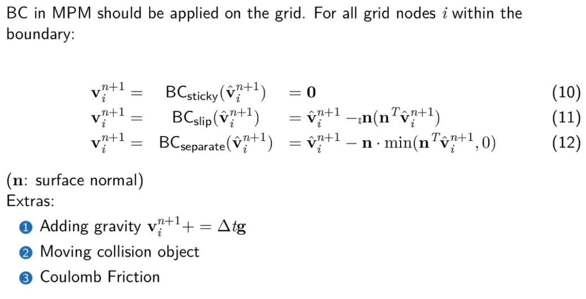

# Affice PIC(APIC)    

每个粒子维护一个额外的属性 \\(C\epsilon R^{2\times 2}\\) 或 \\(C\epsilon R^{3\times 3}\\)    
C 用于记录粒子周围的 Affine 的速度场    

 

pressure progection 一般是指解泊松方程。    

---------------------------------------
> 本文出自CaterpillarStudyGroup，转载请注明出处。
>
> https://caterpillarstudygroup.github.io/GAMES103_mdbook/