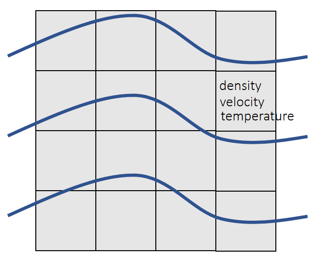

# Two Types of Simulation Approaches  

数值模拟方法可分为拉格朗日方法和欧拉方法两大类。

|Lagrangian Approach|Eulerian Approach|
|---|----|
|     |    |  
| &#x2705; 无 Grid. 物理量附加在粒子上，粒子运动时更新自身物理量。 | &#x2705; 固定 Grid. 物理量固定在 Grid 上。粒子运动后统一新格子的物理量。   |
|拉格朗日法中计算网格随物质一起变形，可方便地跟踪材料界面和引入与变形历史相关的材料模型，但对于涉及特大变形的问题会因网格严重畸变而产生数值求解困难，且难以有效地模拟材料的破碎、融化和汽化等行为。此类方法代表性程序为DYAN。|欧拉法中计算网格固定在空间中，不存网格畸变问题，但不易跟踪材料界面，且非线性对流项也会导致数值求解困难。|

物质点法 (material point method, MPM)采用拉格朗日和欧拉双重描述，将物体离散为一组在空间网格中运动的质点。
- 质点携带了所有的物质信息，如质量、速度、应变和应力等，可很方便地跟踪材料的界面和引入与变形历史相关的材料模型。
- 质点在空间网格中运动，运动方程在空间网格上求解，避免了网格畸变问题，适合于分析特大变形及流动问题。

物质点法充分吸收了拉格朗日法和欧拉法的优点，是超高速碰撞和爆炸数值分析的有效的方法。物质点法与SPH类似，同样属于无网格方法，但是相比而言，物质点法计算效率更高，对于大变形高应变率问题计算更快，精度上相比存在劣势。

# 核心思想

拉格朗日视角 (粒子)：物质点携带密度、速度、应力等信息，随物质变形运动。  
欧拉视角 (背景网格)：划分计算域，用于计算空间导数和物理量更新。  
粒子-网格-粒子 (P-G-P)：信息通过物质点映射到网格节点，在网格上计算更新，再插值回物质点，完成一个时间步。   

# 主要特点与优势
融合拉格朗日与欧拉：兼具拉格朗日法的精确追踪物质界面能力和欧拉法的网格独立性，避免了有限元网格缠绕畸变问题。  
处理大变形：能有效模拟材料的超大变形、破碎、断裂等非线性问题。  
自动处理多体接触：物质点在网格内运动，自动处理多介质界面，无需复杂的碰撞检测。  
适用范围广：适用于高速碰撞、爆炸冲击、岩土动力学、流体与固体相互作用等复杂问题。 

# 基本步骤（一个时间步）  
粒子到网格 (P2G)：将物质点信息（如质量、动量）通过插值函数映射到背景网格节点。  
网格计算：在背景网格上，根据控制方程（如动量守恒）计算节点力、加速度等。  
网格到粒子 (G2P)：将网格上的计算结果（如速度、应力）通过插值函数传回物质点。  
更新粒子：更新物质点的位置、速度和应力状态。  
（可选）丢弃网格：根据需要重新划分或更新背景网格。   

> Deborah Sulsky, Shi-Jian Zhou, and Howard L Schreyer.
Application of a particle-in-cell method to solid mechanics.