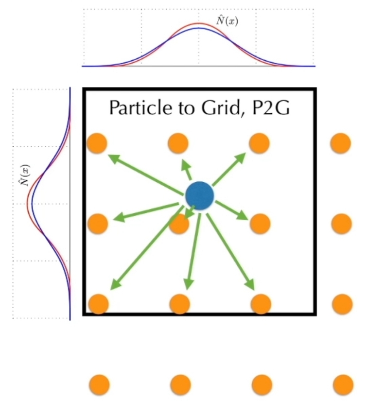
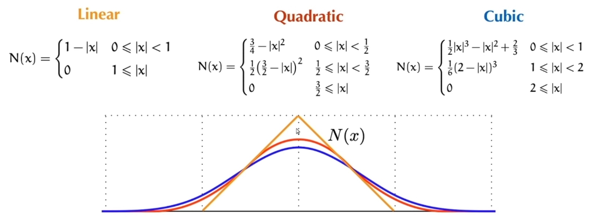

# **粒子-网格法（Particle-in-Cell, PIC）**

## **原理**

将粒子作为离散质量/电荷载体，而将网格用于计算场量（如电磁场、重力场）。粒子在连续空间中运动，但其产生的场量或所受的力通过插值在网格上计算。

## **步骤**：

### **粒子到网格插值**：

将粒子的质量、电荷等属性分配到邻近网格节点。

分配时，距离近的点有更大的权重    

 

权重由核函和数定义     

 

### **网格上求解场方程**：

在网格上求解泊松方程（静电场）或麦克斯韦方程（电磁场）等。
在 Grid 上解 presure，得到无散速度场   

### **网格到场插值**：

将网格节点上的场量插值回粒子位置，更新粒子受力。

 

### **粒子推进**：

根据牛顿定律更新粒子位置和速度。

可以是不同的积分法    
PIC + grid-based 泊松 solver = 流体桢拟器    

## **应用**：

等离子体模拟、天体物理（N体+网格）、流体模拟（如物质点法MPM）。

## 缺点：

能量耗散严重，表现为“黏”。     
因为 G2P 过程有信息丢失    

- Two solutions:     
1. Transfer more information: APIC, PolyPIC     
2. Transfer the <u>delta</u>: FLIP (later in this lecture)    

---------------------------------------
> 本文出自CaterpillarStudyGroup，转载请注明出处。
>
> https://caterpillarstudygroup.github.io/GAMES103_mdbook/