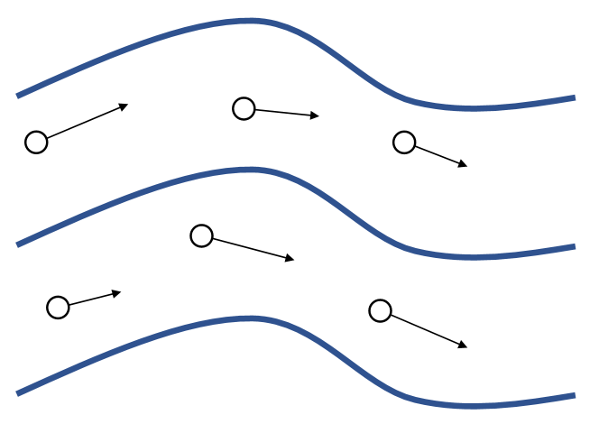
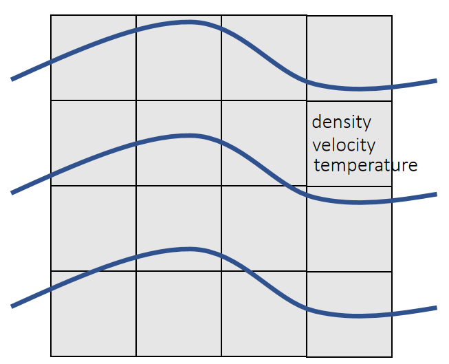
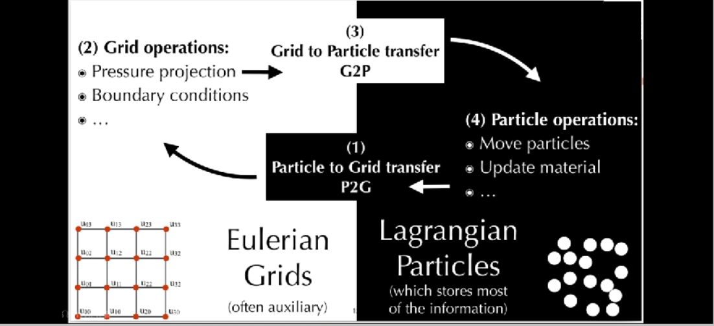

# Two Types of Simulation Approaches  

数值模拟方法可分为拉格朗日方法和欧拉方法两大类。

|Lagrangian Approach|Eulerian Approach|
|---|----|
|     |    |  
| &#x2705; 无 Grid. 物理量附加在粒子上，粒子运动时更新自身物理量。 | &#x2705; 固定 Grid. 物理量固定在 Grid 上。粒子运动后统一新格子的物理量。   |
|拉格朗日法中计算网格随物质一起变形，可方便地跟踪材料界面和引入与变形历史相关的材料模型，但对于涉及特大变形的问题会因网格严重畸变而产生数值求解困难，且难以有效地模拟材料的破碎、融化和汽化等行为。此类方法代表性程序为DYAN。|欧拉法中计算网格固定在空间中，不存网格畸变问题，但不易跟踪材料界面，且非线性对流项也会导致数值求解困难。|

# 粒子法与网格法的结合

$$
\frac{D}{Dt} = \frac{\partial}{\partial t} + U \cdot \nabla
$$

这个公式将欧拉法与拉格朗日法联系在一起 \\(\frac{\partial}{\partial t}\\) 代表固定点物理属性随时间的变化。   
\\(\frac{D}{Dt}\\) 代表流动粒子的物理属性随时间的变化。   
\\(U \cdot \nabla\\) 代表物理属性随位置的变化。   
 
欧拉网格上的物理属性基于 \\(\frac{\partial}{\partial t}\\) 更新。
拉格朗日粒子上的物理属性基于 \\(\frac{D}{Dt}\\) 更新。    
 

### Motivation
 
- **Recall that a fluid solver usually has two components**:
  - **<u>Advection</u>** (evolving the fields)
  - **<u>Projection</u>** (enforcing incompressibility)
- **Eulerian grids are really good at projection**:
  - Easy to discretize
  - Efficient neighbor look-up
  - Easy to precondition (geometric multigrid)
- **But Eulerian grids are bad at advection...**
  - Dissipative: loss of energy and geometry

## 常见方法

 

## **补充：格子玻尔兹曼方法不是混合法**

与上面讨论的 MPM / PIC / FLIP 容易混淆的是**格子玻尔兹曼方法（LBM）**。它同样以"格子 + 粒子"的形式出现在文献里，但两处"粒子"的含义完全不同：

- MPM / PIC / FLIP 的粒子是**空间中的物质点**，位置可以在空间中连续自由变化，跨时间步携带质量、速度、形变梯度等状态，并且会把信息映射回网格（P2G / G2P 双向耦合）。
- LBM 的"粒子"是**速度空间的离散**，只有预先规定的有限个方向（D2Q9 为 9 个方向，D3Q19 为 19 个方向）。它的位置被限制在格点上，没有空间自由度；格点上跨时间步保持的状态是**实数分布函数** fᵢ，而不是粒子对象。

判定标准是：**这次仿真里是否存在一个位置能够连续自由变化、且跨时间步保持状态、并与网格双向交换信息的点。**

| 方法 | 自由移动的物质点 | 双向耦合 | 归类 |
|---|---|---|---|
| MPM / PIC / FLIP | 有 | 有 | 混合法（欧拉-拉格朗日） |
| LBM | 无 | 无 | 纯欧拉式（动理学离散） |

因此 LBM 归**欧拉式**一族，与网格法共享"状态挂在固定离散位置、只与局部邻域耦合、同步更新"的骨架。它相对常规模格法的差别在于**状态变量与规则来源**：状态是速度分布函数而非宏观量，规则来自玻尔兹曼方程的离散，而非 Navier-Stokes 方程的差分近似。详细讨论见 [格子动理学方法](../Lattice/LatticeKinetic.md)。

## **发展趋势**
1. **多尺度耦合**：如量子-分子动力学-连续体的跨尺度模拟。
2. **机器学习加速**：用神经网络替代部分网格求解或粒子交互。
3. **高性能计算优化**：针对GPU/异构计算设计混合算法。

# Reference

|ID|Year|Name|解决了什么痛点|主要贡献是什么|Tags|Link|
|---|---|---|---|---|---|---|
||2005|Animating sand as a fluid|将FLIP方法应用于不可压缩流模拟。这使混合流体模拟达到了新的高度，得以以更高的精度和稳定性探索复杂的流体动力学。|
||1999|Stable fluids|该方法最终使得稳定的、三维的、基于物理的流体仿真成为可实现的目标，并能生成逼真的流体效果。这是首个无条件稳定的流体仿真方法，引入了半拉格朗日平流的概念，也是该领域最早应用混合仿真思路的研究之一。   ||里程碑|
||1986|FLIP: A method for adaptively zoned, particle-in-cell calculations of fluid flows in two dimensions. Journal of Computational Physics Vol|**流体隐式粒子法**|
||1962|The particle-in-cell method for numerical solution of problems in fluid dynamics.|**质点网格法**|

---------------------------------------
> 本文出自CaterpillarStudyGroup，转载请注明出处。
>
> https://caterpillarstudygroup.github.io/GAMES103_mdbook/