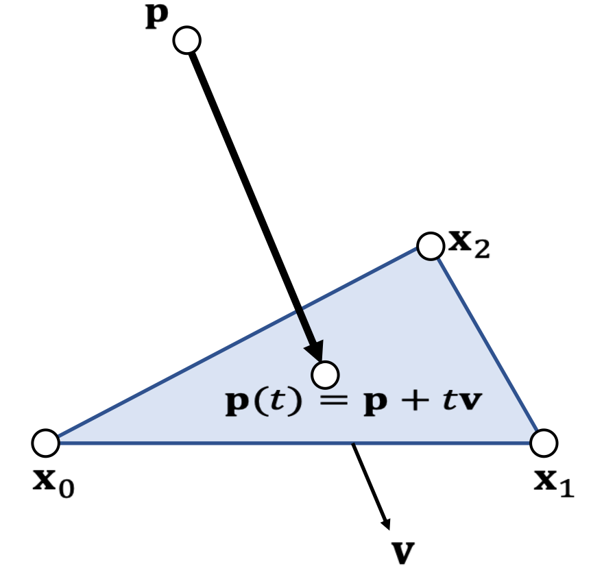

# 粒子与 Mesh     

# 碰撞检测   

## 相交检测     

检测粒子是否在 Mesh 的内部   
射线法：粒子从自身出发，发出一条射线，判断射线是与 Mesh 上的面片相交。    
相交次数为奇数，则在 Mesh 内    
相交次数为偶数，则在 Mesh 外    

## 穿透检测    

P24
## Example 11: Particle-triangle Intersection

 - First, we find t when the particle hits the plane:   

$$
(\mathbf{p} (t)−\mathbf{x} _0)\cdot  \mathbf{x} _{10}\times \mathbf{x} _{20}=0
$$

$$
(\mathbf{p}-\mathbf{x} _0+t\mathbf{v})\cdot  \mathbf{x} _{10}\times \mathbf{x} _{20}=0
$$

$$
t=\frac{(\mathbf{p}−\mathbf{x}_0)\cdot  \mathbf{x} _{10}\times \mathbf{x} _{20}}{\mathbf{v}\cdot \mathbf{x} _{10}\times \mathbf{x} _{20}} 
$$

 
 - We then check if \\(\mathbf{p}(t)\\) is inside or not.   
    - See Example 6.    

> &#x2705; 代入体积公式，体积为0时发生碰撞

# 碰撞响应    

粒子与 SDF 的碰撞响应在此处同样适用，但碰撞深度与反弹方向不同的计算方法不同。       

||粒子+SDF|粒子+Mesh|
|---|---|---|
|碰撞深度|\\(\phi (x)\\)| 点到最近面片的距离 |
|反弹方向|\\(\nabla \phi (x)\\)| 面片的法向|

---------------------------------------
> 本文出自CaterpillarStudyGroup，转载请注明出处。
>
> https://caterpillarstudygroup.github.io/GAMES103_mdbook/