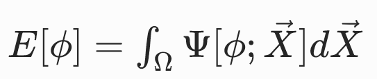
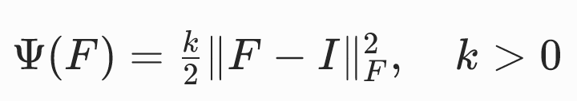
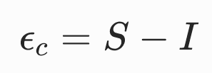
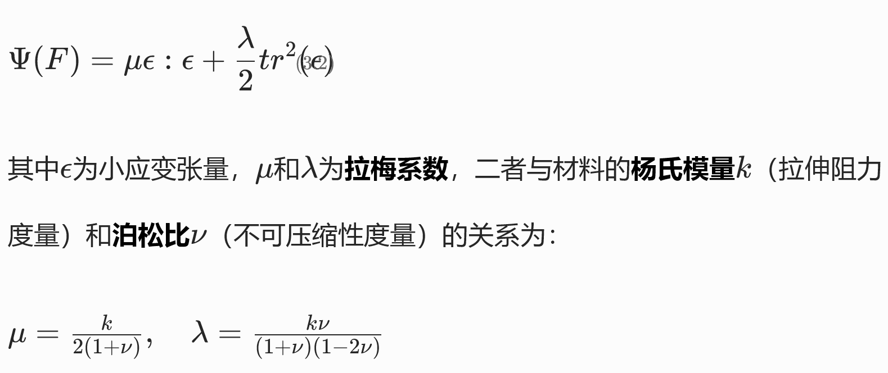
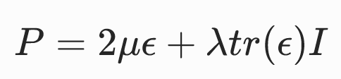
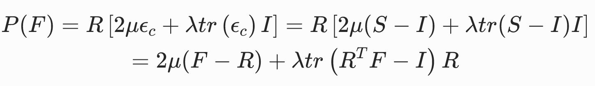

# 三维弹性力学

## 变形梯度 deformation gradient

将未变形的弹性体置于坐标系中，用 Ω 表示弹性体占据的体积域，该区域被称为参考构形（或未变形构形）。

用大写字母表示的向量X∈Ω指代未变形构形中的单个物质点。

弹性体发生变形时，每个物质点X都会位移至新的变形位置，该位置用小写字母表示的向量x指代。

物质点与其变形后位置的对应关系由变形函数ϕ​:R3→R3描述，该函数将每个物质点X映射至其变形后的位置x=ϕ​(X)。

变形梯度张量F∈R3×3是变形映射的雅可比矩阵。

### 变形函数与变形梯度举例：  

|形变|变形函数ϕ|变形梯度F|
|---|---|---|
|平移|x =ϕ( X )= X + t|F=∂ϕ( X )/∂ X =I|
|均匀缩放|ϕ( X )=γ X|F=γI|
|各向异性缩放|ϕ( X )=S X|F=S|
|旋转|ϕ( X )=RX|F=R|

## 应变能与超弹性

弹性变形会积累势能，该势能被称为应变能，用E[ϕ]表示。

**应变能仅与最终的变形形态有关，而与弹性体达到该构形的时间变形路径无关**。这是超弹性材料的标志性特征。

弹性体不同部位的变形程度存在差异，因此，变形与应变能的关系更适合在**局部**尺度上定义。因此引入能量密度函数Ψ[ϕ;X]。  

Ψ[ϕ;X]用于度量物质点X周围微元域dV内，单位**未变形体积**的应变能。

对能量密度函数在整个体积域 Ω 上积分，即可得到弹性体的总应变能：

由于能量密度Ψ[ϕ;X​]定义在X的局部域上，因此可通过一阶泰勒展开对该微小区域的变形映射进行合理近似：

其中t对能量不影响，因此**能量密度仅为局部变形梯度的函数**。但Ψ(F)的具体形式与材料特性有关。

能量密度函数一个自然的期望性质是下有界，即存在最小能量状态，弹性体可稳定于该状态。

### 能量密度函数举例：  

|能量密度函数|稳定状态|特点|
|---|---|---|
||F=0，ϕ(X)=常数|所有物质点都有收缩至同一点的趋势。 不符合自然规律，因为参考构形 Ω 并非其平衡构形。|
||F=I，ϕ(X)=X）|处于参考构形或其恒定平移构形时，能量取得最小值。但旋转状态下的能量非零。|

##  力（Force）与面力（Traction）

力密度，为物质点X周围微元域内，单位未变形体积的力。

对应的：面力密度函数traction(X)，用于度量弹性体边界上物质点X周围微元域内，单位未变形面积的力。

对有限边界区域B⊂∂Ω积分，即可得到该边界区域的总作用力：

## 应力张量

### The First Piola-Kirchhoff 应力张量

定义：  

其中N为参考构形（**未变形**）中边界的单位外法向量。

对于超弹性材料，P仅为变形梯度的函数，且与应变能存在简单的关系：

因此任意给出Ψ(F)或者P(F)中的一个，即可根据F得出traction τ
 ( X )

### 应力张量使用举例

定义：  

可以推导出：P=∂Ψ/∂F=k(F−I)

考虑弹性体沿所有方向均匀拉伸 2 倍的情况，ϕ( X )=2 X时，F=2I，P=kI，τ =−k N，该边界力会使弹性体产生向内的运动，以恢复原始的形状和体积。

# 材料本构模型

对材料物理特性的数学描述被称为本构模型，其中包含将外界激励（如变形）与材料响应（如力、应力、能量）关联起来的方程。

## 基于F的本构方程

将Ψ与F（或P与F）关联的显式公式完全可作为本构方程，例如：  

但**直接利用矩阵F的元素分析变形的类型和程度非常不直观**，通常会定义一些由F推导得到的中间量来定义本构方程。  

## 中间度量
### 应变度量（Strain measures）

应变度量是用于定量描述变形程度的物理量，即衡量当前构形与静息构形的偏离程度。

应变度量由变形梯度推F导得到，保留变形梯度中与**变形程度**评估相关的信息，同时舍弃变形梯度中与形状变化无关的信息。

#### 格林应变张量

特点：  
1. 当弹性体处于参考构形（ϕ​(X)=X）时，F=I，因此E=0；
2. 当弹性体仅发生旋转和平移（形状不变）时，ϕ​(X)=RX+t（R为旋转矩阵），此时F=R，由于RTR=I，因此E=0。
3. 对于更一般的非刚体运动，可以将F分解为F=RS，此时

优点：  
1. 舍弃了与变形程度无关的旋转自由度，仅保留了对称因子S中包含的拉伸 / 剪切信息，且该过程无需显式进行极分解。

缺点：  
1. 格林应变张量是变形的非线性（二次）函数，因此基于格林应变张量构建的本构模型复杂度更高。 
2. 离散化后的节点力将是节点位置的非线性函数。

#### 小应变张量

E(F)在E(I)处泰勒展开，并代入E(I)=0，得：  

优点：  
1. 计算效率高
2. 离散化后的节点弹性力与节点位置呈线性映射关系

缺点：
1. 小应变张量仅能可靠地度量小变形。若用于大变形场景，将产生明显的误差。

#### 共旋应变张量

### 不变度量

#### 各向同性不变量

$$
I_1(F) = tr (F^TF)
$$

I1是F的各奇异值的平方和

#### 体积比不变量J

$$
J = \det F
$$

J的物理意义：变形引起的**体积变化比**。

## 本构模型

### 基于线性弹性（Linear elasticity）张量的本构模型

  

优点：  
1. 应力P是变形梯度F的线性函数，因此节点弹性力与节点位置呈线性关系。
2. 与其他非线性材料模型相比，线弹性模型的计算成本显著更低。
3. 在小变形场景下准确

缺点：
1. 仅在小变形场景下准确，因此仅适用于运动幅度较小的情况。

### 基于格林应变张量的圣维南 - 基尔霍夫模型

将小应变模型中的ϵ（E的近似）替换为E

可求得

特点：
1. 旋转不变性
2. 非线性关系：应力是变形梯度F分量的三次多项式函数；离散化后，节点力也将表示为节点位置的三次多项式。
3. 压缩缺陷：对强压缩的抵抗性较差。当弹性体受到强压缩力或运动学约束时，容易发生局部的扭曲和翻转。

### 基于共旋应变张量的共旋线性弹性模型

  

这三种写法的是等价的。  

特点：  
1. 极分解的计算成本，以及在部分仿真中需要使用非线性求解器的成本。
2. 相较于圣维南 - 基尔霍夫等高度非线性模型，其计算效率仍有显著优势。

### 新胡克弹性

特点：
1. 对极端压缩具有极强的抵抗效应。
2. 近似不可压缩材料，实现保体积的数值格式。
3. 当模拟中意外出现体积反转构型（理论上物理上不可能但实际仿真中极易发生）时，模型没有内置的稳定处理机制。

---------------------------------------
> 本文出自CaterpillarStudyGroup，转载请注明出处。
>
> https://caterpillarstudygroup.github.io/GAMES103_mdbook/

