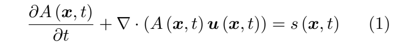
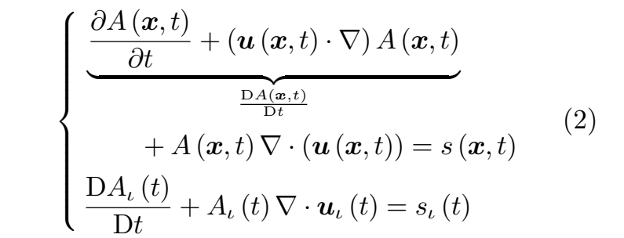
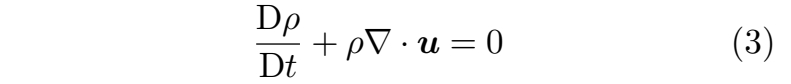
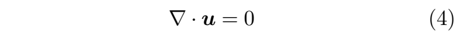
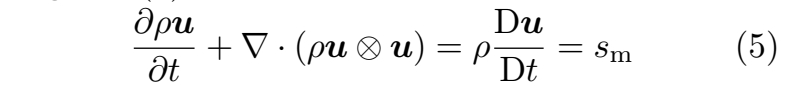
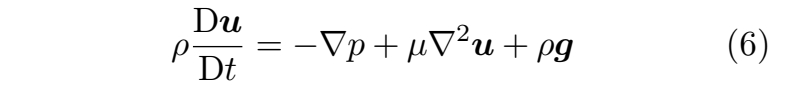

# 流体力学

流体力学将物体建模为物质在其体内**连续分布**的实体，称为**流体微团**。  

**连续性方程**描述了物理量在时空中的输运

   

其中：  
- **A** 可为任意标量、矢量或张量形式的物理属性，
- **u** 表示速度，
- **s** 是 **A** 的源项，
- 所有这些量均定义于时间 **t** 和位置 **x**。

公式 (1) 表明，在固定位置处任何物理属性的变化率 **∂A/∂t** 取决于 **Au** 通量所带来的变化以及源项 **s** 的贡献。

针对公式 (1) 中的物理属性 **A**，流场可从拉格朗日或欧拉视角进行分析：

**欧拉视角** 基于固定位置来研究物理属性的变化。在给定位置 **x** 处物理量 **A** 的变化率即为公式 (1) 中的 **∂A(x, t)/∂t** 项。虽然直观，但这一视角并未显式表达连续介质假设中流体微团的运动，因为微团始终在不同时刻流经固定的空间位置。

**拉格朗日视角** 通过将公式 (1) 改写为以下形式，研究流体微团的物理属性变化：    

   

其中 **D(·)/Dt** 即所谓的**物质导数**，表示流体微团内物理量 **A** 的变化率。

# **纳维-斯托克斯方程** 

**纳维-斯托克斯方程**描述了流体流动的动力学规律，是流体仿真的根本基础。

## **质量守恒**

在封闭系统中，流体的质量随时间保持守恒。该原理由连续性方程（公式（2））表示。令 **A** 为流体密度，并设 **s ≡ 0**，则公式（2）可改写为：   

   

在不可压缩流动的情况下，流体内的密度变化保持恒定，即 **Dρ/Dt = 0**。该条件进一步意味着速度场**无散度**，其表达式为：  

   

## **纳维-斯托克斯动量方程**

为进一步描述不可压缩流体流动的运动特性，可对每个流体微团的动量进行分析。将动量项 **ρu** 代入公式（1），并利用公式（2），可得：  

   

其中 **sm** 是改变各流体微团速度的**动量源项**，符号 **⊗** 表示**外积运算**。在此基础上，**黏性可压缩流**的纳维-斯托克斯动量方程基本形式进一步将 **sm** 具体表述为三个独立项：   

   

其中 **p** 表示**压力**，**g** 为**重力加速度**，**µ** 是描述流体粘性程度的**动态粘性系数**。公式（6）表明，流体微团的速度变化率受三个力项的影响：**压力项（−∇p）**、**粘性项（µ∇2u）** 以及**重力项（ρg）**。

# **从连续统到动理学**

以上讨论全部建立在**连续介质假设**之上：流体被建模为连续分布的**流体微团**，未知量是密度 **ρ(x, t)** 与速度 **u(x, t)** 这类**宏观量**，演化方程是 Navier-Stokes 方程。

若把观察层级下移一层，流体由大量分子构成，每个分子有自己的位置与速度。此时可以用**速度分布函数**描述流体：

\\[f(\mathbf{x}, \boldsymbol{\xi}, t)\\]

它的含义是：在时刻 **t**、位置 **x** 附近单位体积内，速度落在 **ξ** 附近单位速度区间内的分子数。与连续统描述相比，它多保留了一个**速度维度**的自变量。

宏观量是分布函数的**矩**：

\\[\rho = \int f \, d\boldsymbol{\xi}, \qquad \rho\mathbf{u} = \int \boldsymbol{\xi} f \, d\boldsymbol{\xi}\\]

也就是说，**只要知道 f，Navier-Stokes 方程中的宏观量都能由积分得到**。这一步是动理学与连续统之间的接口。

**f** 的演化由**玻尔兹曼输运方程**给出：

\\[\frac{\partial f}{\partial t} + \boldsymbol{\xi}\cdot\nabla_{\mathbf{x}} f = \Omega(f)\\]

- 左端对应分子在无碰撞情况下的**自由飞行**；
- 右端 **Ω(f)** 是**碰撞算子**，描述分子间碰撞引起的分布变化。

碰撞不产生也不消灭质量与动量，因此 **Ω(f)** 关于 **ξ** 的零阶矩与一阶矩均为零。对玻尔兹曼方程两端关于 **ξ** 取矩，即可得到宏观的连续性方程与动量方程——这是"从动理学还原到连续统"的基本途径。完整推导还需要配合 **Chapman-Enskog 展开**：把 **f** 按小参数展开并逐阶分离，零阶给出无粘的欧拉方程，一阶给出粘性应力张量，二阶还原出完整的 Navier-Stokes 方程。

完整碰撞算子是复杂的积分，工程上常用 **BGK 近似**（Bhatnagar-Gross-Krook, 1954）：

\\[\Omega(f) \approx -\frac{1}{\tau}\left(f - f^{eq}\right)\\]

即分布 **f** 以时间常数 **τ** 松弛到局部平衡分布 **f^eq**：

- **τ** 大 → 松弛慢 → 粘性大
- **τ** 小 → 松弛快 → 粘性小

这一近似把碰撞算子从积分运算简化为一次代数插值，是后面格子玻尔兹曼方法能够高效实现的关键。

### 三层描述对照

| 层级 | 描述变量 | 演化方程 | 对应方法 |
|---|---|---|---|
| 连续统（宏观）| \\(\rho, \mathbf{u}\\) | Navier-Stokes | 有限差分 / 有限体积 / 有限元 + 投影法 |
| 动理学（介观）| \\(f(\mathbf{x},\boldsymbol{\xi},t)\\) | 玻尔兹曼输运方程 + BGK | 格子玻尔兹曼方法 LBM |
| 分子（微观）| 每个分子的位置与速度 | 牛顿第二定律 | 分子动力学 MD |

本节内容属于**物理基础**，只说明动理学的描述层级与它和连续统的还原关系。对应的数值离散方案（格子气自动机与格子玻尔兹曼方法）见 [格子动理学方法](../Lattice/LatticeKinetic.md)，其中 [动理学基础](../Lattice/Boltzmann.md) 一节给出了本节内容的完整推导。

---------------------------------------
> 本文出自CaterpillarStudyGroup，转载请注明出处。
>
> https://caterpillarstudygroup.github.io/GAMES103_mdbook/