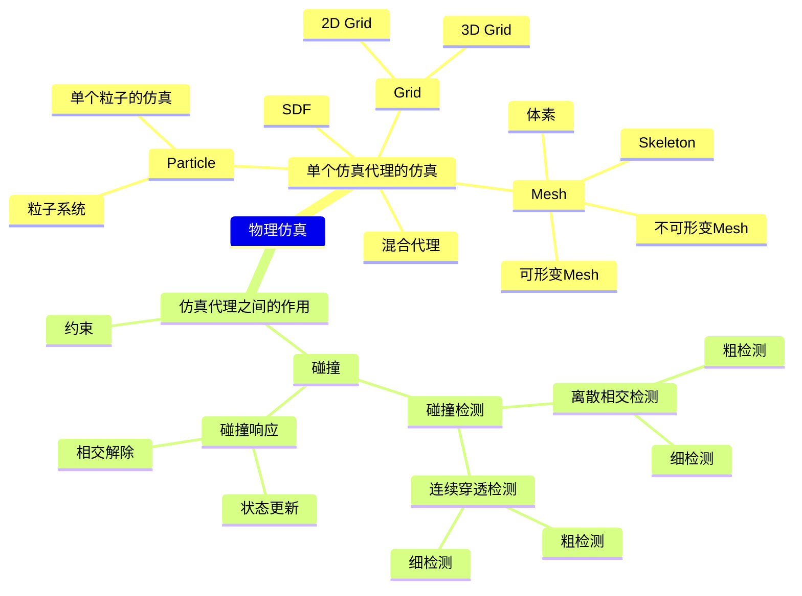

本文以GAMES103课程为始，围绕图形学物理仿真话题，根据自己的理解重新排版、增删。如有侵权，请联系删除。

**仿真是指，根据仿真代理在当前时刻的力计算下一时刻仿真代理的状态。** 把仿真的对象抽象成不同的代理，可以得到不同的仿真效果。不同的仿真代理，其状态特点、受力响应、擅长场景都各不相同。因此本文根据仿真代理来划分章节。对每一种仿真对象，分析     

> &#x2705; 这里涉及到时间步的概念。仿真的帧率不需要与渲染的帧率保持一致。通常一个渲染step会包含多个仿真step。  

1. 属性，包含固有属性、需要仿真的状态、可能产生的内力
2. 对象在力的作用下如何响应，即更新状态
3. 这种仿真对象的使用场景

   

一个真实的场景中，肯定会包含多个仿真对象，每个对象都可能用的不同的仿真代理去仿真。除了单个仿真代理的仿真，还考虑仿真代理之间的相互作用。   

> &#x2705; 王老师建议的学习方法：  
> 读 paper 而不是教材  
> 只读重点不读全文  
> 学知识而不是学用 Unity  
> 多读多写多想  

# Reference

1. 基于物理的计算机动画入门 [原始课程链接](https://www.bilibili.com/video/BV12Q4y1S73g/?spm_id_from=333.337.search-card.all.click)

2. 知乎、Deepseek等网络材料

3. 图形学相关

[数学基础](https://caterpillarstudygroup.github.io/mathematics_basic_for_ML/index.html)          
[Animation - 角色动画](https://caterpillarstudygroup.github.io/GAMES105_mdbook/)   
[Animation - 物理动画](https://caterpillarstudygroup.github.io/GAMES103_mdbook/)     
[Geometry](https://caterpillarstudygroup.github.io/GAMES102_mdbook/)       
[Rendering](https://caterpillarstudygroup.github.io/GAMES101_mdbook/)  

---------------------------------------
> 本文出自CaterpillarStudyGroup，转载请注明出处。  
> https://caterpillarstudygroup.github.io/GAMES103_mdbook/