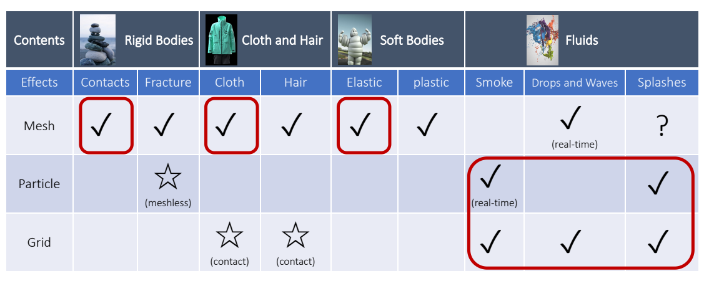

> &#x2705; 王老师建议：  
> 读 paper 而不是教材  
> 只读重点不读全文  
> 学知识而不是学用 Unity  
> 多读多写多想  

本文以GAMES103课程为始，围绕图形学物理仿真话题，根据自己的理解重新排版、增删。如有侵权，请联系删除。

# Reference

1. 基于物理的计算机动画入门 [原始课程链接](https://www.bilibili.com/video/BV12Q4y1S73g/?spm_id_from=333.337.search-card.all.click)

   

2. 知乎、Deepseek等网络材料

---------------------------------------
> 本文出自CaterpillarStudyGroup，转载请注明出处。  
> https://caterpillarstudygroup.github.io/GAMES103_mdbook/