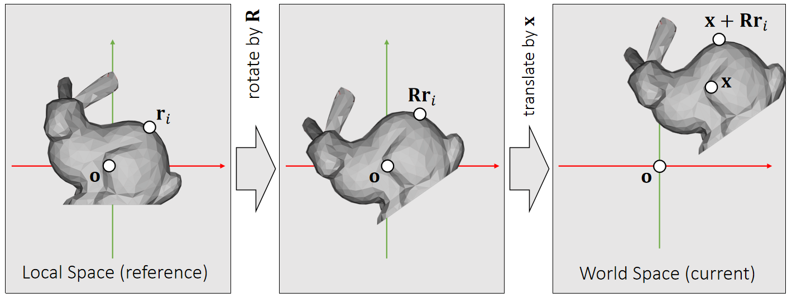

# 刚体的属性

无数的粒子以相对位置关系不变的方式聚合到一起，就形成了刚体。  
刚体的特点是物体很硬，不考虑形变。  

刚体所占的是一个连续的空间，包含了无限多个粒子。实际上会把它离散化为有限个相对位置关系不变的粒子的组合。离散化的方式有两种：  
1. 仅用极少量的例子来表示刚体的外部轮廓。粒子之间用line连接，构成Mesh。用这种方式构造出的刚体不考虑与粒子之间的相互作用力。是最常见的方式。    
2. 用稠密的粒子点云来表示刚体所占据的空间。这种方式可以考虑粒子间的相互作用力，因此可以模拟刚体破碎的效果。  

## 子系统（粒子）的属性

|属性|符号|在通常的仿真场景中是否可变|
|---|---|---|
|质量|m|否|
|相对位置(质心的坐标系)|p或x|否。虽然每个粒子都有位置属性，但它们所有的粒子相对位移不变，因此不需要独立对每个粒子的位置属性做仿真，只需要仿真其中一个粒子的位置就可以。其它粒子的位置都是相对它的偏移|
|全局位置（世界坐标系）|\\(x_i\\)|是。粒子的位置变化是由于质心坐标的平移和旋转导致的，是被动变化的，因此不直接仿真每个粒子的全局位置。|
sv
## 组合系统（刚体）的属性

|属性|符号|在通常的仿真场景中是否可变|
|---|---|---|
|质量|m（均质）或M（非均质）|否。刚体的质量为其所有粒子的质量之和。|
|全局位置（世界坐标系）|p或x|是。刚体所占的是一个连续的空间，而不是一个点。选择刚体中的某一个点（通常是质心）的位置作为刚体的位置|
|全局旋转（世界坐标系）|q   旋转的表示戳这里[link](https://caterpillarstudygroup.github.io/mathematics_basic_for_ML/Geometry/Quaternion.html)。最后结论是四元数表示方法。|是|

     

> &#x2705; reference：参考状态,无平移,无旋转，假设刚体在reference状态的坐标系与世界坐标系是一致的。  
> 当前状态：旋转为\\(\mathbf{R}\\)，平移为\\(\mathbf{T}\\). 那么物体上任意点的位置为：   
$$
\mathbf{{x}}' = \mathbf{Rx} + \mathbf{T}
$$

对应的：  

|属性|符号|说明|
|---|---|---|
|速度|v或\\(\mathbf{\dot{x}} \\)|p的一阶导|
|加速度|a|p的二阶导|
|角速度|v或\\(\mathbf{\dot{x}} \\)|q的一阶导|
|角加速度|a|q的二阶导|

We use a 3D vector \\(\mathbf{\omega}\\) to denote angular velocity.    

$$ 
\begin{cases} \text{The direction of } \mathbf{\omega} \text{ is the axis.} \\\\    
\text{The magnitude of }  \mathbf{\omega} \text{ is the speed.}   
\end{cases}
$$ 

    

## 子系统聚合后产生的新属性

|属性|符号|说明|
|---|---|---|
|占据哪些空间||刚体所占的是一个连续的空间，因此有体积的概念。|

# 应用场景

单个物体的仿真，且物体材质很硬，不考虑形变。 