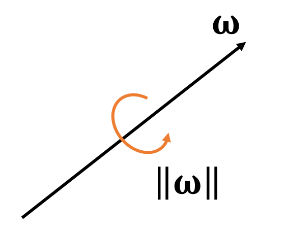

# 不可形变Mesh与刚体

[Mesh](https://caterpillarstudygroup.github.io/GAMES102_mdbook/Introduction/3DData.html)由顶点、边、面片组成。  

不可形变的Mesh指，Mesh上的顶点、边、面片的相对位置位移保持不变，因此把不可形变Mesh称为刚体。刚体的特点是物体很硬，不考虑形变。  

Mesh由点、线、面组成，从不同的角度看待Mesh，可以得到不同的仿真属性和仿真方法，用于不同的仿真目的。

# 刚体的仿真属性

把Mesh看作一个整体，Mesh相当于一个有体积的粒子。那么Mesh有以下属性：  

|属性|符号|在通常的仿真场景中是否可变|
|---|---|---|
|质量|m（均质）或M（非均质）|否。|
|全局位置（世界坐标系）|p或x|是。刚体所占的是一个连续的空间，而不是一个点。选择刚体中的某一个点（通常是质心）的位置作为刚体的位置。|
|全局旋转（世界坐标系）|q   旋转的表示戳这里[link](https://caterpillarstudygroup.github.io/mathematics_basic_for_ML/Geometry/Quaternion.html)。最后结论是四元数表示方法。|是|

对应的：  

|属性|符号|说明|
|---|---|---|
|速度|v或\\(\mathbf{\dot{x}} \\)|p的一阶导|
|加速度|a|p的二阶导|
|角速度|\\(\mathbf{\omega}\\)或\\(\mathbf{\dot{q}} \\)|q的一阶导|
|角加速度||q的二阶导|

 

$$ 
\begin{cases} \text{The direction of } \mathbf{\omega} \text{ is the axis.} \\\\    
\text{The magnitude of }  \mathbf{\omega} \text{ is the speed.}   
\end{cases}
$$ 

# 刚体顶点的属性

刚体上的顶点没有自己的自由度，因此没有仿真属性。但它们具有以下运动属性：

|属性|符号|在通常的仿真场景中是否可变|
|---|---|---|
|质量|m|否|
|相对位置(质心的坐标系)|p或x|否。虽然每个粒子都有位置属性，但它们所有的粒子相对位移不变，因此不需要独立对每个粒子的位置属性做仿真，只需要仿真其中一个粒子的位置就可以。其它粒子的位置都是相对它的偏移|
|全局位置（世界坐标系）|\\(x_i\\)|是。粒子的位置变化是由于质心坐标的平移和旋转导致的，是被动变化的，因此不直接仿真每个粒子的全局位置。|

     

> &#x2705; reference：参考状态,无平移,无旋转，假设刚体在reference状态的坐标系与世界坐标系是一致的。  
> 当前状态：旋转为\\(\mathbf{R}\\)，平移为\\(\mathbf{T}\\). 那么物体上任意点的位置为：   
$$
\mathbf{{x}}' = \mathbf{Rx} + \mathbf{T}
$$

粒子视角可以用于Mesh的受力分析，但是不能直接对Mesh上的粒子进行仿真，要把粒子受到的力转化为刚体的受力响应。  
