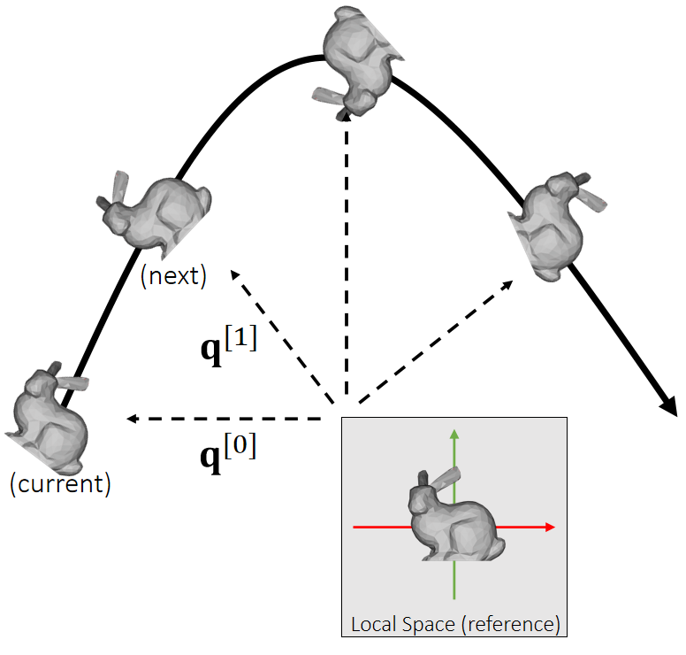

# 刚体对外力的响应

虽然刚体受到的力都是作用在刚体上的某个点上。但受力点不能独立的响应这个力。而是要让刚体作为整体来响应这个力。  
即，刚体的质心的全局位置（世界坐标系）和全局旋转（世界坐标系）。  
因此，刚体在力的作用下会发生旋转和平移。  

     

## 刚体受到经过质心的力

刚体受到经过质心的力，会发生位移，即x的改变。但不会发生旋转。
以下情况可以看作是刚体受到经过质心的力：  
- 力作用在刚体的一个或多个点上，且每个力都经过质心
- 对于均质刚体，对整个刚体施加一个力，例如重力

刚体受力后的平移响应与粒子相似。连续形式与离散形式下的速度、位置更新公式也相同。

     

## 刚体受到一个不经过质心的力

对刚体上的一个点施加一个力F，且力不经过质心，其作用等效于：  

1. 对刚体的质心施加一个力，其它大小与方向与F相同。这个力导致刚体平移。仿真方法上同一节。  
2. 对刚体施加一个力偶，其力矩使刚体发生旋转。

> inertia、torque等概念，请戳这里[link](./supplementary.md)

参考刚体平移的离散积分过程，可以推导出刚体旋转的更新法则：

|    |Translational (linear)|Rotational (Angular)|
|---|---|---|
|Updafe|   |   |
|states| Velocity \\(\mathbf{v}\\)   Position \\(\mathbf{x}\\)|Angular velocity \\(\mathbf{ω} \\)    Quaternion \\(\mathbf{q}\\) |
| Physical Quantities |Mass \\(\mathbf{M}\\)   Force \\(\mathbf{f}\\) | Inertia \\(\mathbf{I} \\)   Torque \\(\mathbf{τ} \\) |

> &#x2705;  平移： \\(加速度 = \frac{力}{质量}\\) ，旋转： \\(加速度 =\frac{力矩}{\text{Inertia}}\\)   
> &#x2705;  \\(q\\)是四元数，代表物体的旋转状态   
> &#x2705;  \\(q_1\times q_2\\)不是叉乘，而是四元数普通乘法    
> &#x2705;  \\(\begin{bmatrix}
  0 & \frac{\bigtriangleup t}{2}  & w^{(1)}
\end{bmatrix}\\)是一个四元数，0为实部，后面为虚部   
> &#x2757;  算完\\(q^{[1]}\\)的之后要对它 Normalize     
> &#x1F50E; 由\\(q^{[0]}\\)到\\(q^{[1]}\\)的更新公式的推导过程见Affer Class Reading（Appendix B）   

    

## 更复杂的情况

更复杂的情况，也都可以把力分解为经过质心的力（造成平移）和力矩（造成旋转）。   
计算出力和力矩以后，都可以套用以上公式更新刚体状态。  

P30 
# 总结       

  
     

---------------------------------------
> 本文出自CaterpillarStudyGroup，转载请注明出处。
>
> https://caterpillarstudygroup.github.io/GAMES103_mdbook/
