P24   
# 碰撞检测    

让刚体上的每个顶点与SDF做一次碰撞检测，检测方法与[粒子+SDF]()相同。     
区别在每个顶点当前的位置与速度的获取当法与粒子不同。  

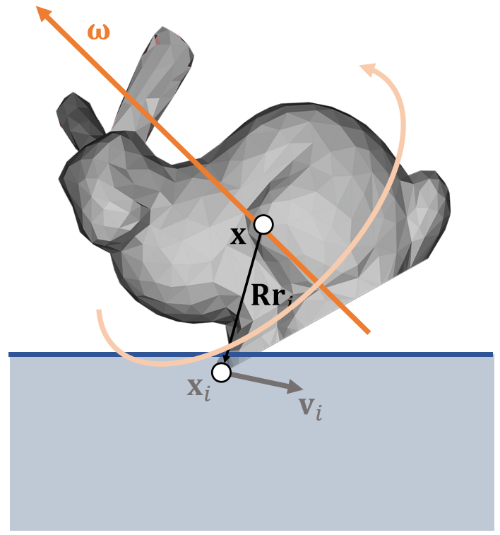    

以Vertex i为例，先分析i当前的位置和速度:    

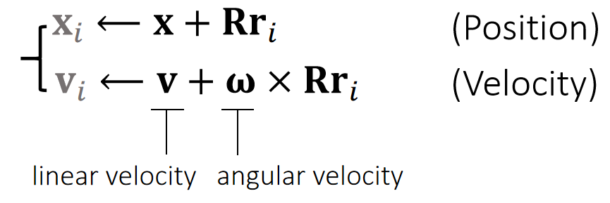    

> &#x2705; \\(x\\)和\\(v\\)分别是刚体质心点的位置和速度,第二项为刚体上的特定点相对于质心点的位置和速度   

# 碰撞响应    

SDF 常用于代表静态物体，这种物体不响应力和碰撞，所以所有的碰撞响应都发生在粒子上。    

Problem: **we cannot directly modif**y \\(\mathbf{x}_i\\) or \\(\mathbf{v}_i\\) **since they not state variables**. They areindirectly determined.     

**对于粒子，可以直接用Impulse修改\\(x\\)和\\(v\\)**   
**对于刚体，impulse只能修改\\(x\\)和\\(v\\)，不能修改\\(x_i\\)和\\(v_i\\)**；其中\\(x\\)可以通过直接修改更新，也可以通过修改\\(v\\)来更新，这里选择后者。  
  
解决方法：通过修改\\(\mathbf{v}\\)和\\(\mathbf{\omega}\\)实现修改\\(x_i\\)和\\(v_i\\)    

## 相交解除    

P32    
### Shape Matching    

> &#x2705; 用粒子的方法来解决刚体的问题

P33  
### Basic Idea    

We allow each vertex to have its own velocity, so it can move by itself.     

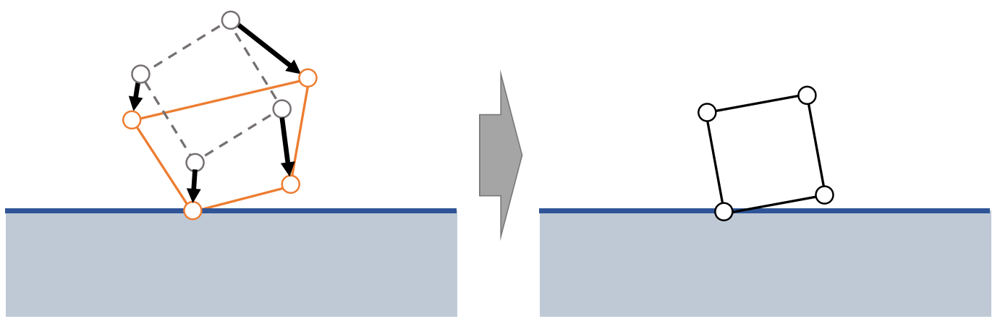    

First, move vertices **independently** by its velocity, with collision and friction being handled.     

Second, enforce the **rigidity** constraint to become a rigid body again.      

先对 Mesh 上的每个顶点看作是粒子对它们进行独立的仿真。保证仿真后每个粒子(顶点)不与 SDF 发生相交。     
此时刚体可能发生了形变，再更新刚体的位置和旋转，使其各个顶点尽量接近第一步的仿真结果。   

> &#x2705; 第二步是 Shape Matching 的关键   

Rigidity：包含更新质心的位置和旋转    

P34  
### 更新质心位置    

Now \\(\mathbf{c}\\) and \\(\mathbf{R}\\) are unknowns we want to find out from:

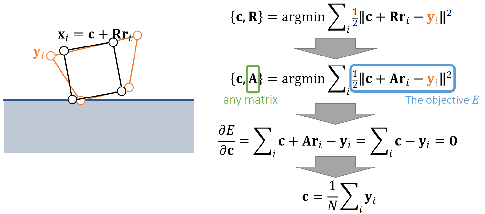    

> &#x2705; \\(\mathbf{c}\\) 代表质心，即前面的 \\(\mathbf{x}\\)    
> &#x2705; 约束1：新的顶点位置与原顶点位置的距离尽量接近。   
> &#x2705; 约束2：\\(\mathbf{R}\\) 是旋转矩阵。   
> &#x2705; 很难通过定义目标函数来满足约束2，因此问题简化：用任意矩阵A代替需要满足旋转矩阵约束的\\(R\\)。      
> &#x2705; \\(\sum Ar_i = A \sum r_i = 0\\)，因此得出结论：约束前后质心位置不变    
> &#x2753; 优化之后的刚体可能还是与地面穿透的。   

P35  

### 更新质心旋转

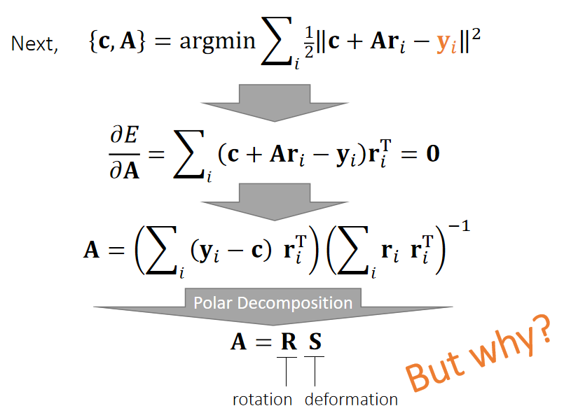    

> &#x2705; 先假设 \\(\mathbf{R}\\) 是任意矩阵 \\(\mathbf{A}\\),再从中提取旋转成分   
> &#x2705; [Polar Decomposition]([TODO])：极性分解，把任意矩阵分解旋转部分和形变部分。  

P36   

结论：   
\\(A^TA=S^TS=S^2\\)    
\\(R=AS^{-1}\\)  

P39  
### Shape Matching Pipeline   

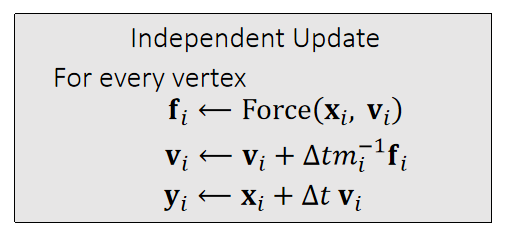 

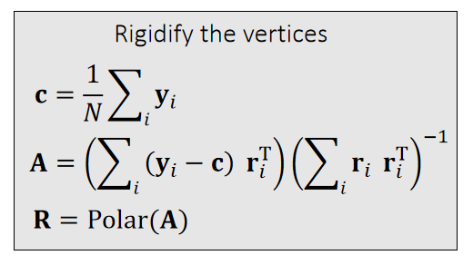 

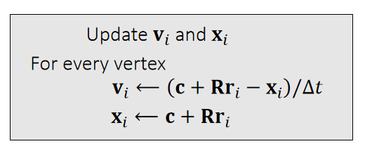 

Physical quantities are attached to each vertex, not to the entire body.   

P40  
#### 算法分析    

 - 优点：Easy to implement and compatible with other nodal systems, i.e., cloth, soft bodies and even particle fluids.    

 - 局限性：Difficult to strictly enforce friction and other goals. The rigidification process will destroy them.    

 - 适用场景：More suitable when the **friction accuracy is unimportant**, i.e., buttons on clothes.    
 
 
 P41   
#### After-Class Reading    

Muller et al. 2005.    
*Meshless Deformations Based on Shape Matching*. TOG (SIGGRAPH).     

## 状态更新　　　

### 冲量法   

碰撞 → 粒子响应 → 粒子速度 → 刚体冲量 → 刚体状态    

P25   
#### 反向思考

What happens to \\(\mathbf{v}_i\\) when an impulse \\(\mathbf{j}\\) is appliedat vertex \\(i\\)?      

> &#x2705; \\(\mathbf{j}\\) 是一个未知的冲量。\\(\mathbf{v}_i\\) 是点速度、\\(\mathbf{v}\\)是线速度     
> &#x2705;假设：此时对\\(x_i\\)点施加冲量\\(j\\)，会发生什么？   

#### 冲量\\(\mathbf{j}\\)对刚体的影响     

根据[刚体动力学]()可得：   

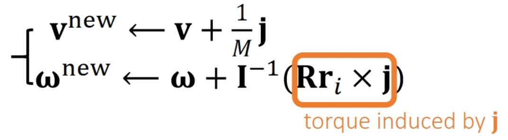    

> &#x2705; 冲量 = \\(Ft\\) = \\(m\Delta v \Rightarrow \Delta v\\) = 冲量/\\(m\\)，由此得到\\(v^{new}\\)  
> &#x2705; 冲量力矩=质量矩阵 * \\( \Delta \omega \\) = 力矩 \\(·t\\), 由力矩=\\(Rr_i \times f_i\\)，可得：
\\(Rr_i \times j\\) = 冲量力矩 \\(\Rightarrow \Delta \omega\\) ＝ 质量矩阵\\(^{-1}\\) · 冲量力矩 ，由此得到\\(\omega^{new}\\)   

#### 冲量\\(\mathbf{j}\\)对刚体顶点\\(\mathbf{i}\\)的影响       

由线速度\\(v^{new}\\)得到点速度\\(\mathbf{v}_i^{new}\\)  

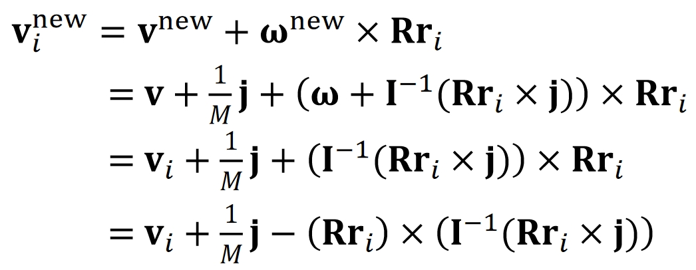    

P27    

$$
\mathbf{v_i^{new}} = \mathbf{v} _i+\frac{1}{M}\mathbf{j} −(\mathbf{Rr} _i)×(\mathbf{I} ^{−1}(\mathbf{Rr} _\mathbf{i}\times \mathbf{j} ))
$$

> &#x2705; 向量之间的点乘可以转化为矩阵与向量的乘法，方便化简。具体内容见页面最后的**补充1**

$$
\mathbf{v_i^{new}} = \mathbf{v} _i+\frac{1}{M} \mathbf{j} −(\mathbf{Rr} _i)^∗\mathbf{I} ^{−1} (\mathbf{Rr} _i)^∗\mathbf{j} 
$$

化简得：  

>$$
>\mathbf{v_i^{new}}-\mathbf{v}_i=\mathbf{Kj}
>$$
>$$
>\mathbf{K} \longleftarrow \frac{1}{M} \mathbf{1} −(\mathbf{Rr} _i)^{∗}\mathbf{I} ^{−1}(\mathbf{Rr} _i)^{∗}
>$$
> 

> &#x2705; 结论，当碰撞点\\(i\\)确定时，冲量\\(j\\)和其造成的速度改变量\\(Δv\\)是确定的，这样，可以通过施加\\(j\\)，精确修改\\(v_i\\)   
> &#x2705; 已知 \\(\mathbf{v}_i^{new},\mathbf{v}_i,\mathbf{K}\\),可求得 \\(\mathbf{j}\\)     

P28  
#### Pipeline    

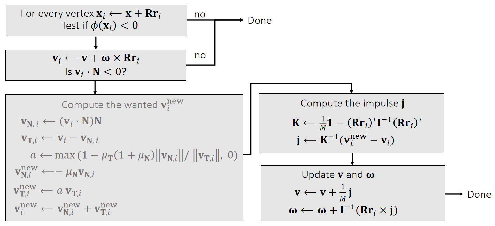    

> &#x2705; \\(i\\)点发生碰撞 → 算出i点碰撞后的速度 → 算出给i点什么样的冲量能让\\(i\\)出现碰撞后的效果 → 真的施加这样一个冲量 → 更新刚体状态     
此处假设不合理。这里假设刚体上每个顶点被撞后的响应效果是确定的，即与刚体被撞击的位置及刚体自身状态无关，但又由于刚体自身状态等原因，为了达到目标效果，碰撞所产生的冲量却是不一样的。    
事实上，正确逻辑应该，碰撞所生的冲量是确定的。而由于刚体自身状态等原因，对刚体顶点产生的效果是不同的。

P29  
#### Some Implementation Details    

 - We can decrease the restitution \\(\mathbf{\mu_N} \\) to reduce oscillation（抖动）.     

> &#x2705; 抖动原因：重力让它往下，冲量让它往上，导致在地面上反复振荡      
解决方法：接近静止时衰减 \\(\mathbf{\mu_N} \\)   

 - We don't update the position here. Why?      
    - Because the problem is nonlinear.     
    - We will come back to this later when we talk about constraints.      

P30   
### 多碰撞点场景    

> &#x2705; 如果有多个顶点发生碰撞呢？     
> 答：方法1，问题简化，用平均值。方法2，解线性系统。  

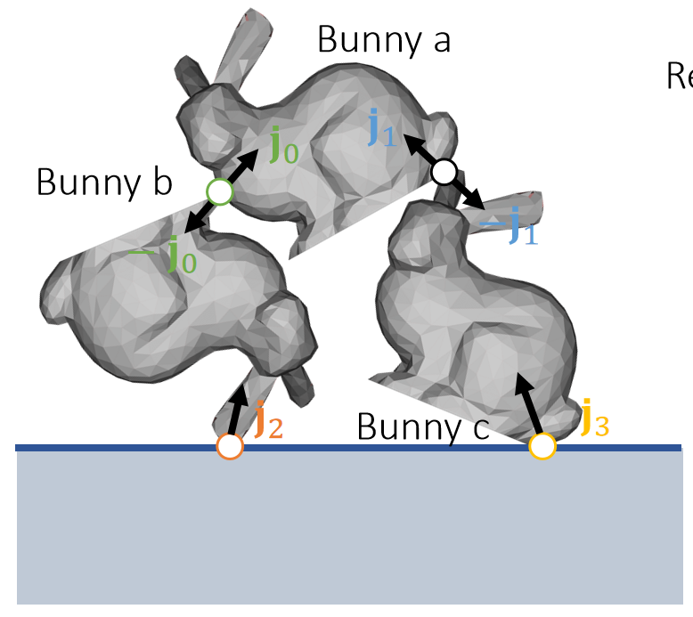    

Relative velocity at joints     

$$
\begin{cases}
 \mathbf{v} _0 ^{\mathbf{new} }− \mathbf{v} _0=\mathbf{K} _{a00 }\mathbf{j} _0+\mathbf{K} _{a01 }\mathbf{j} _1 −(−\mathbf{K} _{b00 }\mathbf{j} _0 +\mathbf{K} _{b02}\mathbf{j} _2 )\\\\
 \mathbf{v} _1 ^{\mathbf{new} }− \mathbf{v} _1=\mathbf{K} _{a10 }\mathbf{j} _0+\mathbf{K} _{a11 }\mathbf{j} _1 −(−\mathbf{K} _{c11 }\mathbf{j} _0 +\mathbf{K} _{c13 }\mathbf{j} _3 )\\\\
 \mathbf{v} _2 ^{\mathbf{new} }− \mathbf{v} _2=\mathbf{K} _{b20 }\mathbf{j} _0+\mathbf{K} _{b22 }\mathbf{j} _2\\\\
\mathbf{v} _3 ^{\mathbf{new} }− \mathbf{v} _3=\mathbf{K} _{c31 }\mathbf{j} _1+\mathbf{K} _{c33 }\mathbf{j} _3
\end{cases}
$$

$$
\Downarrow
$$

$$
\begin{bmatrix}
 \mathbf{K} _{a00 }+\mathbf{K} _{b00 } & \mathbf{K} _{a01 } & -\mathbf{K} _{b02 } & \Box \\\\
 \mathbf{K} _{a10 } & \mathbf{K} _{a11 }+\mathbf{K} _{c11 } & \Box  & -\mathbf{K} _{c13 }\\\\
 -\mathbf{K} _{b20 } & \Box  & \mathbf{K} _{b22} & \Box \\\\
 \Box  & -\mathbf{K} _{c31 } & \Box  & \mathbf{K} _{c33 } 
\end{bmatrix}\begin{bmatrix}
 \mathbf{j} _{0 }\\\\
 \mathbf{j} _{1}\\\\
 \mathbf{j} _{2}\\\\
\mathbf{j} _{3}
\end{bmatrix}=\begin{bmatrix}
 \bigtriangleup \mathbf{v} _{0}\\\\
 \bigtriangleup \mathbf{v} _{1}\\\\
 \bigtriangleup \mathbf{v} _{2}\\\\
\bigtriangleup \mathbf{v} _{3}
\end{bmatrix}
$$

\\(\mathbf{K} _{a01}\mathbf{j} _1\\) stands for the velocity change of bunny \\(a\\) at joint 0, caused by impulse \\(\mathbf{j}_1\\).

P31  
### After-Class Reading (Before Collision)    

<https://graphics.pixar.com/pbm2001>     
Rigid Body Dynamics

---------------------------------------
> 本文出自CaterpillarStudyGroup，转载请注明出处。
>
> https://caterpillarstudygroup.github.io/GAMES103_mdbook/