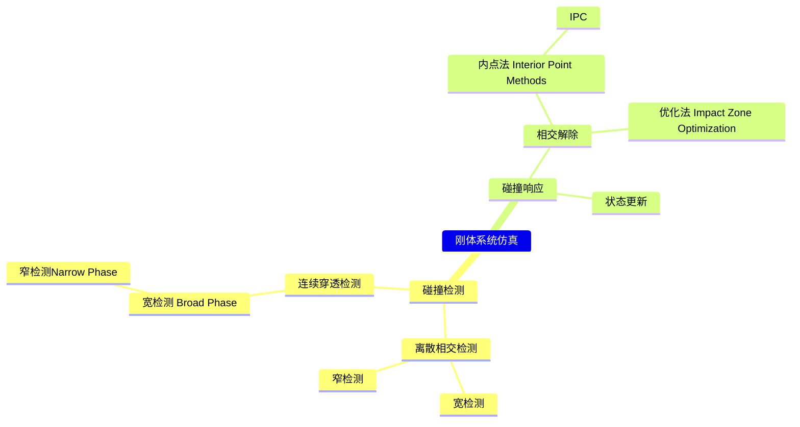

P9   

# Topics for the Day   
  

**碰撞检测提供以信息：**    
1. 是否存在穿模     
2. 最快解除模的移动方向     
3. 解除穿模移动方向对应的矩离    

**碰撞检测层次：**    
1. 刚体 bbox 之间      
2. 刚体之间    
3. 三角形面片之间     

**其它：**     
1. 粗/精检测，是否能准确判断穿模情况，或是提供排除信息     
2. 是否支持多个对象之间碰撞检测     

输出：是否存在穿模(粗)   
检测层次：1.2.3    
多对象检测：支持    

---------------------------------------
> 本文出自CaterpillarStudyGroup，转载请注明出处。
>
> https://caterpillarstudygroup.github.io/GAMES103_mdbook/