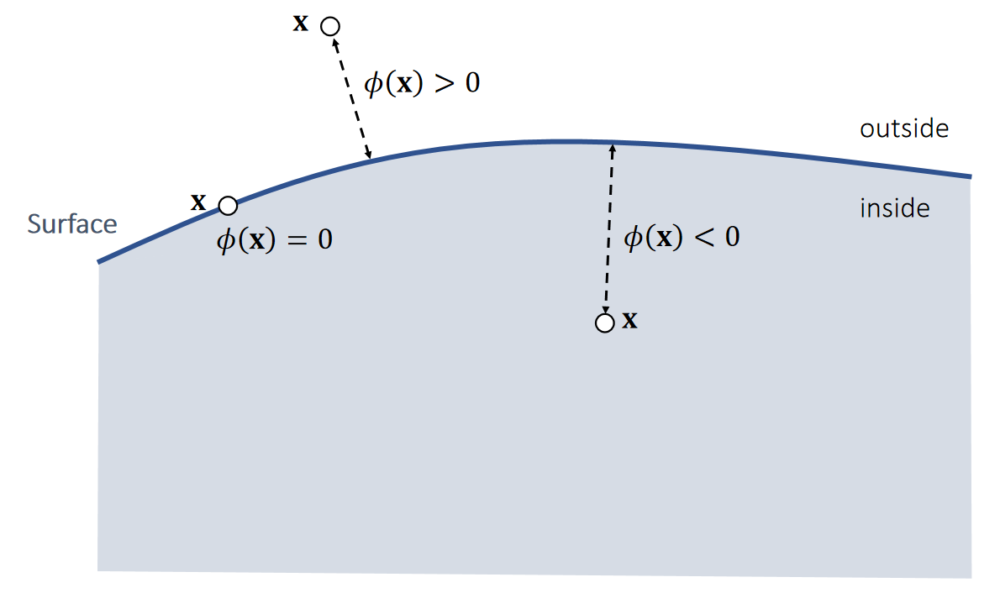
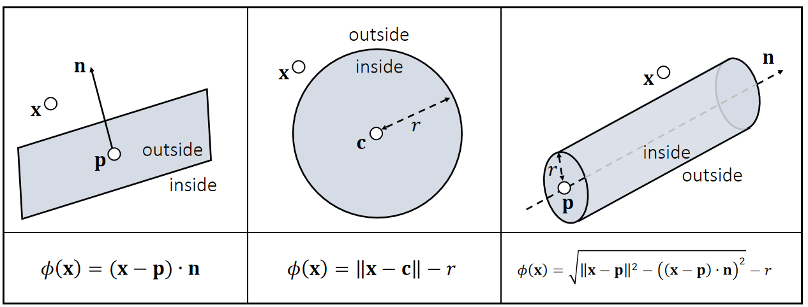

# Signed Distance Function   

A <u>signed</u> distance function \\(\phi (\mathbf{x} )\\) defines the distance from \\(\mathbf{x}\\) to a surface with a sign. The sign indicates on which side \\(\mathbf{x}\\) is located.     

     

P12   
## Signed Distance Function Examples    

     

> &#x2705; 圆柱SDF基于勾股定理，\\(\sqrt{\cdot }\\) 内第一项为斜边长，
第二项为底边长，得出点到中轴的距离。  

---------------------------------------
> 本文出自CaterpillarStudyGroup，转载请注明出处。
>
> https://caterpillarstudygroup.github.io/GAMES103_mdbook/
