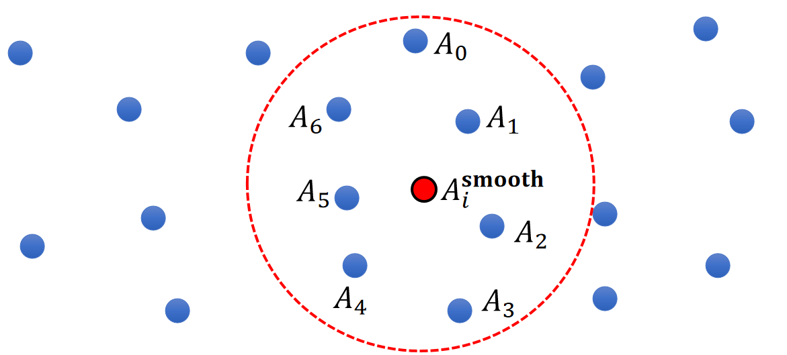
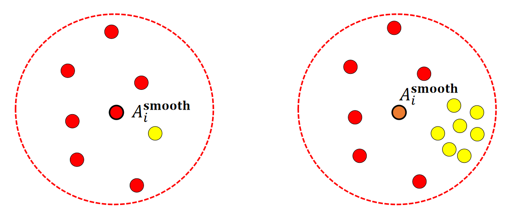

P1   
## GAMES103: Intro to Physics-Based Animation  

## Smoothed Particle Hydrodynamics  

##### Huamin Wang  

##### Jan 2022  

P2   
## Topics for the Day  

 - A SPH model  

 - SPH-based fluids     
 
 

P3   
## A SPH Model   

P4   
## A SPH Model  

Consider a (Lagrangian) particle system: each water molecule is a particle with physical quantities attached, such as position \\(\mathbf{x}_i\\), velocity \\(\mathbf{v}_i\\), and mass \\(m_i\\).   

    

P5   
## Smoothed Interpolation – A Simple Model   

 - Suppose each particle j has a physical quantity \\(A_j\\).   
 - The quantity can be: velocity, pressure, density, temperature….   
 - How to estimate the quantity at a new location \\(\mathbf{x}_i\\)?   

$$
\begin{matrix}
 A_i^{\mathbf{smooth}}=\frac{1}{n}\sum _jA_j & \text{ For } ||\mathbf{x}_i−\mathbf{x}_j||<R
\end{matrix}
$$

   

P6   
## Problem with the Simple Model 

$$
A_i^{\mathbf{smooth}}=\frac{1}{n}\sum _jA_j
$$

   

P7  
## Smoothed Interpolation – A Better Model  

 - Let us assume each one represents a volume \\(V_j\\).    
 - So a better solution is:    

$$
\begin{matrix}
 A_i^{\mathbf{smooth} }=\frac{1}{n}\sum_jV_jA_j  & \text{  For }  ||\mathbf{x} _i−\mathbf{x} _j||<R
\end{matrix}
$$

   

P8   
## Problem with the Better Model  

 - One problem of this solution:

$$
\begin{matrix}
 A_i^{\mathbf{smooth} }=\frac{1}{n}\sum_jV_jA_j  & \text{  For }  ||\mathbf{x} _i−\mathbf{x} _j||<R
\end{matrix}
$$

 - Not smooth!  (7 -> 9!)

   

P9   
## Smoothed Interpolation – Final Solution   

 - Final solution:   
 
$$
\begin{matrix}
 A_i^{\mathbf{smooth}}=\sum _ j V_jA_jW_{ij}  & \text {  For } ||\mathbf{x} _ i− \mathbf{x} _j||< R
\end{matrix}
$$

 - \\(W_{ij}\\) is called smoothing kernel.   
 - When \\(||\mathbf{x} _ i − \mathbf{x} _ j||\\) is large, \\(W_{ij}\\) is small.    
 - When \\(||\mathbf{x} _ i−\mathbf{x} _ j||\\) is small, \\(W_{ij}\\) is large.   

   

P10   
## Particle Volume Estimation    

 - But how do we get the volume of particle \\(i\\)?    
$$
V_i=\frac{m_i}{ρ_i}
$$

$$
ρ_i^ \mathbf{smooth} =\sum _ j V_ j ρ_ j W _ {ij}= \sum _ jm_jW_{ij}
$$

|  $$V_i=\frac{m_i}{ρ_i^\mathbf{smooth} }=\frac{m_i}{∑_jm_jW_{ij}}$$ |  
|----|

   

P11   
## Smoothed Interpolation – Final Solution   

 - So the actual solution is:   

   

P12  
## Why Smoothed Interpolation?  

 - We can easily compute its derivatives:
    - Gradient  

    $$ \begin{matrix}
     A_i^ \mathbf{smooth} = \sum _ jV_jA_ jW_ {ij} \quad & ∇A_i ^\mathbf{smooth} = \sum_jV_jA_j∇W_ {ij}
     \end{matrix}
    $$

    - Laplacian    

    $$
    \begin{matrix}
    A_i^ \mathbf{smooth} = \sum _ j V_ j A_ jW_ {ij} \quad & ∇A_i^\mathbf{smooth} = \sum_ jV_ jA_ j∇W_ {ij}
    \end{matrix}
    $$

P13   
## A Smoothing Kernel Example    

   

$$
W_{ij}=\frac{3}{2\pi h^3} 
\begin{cases}
\frac{2}{3}-q^2+\frac{1}{2} q^3  \quad &  (0\le q<1) \\\\
 \frac{1}{6}(2-q)^3  \quad& (1\le q<2) \\\\
0 \quad & (2\le q)
\end{cases}
$$

$$
q=\frac{||\mathbf{x} _i-\mathbf{x} _j||}{h} 
$$

\\(h\\) is called smoothing length    

P14  
## Kernel Derivatives   

 - Gradient at particle i (a vector)     

$$
\nabla _ i W _ {ij} = \begin{bmatrix}
 \frac{\partial W _ {ij}}{\partial x _ i} \\\\
 \frac{\partial W _ {ij}}{\partial y _ i} \\\\
\frac{\partial W _ {ij}}{\partial z _ i} 
\end{bmatrix} = \frac{\partial W_ {ij}}{\partial q} \nabla _ iq= \frac{\partial W _ {ij}}{\partial q} \frac{\mathbf{x} _ i-\mathbf{x} _ j}{|| \mathbf{x} _ i - \mathbf{x} _ j||h} 
$$

$$
q=\frac{||\mathbf{x} _i-\mathbf{x} _j||}{h} 
$$

$$
W_{ij}=\frac{3}{2\pi h^3} 
\begin{cases}
\frac{2}{3}-q^2+\frac{1}{2} q^3  \quad &  (0\le q<1) \\\\
 \frac{1}{6}(2-q)^3  \quad& (1\le q<2) \\\\
0 \quad & (2\le q)
\end{cases}
$$

$$
\frac{\partial W_{ij}}{\partial q} =\frac{3}{2\pi h^3} 
\begin{cases}
-2q+\frac{3}{2}q^2  \quad &  (0\le q<1) \\\\
 -\frac{1}{2}(2-q)^2  \quad& (1\le q<2) \\\\
0 \quad & (2\le q)
\end{cases}
$$

P15   

| $$\Delta _i W _ {ij}= \frac{\partial^2 W _ {ij}}{\partial x_i^2}+ \frac{\partial^2 W _ {ij}}{\partial y_i^2} + \frac{\partial^2 W _ {ij}}{\partial z_i^2}= \frac{\partial^2 W _ {ij}}{\partial q^2}\frac{1}{h^2} + \frac{\partial W _ {ij}}{\partial q} \frac{2}{h} $$ |
|----|

$$
\frac{\partial W_{ij}}{\partial q} =\frac{3}{2\pi h^3} 
\begin{cases}
-2q+\frac{3}{2}q^2  \quad &  (0\le q<1) \\\\
 -\frac{1}{2}(2-q)^2  \quad& (1\le q<2) \\\\
0 \quad & (2\le q)
\end{cases}
$$

$$
\frac{\partial^2 W_{ij}}{\partial q^2} =\frac{3}{2\pi h^3} 
\begin{cases}
-2+3q  \quad &  (0\le q<1) \\\\
 2-q \quad& (1\le q<2) \\\\
0 \quad & (2\le q)
\end{cases}
$$

P16   
## SPH-Based Fluids   

P17  
## Fluid Dynamics   

 - We model fluid dynamics by applying three forces on particle i.     
    - Gravity
    - Fluid Pressure
    - Fluid Viscosity   

P18   
## Gravity Force   

 - Gravity Force is:

$$
\mathbf{F} _ i^ \mathbf{gravity}  = m _i \mathbf{g} 
$$

P19   
## Pressure Force   

 - Pressure is related to the density
    - First compute the density of Particle i:

    $$
    \rho _ i = \sum _ j m _ j W _ {ij}
    $$

    - Convert it into pressure (some empirical function):   

    $$
    P_i=k((\frac{\rho _i}{\rho _\mathrm{constant } } )^7-1)
    $$

P20   
## Pressure Low pressure   

 - Pressure force depends on the difference of pressure:   

   

P21   
## Pressure Force   

 - Mathematically, the difference of pressure => Gradient of pressure.    

 $$
 \mathbf{F} _i^{pressure}=-V_i\nabla _iP^{smooth}
 $$

 - To compute this pressure gradient, we assume that the  pressure is also smoothly represented:  

 $$
 P_i^{smooth}=  \sum _ j V_jP_j W_{ij}
 $$

 - So:   

 $$
 \mathbf{F} _ i^{pressure} = - V _ i \sum _ j V _ j P _ j \nabla _ i W _ {ij}
 $$

P22   
## Viscosity Force   

 - Viscosity effect means: *particles should move together in the same velocity*.     
 - In other words, minimize the difference between the particle velocity and the velocities of its neighbors.    

   

P23   
## Viscosity Force   

 - Mathematically, it means:   
 $$
 \mathbf{F} _i^{vis \cos  ity}=-\nu m_i\Delta  _i\mathbf{V} ^{smooth}
 $$ 

 - To compute this Laplacian, we assume that the velocity is also smoothly represented:  

 $$
 \mathbf{V} _i^{smooth}= \sum_jV_j \mathbf{v} _ j W _ {ij}
 $$ 

 - So:   

 $$
 \mathbf{F} _i^{vis \cos  ity}=-\nu m_i\sum _jV_j\mathbf{v} _j\Delta  _iW _{ij}
 $$

P24  
## Algorithm   

 - For every particle i  
    - Compute its neighborhood set   
    - Using the neighborhood, compute:   
      - Force = 0   
      - Force + = The gravity force   
      - Force + = The pressure force   
      - Force + = The viscosity force   
 - Update \\(v_i = v_i + t * \text{ Force } / m_i\\);   
 - Update \\(x_i = x_i + t * v_i\\);   

|  $$ \color{Red}{ \text{ What is the bottleneck of the performance here?}} $$  |
|---|

P25   
## Exhaustive Neighborhood Search   

 - Search over every particle pair? O(\\(N^2\\))
 - 10M particles means: 100 Trillion pairs…    

   

P26   
## Solution: Spatial Partition   

 - Separate the space into cells    
 - Each cell stores the particles in it   
 - To find the neighborhood of i, just look at the surrounding
cells   

   

P27   
## Spatial Partition   

 - What if particles are not uniformly distributed?   
 - **Solution**: Octree, Binary Spatial Partitioning tree…    

   

P28   
## Fluid Display   

• Need to reconstruct the water surface from particles!    

   

P29   
## Ongoing Research    

 - How to make the simulation more efficient?   
 
 - How to make fluids incompressible?    
 
 - When simulating water, only use water particles, no air particles. So particles are sparse on the water-air boundary. How to avoid artifacts there?    
 
 - Using AI, not physics, to predict particle movement?    
