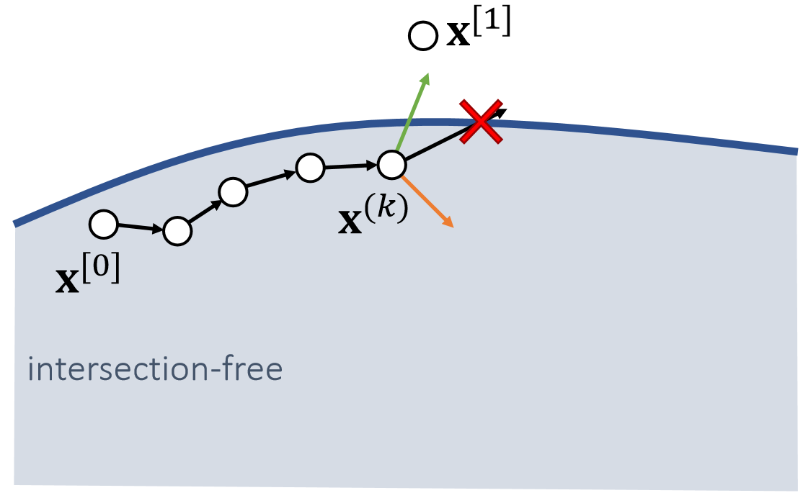
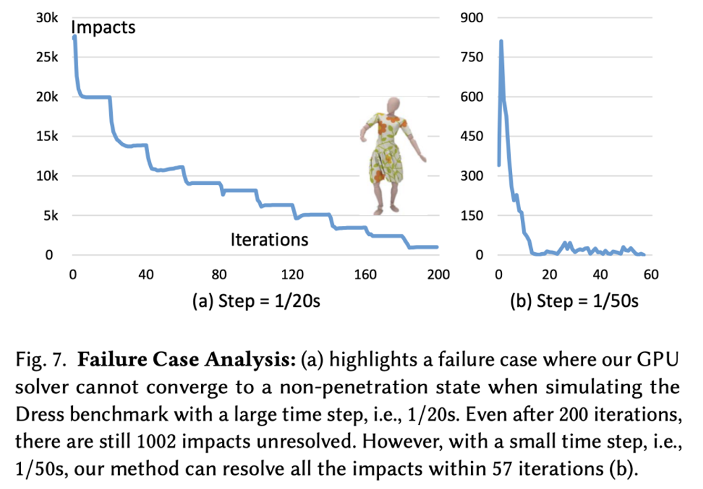
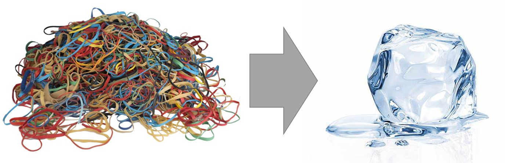
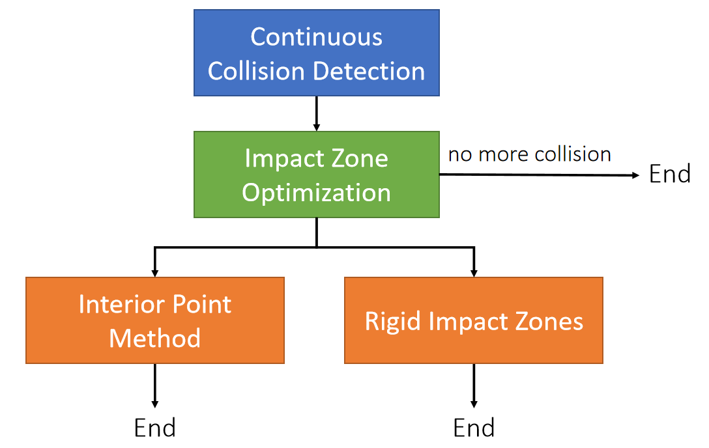

P27   
## Interior Point Methods and Impact Zone Optimization    

P28   
## Two Continuous Collision Response Approaches    

Given the calculated next state \\(\mathbf{x} ^{[1]}\\), we want to update it into \\(\bar{\mathbf{x} } ^{[1]}\\), such that the path from \\(\mathbf{x} ^{[0]}\\) to \\(\bar{\mathbf{x} } ^{[1]}\\) is intersection-free.    

   

> &#x2705; 蓝色区域为安全区域     
内点法：从\\(\mathbf{x}^{[0]}\\)出来，朝\\(\mathbf{x}^{[1]}\\)走，并永远保证只在安全区域走，直到不能走为止。    
Impact Zone 法，从\\(\mathbf{x}^{[1]}\\)出发，反复优化结果（投影），直到回到安全区域为止。    

> &#x2705;发现碰撞的pairs后如何处理。   

P29  
### Pros and Cons    

 - Slow.    
    - Far from solution.    
    - All of the vertices.    
    - Cautiously by small step sizes.    
 - Always succeed.   

   

 - Fast. 
    - Close to solution. 
    - Only vertices in collision (impact zones). 
    - Can take large step sizes. 
 - May not succeed.

   

> &#x2705; 内点：为保证每一步安全，步长不能太大，因此慢、哪怕\\(\mathbf{\bar{x}}^{[1]}\\)最终没有到最佳位置，但能保证一定在安全区域，因此一定成功。\\(\mathbf{x}^{[0]}\\)和\\(\mathbf{x}^{[1]}\\)可能比较远，也导致慢。   
Impact Zone：\\(\mathbf{x}^{[1]}\\)通常离安全区域不太远，且优化时只针对 Impact Zone 优化，因此快。  

> &#x2705;内点法慢的原因2没有解释。   

P30   
## Log-Barrier Interior Point Methods   

For simplicity, let’s consider the Log-barrier repulsion between two vertices.     

> $$E(\mathbf{x} )=−\rho \text{ log} ||\mathbf{x} _{ij}||$$    

> $$
\mathbf{f} _i(\mathbf{x} )=−∇_iE=ρ\frac{\mathbf{x} _ {ij}}{||\mathbf{x} _ {ij}||^2} \\\\
\mathbf{f} _j(\mathbf{x} )=−∇_jE=−ρ\frac{\mathbf{x} _ {ij}}{||\mathbf{x} _{ij}||^2}
$$

   

> &#x2705; 用 Log 定义能量、前面某一节课讲过，   
不需要互斥力一直存在，因此做了一个截断（IPC）      

> &#x2705;距离 → 能量 → 斥力    

P31   
### Interior Point Methods – Implementation      

We can then formulate the problem as:   

$$
\bar{\mathbf{x} }^ {[1]}\longleftarrow \mathrm{argmin} _\mathbf{x} (\frac{1}{2} ||\mathbf{x} −\mathbf{x} ^{[1]}||^2−ρ\sum \mathrm{log} ||\mathbf{x} _{ij}||)
$$

Gradient Descent:    

>\\(\mathbf{x} ^{(0)}\longleftarrow \mathbf{x} ^{[0]}\\)   
For \\(k=0…K\\)    
$$\mathbf{x} ^{(k+1)}\longleftarrow \mathbf{x} ^{(k)}+α(\mathbf{x} ^{[1]}−\mathbf{x} ^{(k)}+ρ\sum \frac{\mathbf{x} _{ij}}{||\mathbf{x} _{ij}||^2})$$ 
\\(\bar{\mathbf{x} }^ {[1]}\longleftarrow \mathbf{x} ^{(k+1)}\\)

The step size \\({\color{Red} α}\\) must be adjusted to ensure that no collision happens on the way.  To find \\({\color{Red} α}\\), **we need collision tests**.    

   

> &#x2705; 绿色是来自\\(\mathbf{x}^{[1]}\\)的引力，黄色是来自边界的斥力、关键是步长\\(\alpha \\)， 每走一小步都需要反复的碰撞检测。   

> &#x2705;优化目标：点的位置与目标位置（穿模）尽量接近，然后优化。   

P32    
## Impact Zone Optimization    

The goal of impact zone optimization is to optimize \\(\mathbf{x}^{[1]}\\) until it becomes intersection-free. (This potentially suffers from the tunneling issue, but it’s uncommon.)     

$$
\bar{\mathbf{x} }^{[1]}\longleftarrow \mathrm{argmin} _\mathbf{x}  \frac{1}{2} ||\bar{\mathbf{x} }-\mathbf{x}^{[1]}||^2
$$  

$$
\text{such that}
\begin{cases}
 C(\mathbf{x} )=−(\mathbf{x} _3−b_0\mathbf{x} _0−b_1\mathbf{x} _1−b_2\mathbf{x} _1)\cdot \mathbf{N} ≤0 & \text{ For each detected vertex-triangle pair }  \\\\
 C(\mathbf{x} )=−(b_2\mathbf{x} _2+b_3\mathbf{x} _3−b_0\mathbf{x} _0−b_1\mathbf{x} _1)\cdot \mathbf{N}≤0 & \text{ For each detected edge-edge pair }
\end{cases}
$$

   

> &#x2705; 利用 constrain（不是能量）转化成优化问题，具体没讲。  

P33   
## Geometric Impulse   

The goal of impact zone optimization is to optimize \\(\mathbf{x}^{[1]}\\) until it becomes intersection-free. (This potentially suffers from the tunneling issue, but it’s uncommon.)     

   

Every pair gives new positions to the involved vertices.  We can combine them together in a Jacobi, or Gauss-Seidel fashion, just like position-based dynamics.     

P34    
## After-Class Reading (Cont.)   

Bridson et al. 2002. *Robust Treatment of Collisions, Contact
and Friction for Cloth Animation. TOG (SIGGRAPH)*.     

Relative simple explicit integration of cloth dynamics     

P35   
## Augmented Lagrangian     

$$
\bar{\mathbf{x} }^{[1]}\longleftarrow \text{argmin} _\mathbf{x}  \frac{1}{2} ||{\mathbf{x} }-\mathbf{x}^{[1]}||^2
$$  

$$
\text{such that}
\begin{cases}
 C(\mathbf{x} )=−(\mathbf{x} _3−b_0\mathbf{x} _0−b_1\mathbf{x} _1−b_2\mathbf{x} _1)\cdot \mathbf{N} ≤0 & \text{ For each detected vertex-triangle pair }  \\\\
 C(\mathbf{x} )=−(b_2\mathbf{x} _2+b_3\mathbf{x} _3−b_0\mathbf{x} _0−b_1\mathbf{x} _1)\cdot \mathbf{N}≤0 & \text{ For each detected edge-edge pair }
\end{cases}
$$

  

P36   
## Augmented Lagrangian    

We can then convert it into an unconstrained form:   

$$\bar{\mathbf{x} } {[1]}\longleftarrow \text{argmin}_{x,λ}(\frac{1}{2} ||\mathbf{x} −\mathbf{x} ^{[1]}||^2+\frac{ρ}{2} ||\text{max}(\tilde{C}  (\mathbf{x} ))||^2−\frac{1}{2ρ}||\mathbf{λ} ||^2)
$$

$$
\tilde{C}  (\mathbf{x})= \text{max}(\mathbf{C} (\mathbf{x} )+\mathbf{λ} /ρ)
$$

Augmented Lagrangian:    

> \\(\mathbf{x} ^{(0)} \longleftarrow \mathbf{x} ^{[0]}\\)    
\\(\mathbf{λ \longleftarrow 0} \\)    
For \\(k=0…K\\)    
$$\mathbf{x} ^{(k+1)} \longleftarrow \mathbf{x} ^{(k)}−α∇(\frac{1}{2} ||\mathbf{x} −\mathbf{x} ^{[1]}||^2+\frac{ρ}{2} ||\text{max}(\tilde{C} (\mathbf{x} ))||^2−\frac{1}{2ρ}||\mathbf{λ} ||^2)$$  
\\(λ\longleftarrow ρ\tilde{C} (\mathbf{x} )\\)   
\\(\bar{\mathbf{x} } ^{[1]}\longleftarrow \mathbf{x} ^{(k+1)}\\)

Tang et al. 2018. I-Cloth: *Incremental Collision Handling for GPU-Based Interactive Cloth Simulation*. TOG. (SIGGRAPH Asia)    

P37   
## About Impact Zone Optimization   

 - Fast per iteration    
    - Only have to deal with vertices in collision.    

 - Convergence sensitive to \\(||\mathbf{x} ^{[0]}−\mathbf{x} ^{[1]}||^2\\), or the time step \\(∆t\\)      
    - Can take many iterations to, or never achieve *intersection-free*.   
    - Easy solution is to reduce \\(∆t\\), but that increases total costs.    

    

P38    
## Rigid Impact Zones    

The rigid impact zone method simply freezes vertices in collision from **moving in their pre-collision state**. It’s simple and safe, but has noticeable artifacts.     

    

> &#x2705;检测到碰撞，则把这个区域退回到上一帧。   

P39   
## A Practical System   

    

> &#x2705; 有碰撞，先做 Impact Zone. 因为这个快、不能解决再用后面方法、计算量不允许则选择 Rigid Impact.   

P40   
## Untangling Cloth    

P41   
## Intersection Elimination   

 - Let’s consider how to eliminate existing intersections, but without using any collision history.   
 
 - Such a method is useful when there are already intersections in simulation, due to:    
    - Past collision handling failures
    - Intense user interaction
 - In this case, we don’t require the simulation is to always <u>intersection-free</u>.     
 
     

> &#x2753; 相交解除跟碰撞处理有什么区别？   

P42   
## Intersection Elimination

Eliminating cloth-volume and volume-volume intersections is straightforward: simply pushing vertices/edges in the volume out.     

    

P43   
## Untangling Cloth    

The situation is complicated in cloth-cloth intersection, since we don’t have a clear definition of inside and outside.      

Baraff et al. used flood-fill to segment cloth into regions and decided which region is in intersection. (**Cannot handle boundary well**.)    

    

Baraff et al. 2003. Untangling Cloth. TOG (SIGGRAPH)   

> &#x2705; 两根线没有里面外面之分，因此相交时不知道哪一段是正确的。此方法缺点：1. 无法处理边界；2. 难以在 GPU 上实 现；  

> &#x2705;P42适用于有体积的物体，但布没有封闭体积，没有里外。   
方法：对布分段，根据分段区域决定谁在上谁在下，以此为依据推动顶点。   

P44  
## Untangling Cloth    

    

Baraff et al. 2003. Untangling Cloth. TOG (SIGGRAPH)    

> &#x2705;缺点：1. 难以处理边界；2. 对整个面进行评估，难以用于GPU.   

P45   
## Untangling Cloth    

Volino and Magnenat-Thalmann proposed to untangle cloth by reducing the
intersection contour.     
Their method can handle boundaries, but it doesn’t always work.    

    

> &#x2705; 两个面相交会产生一条曲线，目标是让曲线变短。优点：可以处理边界；缺点：基于局部优化、可用于 GPU。   

> &#x2705;可以处理边界情况，缩短边界也能解除相交。   

P46   
## After-Class Reading   

Volino and Magnenat-Thalmann et al. 2006. *Resolving
Surface Collisions through Intersection Contour
Minimization*. TOG (SIGGRAPH).   

P47   
## A Summary For the Day   

 - Collision handling involves two steps: *collision detection* and *collision response*.    
 
 - Collision detection contains two phases: *broad-phase culling* and *narrow-phase test*.    
 
 - There are two types of collision detection tests: *discrete* and *continuous*.    
 
 - Similarly, there are discrete and continuous collision responses.   
 
 - For continuous collision responses, we must update the state to become collisionfree state. There are two approaches: *interior point method* and *impact zone optimization*. **Rigid impact zone is also a method, but it’s problematic**.    

 - For discrete collision responses, we allow intersections to stay and hope to remove them in long turn. **Cloth-cloth intersections are difficult to handle**.    

> &#x2705; 考虑摩擦，通常把摩擦做为后处理，但这样结果不精确。如果同时处理摩擦和碰撞、会很复杂。   

> &#x2705;Impulse方法的碰撞检测通常用SDF．但很多形变体无法使用SDF.    
Impulse响应方式是离散响应方式，无法处理穿透问题。   
碰撞开源代码：bullet. physics X   

---------------------------------------
> 本文出自CaterpillarStudyGroup，转载请注明出处。
>
> https://caterpillarstudygroup.github.io/GAMES103_mdbook/