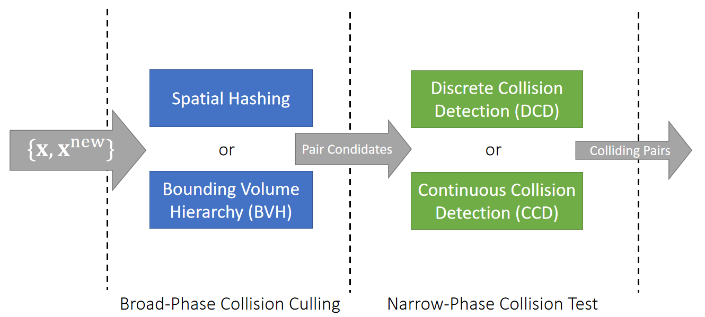
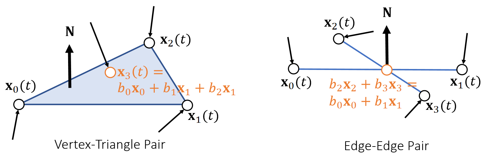
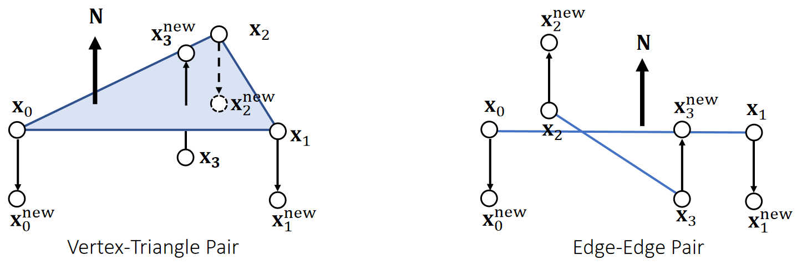

P3
## Collision Detection   

P4  
## Collision Detection Pipeline    

    

P5    
## Spatial Partitioning    

Spatial partitioning divides the space by a grid and stores objects into grid cells.     

P6   

To find pair candidates for collision test, we just have to check the grid cells.      

    

P7   
## Spatial Partitioning    

If we need to consider moving objects, we just expand the object region.    

    

P8   
## Spatial Partitioning    

P8   
Instead of allocating **memories** to cells, we can build an object-cell list and then sort them. This avoids memories wasted in empty cells.     

    

    

P9   
## Morton Code   

One question is how to define the cell ID. Using the grid order is not optimal, since it cannot be easily extended and it is lack of locality. Morton code uses a Z-pattern instead.     

    

    

P10   
## After-Class Reading   

GPU Gems 3    

Chapter 32. Broad-Phase Collision Detectionwith CUDA    

P14   
## Bounding Volume Hierarchy

Bounding volume hierarchy is built on geometric/topological proximity of objects.     

    

P15   
## Bounding Volume Hierarchy  

To find elements potentially in collision with an object, we just traverse the tree.    

    

P16  
## Bounding Volume Hierarchy   

<u>Axis-aligned bounding box (AABB)</u> is the most popular bounding volume. Besides that, there are also <u>spheres</u> and <u>oriented bounding box (OBB)</u>.     

Two AABBs intersect if and only if they intersect in every axis.     

P17    
## Bounding Volume Hierarchy    

To process **self collisions** by BVH, we define two procedures.     

|  Process_Node(A)   {   For every A’s child: B Process_Node(B)   For every A’s children pair <B, C>   if B and C intersect   Process_Pair(B, C)   } |  
|:-----|  

$$\quad$$

| Process_Pair(B, C)   {   For every B’s child: B’ For every C’s child: C’   if B’ and C’ intersect   Process_Pair(B’, C’) }  |  
|:-----| 

   

P18   
## Bounding Volume Hierarchy   

The performance depends on the effectiveness of culling.    

| Process_Node(A)   {   For every A’s child: B Process_Node(B)   For every A’s children pair <B, C>  if B and C intersect ⟵ Zheng and James. 2012. *Energy-based Self-Collision Culling for Arbitrary Mesh Deformations*. TOG (SIGGRAPH)   Process_Pair(B, C) }  |  
|:-----| 

$$\quad$$

| Process_Pair(B C)         {      For every B’s child: B’   For every C’s child: C’        if B’ and C’ intersect    Process_Pair(B’, C’)       } |  
|:-----|    

   

P19   
## Comparison between SH and BVH   

 - Spatial Hashing    
    - Easy to implement    
    - GPU friendly    
    - Needs to <u>recompute</u> after updating objects    

 - Bounding Volume Hierarchy    
    - More involved    
    - Not GPU friendly    
    - To update BVH, just update bounding volumes    
    
    
P20   
## Collision Detection Pipeline    

   

P21   
## Discrete Collision Detection (DCD)    

DCD tests if any intersection exists in each state at discrete time instant: \\(\mathbf{x}^{[0]}\\), \\(\mathbf{x}^{[1]}\\), …

To a triangle mesh, the basic test is <u>edge-triangle intersection</u> test.     

   

   

P22   
## Tunneling   

DCD is simple and robust, but it suffers from the tunneling problem: objects penetrating through each other without being detected.     

   

P23   
## Continuous Collision Detection (CCD)    

CCD tests if any intersection exists between two states: \\(\mathbf{x} ^{[0]}\\) and \\(\mathbf{x} ^{[1]}\\).    

To a triangle mesh, there two basic tests: <u>vertex-triangle</u> and <u>edge-edge</u> tests.      

   

   

P24   
## Continuous Collision Detection (CCD)   

CCD tests if any intersection exists between two states: \\(\mathbf{x} ^{[0]}\\) and \\(\mathbf{x} ^{[1]}\\).      

To a triangle mesh, there two basic tests: <u>vertex-triangle</u> and <u>edge-edge</u> tests.       

   

   

P25   
## Issues with CCD   

 - Floating-point errors, especially due to root finding of a cubic equation    
    - Buffering epsilons, but that causes **false positives**.     
    - Gaming GPUs often use single floating-point precision.   

 - Computational costs: more expensive than DCD.   
    - Some argue that broad-phase collision culling is the bottleneck.   

 - Difficulty in implementation.    
 
 

P26   
## After-Class Reading    

Bridson et al. 2002. *Robust Treatment of Collisions, Contact
and Friction for Cloth Animation. TOG (SIGGRAPH)*.    

Relative simple explicit integration of cloth dynamics    

P27   
## Interior Point Methods and Impact Zone Optimization    

P28   
## Two Continuous Collision Response Approaches    

Given the calculated next state \\(\mathbf{x} ^{[1]}\\), we want to update it into \\(\bar{\mathbf{x} } ^{[1]}\\), such that the path from \\(\mathbf{x} ^{[0]}\\) to \\(\bar{\mathbf{x} } ^{[1]}\\) is intersection-free.    

   

P29  
## Pros and Cons    

 - Slow.    
    - Far from solution.    
    - All of the vertices.    
    - Cautiously by small step sizes.    
 - Always succeed.   

   

 - Fast. 
    - Close to solution. 
    - Only vertices in collision (impact zones). 
    - Can take large step sizes. 
 - May not succeed.

   

P30   
## Log-Barrier Interior Point Methods   

For simplicity, let’s consider the Log-barrier repulsion between two vertices.     

> $$E(\mathbf{x} )=−\rho \text{ log} ||\mathbf{x} _{ij}||$$    

> $$
\mathbf{f} _i(\mathbf{x} )=−∇_iE=ρ\frac{\mathbf{x} _ {ij}}{||\mathbf{x} _ {ij}||^2} \\\\
\mathbf{f} _j(\mathbf{x} )=−∇_jE=−ρ\frac{\mathbf{x} _ {ij}}{||\mathbf{x} _{ij}||^2}
$$

   

P31   
## Interior Point Methods – Implementation      

We can then formulate the problem as:   

$$
\bar{\mathbf{x} }^ {[1]}\longleftarrow \mathrm{argmin} _\mathbf{x} (\frac{1}{2} ||\mathbf{x} −\mathbf{x} ^{[1]}||^2−ρ\sum \mathrm{log} ||\mathbf{x} _{ij}||)
$$

Gradient Descent:    

>\\(\mathbf{x} ^{(0)}\longleftarrow \mathbf{x} ^{[0]}\\)   
For \\(k=0…K\\)    
$$\mathbf{x} ^{(k+1)}\longleftarrow \mathbf{x} ^{(k)}+α(\mathbf{x} ^{[1]}−\mathbf{x} ^{(k)}+ρ\sum \frac{\mathbf{x} _{ij}}{||\mathbf{x} _{ij}||^2})$$ 
\\(\bar{\mathbf{x} }^ {[1]}\longleftarrow \mathbf{x} ^{(k+1)}\\)

The step size \\({\color{Red} α}\\) must be adjusted to ensure that no collision happens on the way.  To find \\({\color{Red} α}\\), **we need collision tests**.    

   

P32    
## Impact Zone Optimization    

The goal of impact zone optimization is to optimize \\(\mathbf{x}^{[1]}\\) until it becomes intersection-free. (This potentially suffers from the tunneling issue, but it’s uncommon.)     

$$
\bar{\mathbf{x} }^{[1]}\longleftarrow \mathrm{argmin} _\mathbf{x}  \frac{1}{2} ||\bar{\mathbf{x} }-\mathbf{x}^{[1]}||^2
$$  

$$
\text{such that}
\begin{cases}
 C(\mathbf{x} )=−(\mathbf{x} _3−b_0\mathbf{x} _0−b_1\mathbf{x} _1−b_2\mathbf{x} _1)\cdot \mathbf{N} ≤0 & \text{ For each detected vertex-triangle pair }  \\\\
 C(\mathbf{x} )=−(b_2\mathbf{x} _2+b_3\mathbf{x} _3−b_0\mathbf{x} _0−b_1\mathbf{x} _1)\cdot \mathbf{N}≤0 & \text{ For each detected edge-edge pair }
\end{cases}
$$

   

P33   
## Geometric Impulse   

The goal of impact zone optimization is to optimize \\(\mathbf{x}^{[1]}\\) until it becomes intersection-free. (This potentially suffers from the tunneling issue, but it’s uncommon.)     

   

Every pair gives new positions to the involved vertices.  We can combine them together in a Jacobi, or Gauss-Seidel fashion, just like position-based dynamics.     

P34    
## After-Class Reading (Cont.)   

Bridson et al. 2002. *Robust Treatment of Collisions, Contact
and Friction for Cloth Animation. TOG (SIGGRAPH)*.     

Relative simple explicit integration of cloth dynamics     

P35   
## Augmented Lagrangian     

$$
\bar{\mathbf{x} }^{[1]}\longleftarrow \text{argmin} _\mathbf{x}  \frac{1}{2} ||{\mathbf{x} }-\mathbf{x}^{[1]}||^2
$$  

$$
\text{such that}
\begin{cases}
 C(\mathbf{x} )=−(\mathbf{x} _3−b_0\mathbf{x} _0−b_1\mathbf{x} _1−b_2\mathbf{x} _1)\cdot \mathbf{N} ≤0 & \text{ For each detected vertex-triangle pair }  \\\\
 C(\mathbf{x} )=−(b_2\mathbf{x} _2+b_3\mathbf{x} _3−b_0\mathbf{x} _0−b_1\mathbf{x} _1)\cdot \mathbf{N}≤0 & \text{ For each detected edge-edge pair }
\end{cases}
$$

  

P36   
## Augmented Lagrangian    

We can then convert it into an unconstrained form:   

$$\bar{\mathbf{x} } {[1]}\longleftarrow \text{argmin}_{x,λ}(\frac{1}{2} ||\mathbf{x} −\mathbf{x} ^{[1]}||^2+\frac{ρ}{2} ||\text{max}(\tilde{C}  (\mathbf{x} ))||^2−\frac{1}{2ρ}||\mathbf{λ} ||^2)
$$

$$
\tilde{C}  (\mathbf{x})= \text{max}(\mathbf{C} (\mathbf{x} )+\mathbf{λ} /ρ)
$$

Augmented Lagrangian:    

> \\(\mathbf{x} ^{(0)} \longleftarrow \mathbf{x} ^{[0]}\\)    
\\(\mathbf{λ \longleftarrow 0} \\)    
For \\(k=0…K\\)    
$$\mathbf{x} ^{(k+1)} \longleftarrow \mathbf{x} ^{(k)}−α∇(\frac{1}{2} ||\mathbf{x} −\mathbf{x} ^{[1]}||^2+\frac{ρ}{2} ||\text{max}(\tilde{C} (\mathbf{x} ))||^2−\frac{1}{2ρ}||\mathbf{λ} ||^2)$$  
\\(λ\longleftarrow ρ\tilde{C} (\mathbf{x} )\\)   
\\(\bar{\mathbf{x} } ^{[1]}\longleftarrow \mathbf{x} ^{(k+1)}\\)

Tang et al. 2018. I-Cloth: *Incremental Collision Handling for GPU-Based Interactive Cloth Simulation*. TOG. (SIGGRAPH Asia)    

P37   
## About Impact Zone Optimization   

 - Fast per iteration    
    - Only have to deal with vertices in collision.    

 - Convergence sensitive to \\(||\mathbf{x} ^{[0]}−\mathbf{x} ^{[1]}||^2\\), or the time step \\(∆t\\)      
    - Can take many iterations to, or never achieve *intersection-free*.   
    - Easy solution is to reduce \\(∆t\\), but that increases total costs.    

    

P38    
## Rigid Impact Zones    

The rigid impact zone method simply freezes vertices in collision from **moving in their pre-collision state**. It’s simple and safe, but has noticeable artifacts.     

    

P39   
## A Practical System   

    

P40   
## Untangling Cloth    

P41   
## Intersection Elimination   

 - Let’s consider how to eliminate existing intersections, but without using any collision history.   
 
 - Such a method is useful when there are already intersections in simulation, due to:    
    - Past collision handling failures
    - Intense user interaction
 - In this case, we don’t require the simulation is to always <u>intersection-free</u>.     
 
     

P42   
## Intersection Elimination

Eliminating cloth-volume and volume-volume intersections is straightforward: simply pushing vertices/edges in the volume out.     

    

P43   
## Untangling Cloth    

The situation is complicated in cloth-cloth intersection, since we don’t have a clear definition of inside and outside.      

Baraff et al. used flood-fill to segment cloth into regions and decided which region is in intersection. (**Cannot handle boundary well**.)    

    

Baraff et al. 2003. Untangling Cloth. TOG (SIGGRAPH)   

P44  
## Untangling Cloth    

    

Baraff et al. 2003. Untangling Cloth. TOG (SIGGRAPH)    

P45   
## Untangling Cloth    

Volino and Magnenat-Thalmann proposed to untangle cloth by reducing the
intersection contour.     
Their method can handle boundaries, but it doesn’t always work.    

    

P46   
## After-Class Reading   

Volino and Magnenat-Thalmann et al. 2006. *Resolving
Surface Collisions through Intersection Contour
Minimization*. TOG (SIGGRAPH).   

P47   
## A Summary For the Day   

 - Collision handling involves two steps: *collision detection* and *collision response*.    
 
 - Collision detection contains two phases: *broad-phase culling* and *narrow-phase test*.    
 
 - There are two types of collision detection tests: *discrete* and *continuous*.    
 
 - Similarly, there are discrete and continuous collision responses.   
 
 - For continuous collision responses, we must update the state to become collisionfree state. There are two approaches: *interior point method* and *impact zone optimization*. **Rigid impact zone is also a method, but it’s problematic**.    

 - For discrete collision responses, we allow intersections to stay and hope to remove them in long turn. **Cloth-cloth intersections are difficult to handle**.    
