P3  
## Strain Limiting and Position Based Dynamics    

P4  
## The Stiffness Issue    

 - Real-world fabrics resist strongly to stretching, once they stretch beyond certain limits.   
 
 - But, increasing the stiffness can cause problems.  
     - Explicit integrators will be *unstable*    
       - Solution: smaller time steps and more **computational time**.    
     - The linear systems involved in Implicit integrators will be *ill-conditioned*.     
       - Solution: more iterations and **computational time**.   
 - Can we achieve high stiffness, with a low computational cost?    

P5   
## A Single Spring   

If a spring is infinitely stiff, we can treat the length as a constraint and define a projection function.      

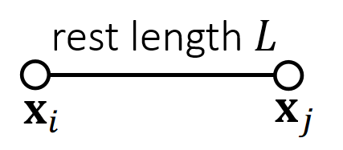    

\\(\mathbf{ϕ} (\mathbf{x} )=||\mathbf{x} _i− \mathbf{x} _j||−L=0\\)      
Constraint     

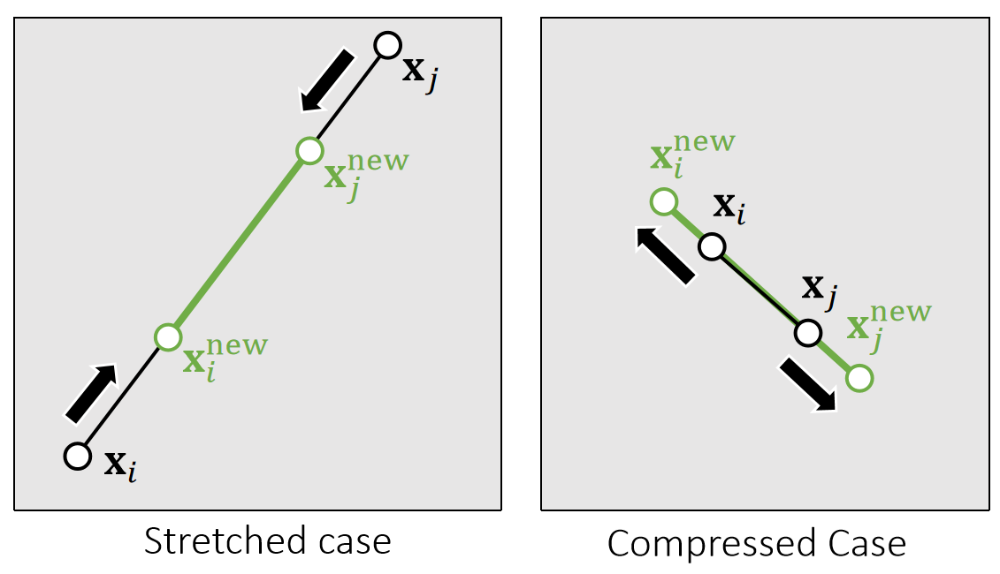    

> &#x2705; projection function.投影函数、会移动端点使弹簧满足约束。   

P6   
## A Single Spring    

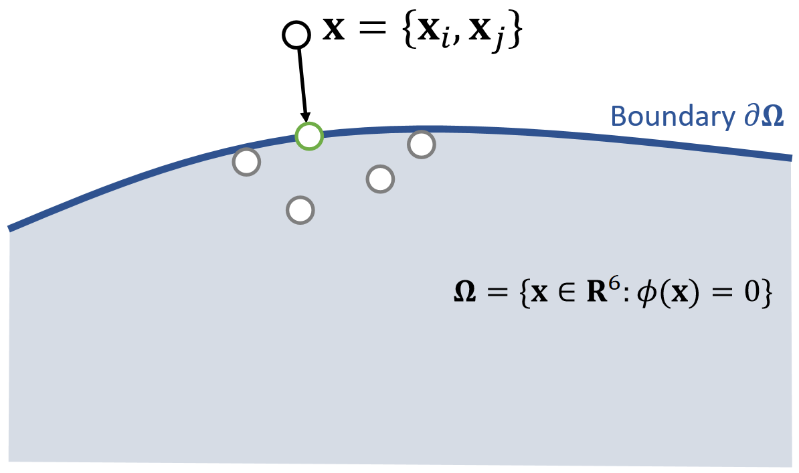    

{\\(\mathbf{x} _i^{\mathbf{new}},\mathbf{x} _j^{\mathbf{new} }\\)}= argmin \\( \frac{1}{2}\\){\\(m_i||\mathbf{x} _i^{\mathbf{new} }−\mathbf{x} _i||^2+m_j||\mathbf{x} _j^{\mathbf{new}} −\mathbf{x} _j||^2\\)}    

such that  \\(\mathbf{ϕ} (\mathbf{x} )=0\\)

> &#x2705; 把\\(\mathbf{x}_ i\\)和\\(\mathbf{x}_ j\\)拼成6维空间中的点\\(\mathbf{x}\\)，满足约束的\\(\mathbf{x}\\)构成6D空间中的一块区域；投影函数的目标：(1)把\\(\mathbf{x}\\)移到区域内。 (2)移动距离最短，因此构成优化问题。    

P7   
## A Single Spring     

 
$$
\mathbf{x} ^{\mathbf{new} } \longleftarrow  \mathrm{Projection} (\mathbf{x})
$$   

$$
\mathbf{x} _i^{\mathbf{new} }\longleftarrow \mathbf{x} _i−\frac{m_j}{m_i+m_j} (||\mathbf{x} _i−\mathbf{x} _j||−L)\frac{\mathbf{x} _i−\mathbf{x}_j}{||\mathbf{x} _i−\mathbf{x} _j||} 
$$
   
$$
\mathbf{x} _j^{\mathbf{new} }\longleftarrow \mathbf{x} _j+\frac{m_i}{m_i+m_j} (||\mathbf{x} _i−\mathbf{x} _j||−L)\frac{\mathbf{x} _i−\mathbf{x}_j}{||\mathbf{x} _i−\mathbf{x} _j||} 
$$

$$
\quad
$$

$$
\mathbf{ϕ} (\mathbf{x} ^{\mathbf{new} })=||\mathbf{x} _i^{\mathbf{new} }− \mathbf{x} _j^{\mathrm{new} }||−L=||\mathbf{x} _i−\mathbf{x} _j−\mathbf{x} _i+\mathbf{x} _j+L||−L=0
$$

By default, \\(m_i=m_j\\), but we can also set \\(m_i=\infty\\) for stationary nodes.   

> &#x2705; 对推导结果的合理性解释：(1) 移到前后质心不变。(2) 移到方向为沿着或远离质心。(3) 移到距离与自身重量有关。   

P8   
## Multiple Springs – A Gauss-Seidel Approach    

What about multiple springs? The Gauss-Seidel approach **projects each spring sequentially in a certain order**. Imagine two springs with unit rest lengths…

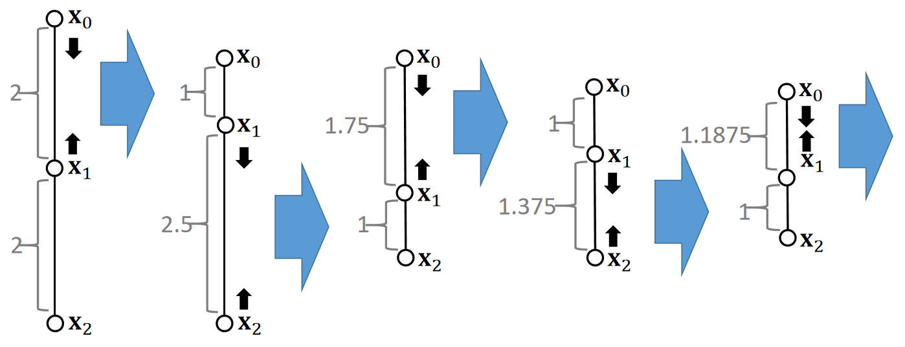    

P9   

> Projection (by Gauss-Seidel)     
\\(\quad\quad\\) For \\(k=0…K\\)    
For every edge \\(e\\) = {\\(i,j\\)}    
$$
\mathbf{x} _i\longleftarrow \mathbf{x} _i−\frac{1}{2} (||\mathbf{x} _i−\mathbf{x} _j||−L_e)\frac{\mathbf{x} _i−\mathbf{x}_j}{||\mathbf{x} _i−\mathbf{x} _j||}   
$$
$$
\mathbf{x} _j\longleftarrow \mathbf{x} _j+\frac{1}{2} (||\mathbf{x} _i−\mathbf{x} _j||−L_e)\frac{\mathbf{x} _i−\mathbf{x}_j}{||\mathbf{x} _i−\mathbf{x} _j||} 
$$

 - We cannot ensure the satisfaction of every constraint. But the more iterations we use, the better those constraints are satisfied.    

 - Although the name is related to Gauss-Seidel, it differs from Gauss-Seidel. It is more relevant to stochastic gradient descent (in machine learning).    

 - The order matters. The order can cause bias and affect convergence behavior.     

P10  
## Multiple Springs – A Jacobi Approach   

 - To avoid bias, the Jacobi approach projects all of the edges **simultaneously** and then linearly blend the results.    

 - The problem is an even lower convergence rate. 

 - Again, the more iterations it uses, the better the constraints are enforced.    

$$
\quad
$$

Projection (by Jacobi)    
For \\(k = 0…K\\)    
For every vertex \\(i\\)    

$$
\mathbf{x} ^{\mathbf{new} }_i\longleftarrow 0
$$

$$
n _i\longleftarrow 0
$$

For every edge \\(e\\) = {\\(i,j\\)}     

$$
\mathbf{x}^{\mathbf{new} } _i\longleftarrow \mathbf{x}^{\mathbf{new} } _i+\mathbf{x}_i−\frac{1}{2} (||\mathbf{x} _i−\mathbf{x} _j||−L_e)\frac{\mathbf{x} _i−\mathbf{x}_j}{||\mathbf{x} _i−\mathbf{x} _j||}    
$$

$$
\mathbf{x}^{\mathbf{new} } _j\longleftarrow \mathbf{x}^{\mathbf{new} } _j+\mathbf{x}_j+\frac{1}{2} (||\mathbf{x} _i−\mathbf{x} _j||−L_e)\frac{\mathbf{x} _i−\mathbf{x}_j}{||\mathbf{x} _i−\mathbf{x} _j||}    
$$

$$
n _i\longleftarrow n_i+1
$$

$$
n _j\longleftarrow n_j+1
$$

For every vertex \\(i\\)     

$$
\mathbf{x} _i⟵(\mathbf{x} _i^{\mathbf{new} }+α\mathbf{x} _i)/(n_i+α)
$$

$$
\quad
$$

> &#x2705; 基于每条边计算\\(\mathbf{x}\\)的更新但不真的更新、每个点会得到多种更新方案，最后取更新方案的均值。   

P11   
## Position Based Dynamics (PBD)   

Position based dynamics (PBD) is based on the projection function.    

 - The stiffness behavior, i.e., how tightly constraints are enforced, is subject to **non-physical** factors. 
    - The number of iterations 
    - The mesh resolution
 - The velocity update following projection is important to dynamic effects. 
 
 - This method is applicable to other constraints as well, including triangle constraints, volume constraints, and collision constraints. 
    - To implement these constraints, simply define their
projection functions.    

$$
\quad
$$

A PBD Simulator     
//Do Simulation, update \\(\mathbf{x}\\) and \\(\mathbf{v}\\)     
$$
\mathbf{v}\longleftarrow\dots
$$

$$
\mathbf{x}\longleftarrow\dots   
$$   

//Now PBD starts.    

$$
\mathbf{x} ^{\mathbf{new} } \longleftarrow \mathrm{Projection} (\mathbf{x} )
$$    

$$
\mathbf{v}\longleftarrow \mathbf{v} +(\mathbf{x} ^{\mathbf{new} }−\mathbf{x})/∆t
$$

$$
\mathbf{x}\longleftarrow \mathbf{x} ^{\mathbf{new}}
$$

$$
\quad
$$

> &#x2705; 第一步：不考虑约束，基于粒子运动方法更新 \\(\mathbf{v}\\) 和 \\(\mathbf{x}\\)；第二步：基于约束和投影函数更新 \\(\mathbf{v}\\) 和 \\(t\\).    
问：PBD 非物理方法，怎么体现出弹性效果？  
答：迭代数多则弹性差、网格顶点少则弹性差。   

P12   
## Pros and Cons of PBD 

 - Pros    
    - Parallelable on GPUs (PhysX)    
    - Easy to implement    
    - Fast in low resolutions    
    - Generic, can handle other coupling and constraints, including fluids    
 - Cons    
     - Not physically correct    
     - Low performance in high resolutions    
       - Hierarchical approaches (can cause oscillation and other issues…)     
       - Acceleration approaches, like Chebyshev    
       

> &#x2705; 弹性表现受网格数量影响(难以控制)、没有所谓的精确解，哪怕迭代数足够多、迭代数过多会导致locking issue.   
PBD 适用于低分辨率场景、常见的低精度实时模拟的套路。 

P13   
## After-Class Reading    

Muller. 2008. *Hierarchical Position Based Dynamics*. VRIPHYS.

P14  
## Strain Limiting    

Strain limiting aims at using the projection function for **correction** only. 

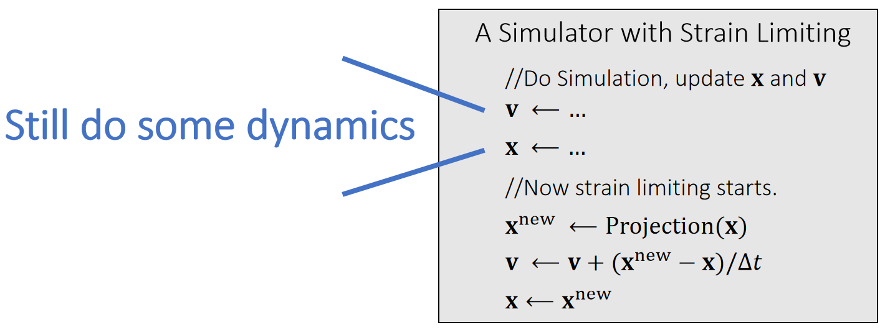    

> &#x2705; 投影函数作为模拟过程的后处理，防止模拟后产生大的形变，使模拟结果更稳定。    

|  | PBD | Strain Limiting | 
|----|----|----|
| 第一步  | 只考虑粒子运动，不考虑约束|模拟粒子运动、同时考虑约束|
| 第二步  |使粒子状态满足约束 | 校正，但约束较宽 |  

P15   
## Spring Strain Limit   

We can set the spring strain, i.e., the stretching ratio σ, to be within a limit.

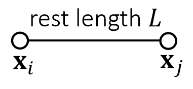    

$$
\sigma ^\mathrm{{min}}≤\frac{1}{L}||\mathbf{x} _i− \mathbf{x} _j||≤\sigma^\mathrm{{max}}
$$

Constraint

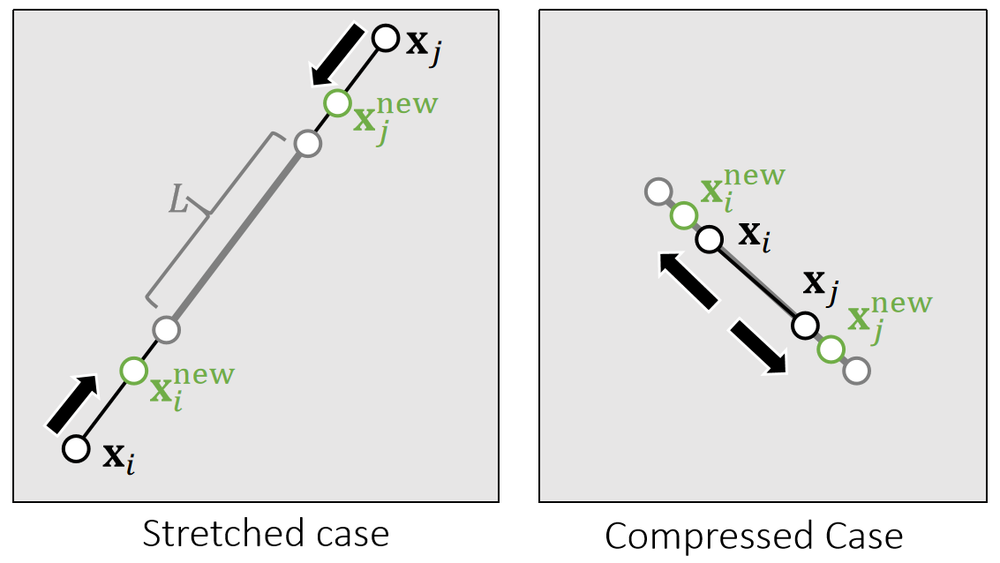    

 

> &#x2705; 这一页以弹簧为例子说明 Strain Limit   
Strain：物理上描述形变的量，即本页的\\(\sigma \\)   
Strain Limit 的应用场景：(1) 模拟布料：“拉伸到一定范围后变得非常 stiff” 的效果 (2) 防止“形变大发生数值不稳定”。    

P16  

$$
\quad
$$

$$
\mathbf{x}^{\mathbf{new}}\longleftarrow \mathrm{Projection}  (\mathbf{x} )
$$

$$
\sigma\longleftarrow \frac{1}{L}||\mathbf{x}_i− \mathbf{x}_j||
$$

$$
\sigma _0\longleftarrow \mathrm{min} (\mathrm{max} (\sigma,\sigma^{\mathrm{min} }),\sigma^{\mathrm{max} })
$$

$$
\mathbf{x} _i^{\mathrm {new} }⟵\mathbf{x} _i−\frac{m_j}{m_i+m_j}(||\mathbf{x} _i− \mathbf{x} _j||−σ_0L)\frac{\mathbf{x} _i− \mathbf{x} _j}{||\mathbf{x} _i− \mathbf{x} _j||}
$$

$$
\mathbf{x} _j^{\mathrm {new} }⟵\mathbf{x} _j+\frac{m_j}{m_i+m_j}(||\mathbf{x} _i− \mathbf{x} _j||−σ_0L)\frac{\mathbf{x} _i− \mathbf{x} _j}{||\mathbf{x} _i− \mathbf{x} _j||}
$$

$$
\quad
$$

\\(\mathrm{PBD}: \sigma _0≡1;\quad\quad\\)No limit: \\(\sigma ^{\mathrm{min} }, σ^{\mathrm{max} }\longleftarrow \infty\\)   

P17  
## Triangle Area Limit    

We can limit the triangle area as well. To do so, we define a scaling factor.     

{\\(\mathbf{x}_i^{\mathrm{new} },\mathbf{x}_i^{\mathrm{new} },\mathbf{x}_k^{\mathrm{new} }\\)}  = \\(\mathrm{argmin} \frac{1}{2} \\){\\(m_i||\mathbf{x}_i^{\mathrm{new} }−\mathbf{x}_i||^2+m_j||\mathbf{x}_j^{\mathrm{new} }−\mathbf{x}_j||^2+m_j||\mathbf{x}_k^{\mathrm{new} }−\mathbf{x}_k||^2\\)} 

such that the constraint is satisfied.   

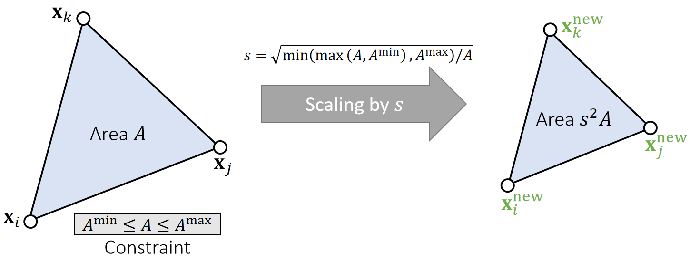    

P18   

$$
\quad
$$

$$
\mathbf{x} ^{\mathbf{new}} ⟵\mathrm{Projection} (\mathbf{x} )
$$

$$
\mathbf{A}\longleftarrow \frac{1}{2} ||(\mathbf{x} _j− \mathbf{x} _i)\mathbf{×} (\mathbf{x}_k− \mathbf{x} _i)||
$$

$$
\mathbf{s} \longleftarrow \sqrt{\mathrm{\mathrm{min}} (\mathrm{\mathrm{max}} (A,A^{\mathrm{min}}),A^{\mathrm{max}})/A}
$$

$$
\mathbf{c} \longleftarrow \frac{1}{m_i+m_j+m_k} (m_i\mathbf{x} _i+m_j\mathbf{x} _j+m_k\mathbf{x} _k)
$$

$$
\mathbf{x} _i^{\mathrm{new}}\longleftarrow \mathbf{c} +s(\mathbf{x} _i−\mathbf{c} )
$$

$$
\mathbf{x} _j^{\mathrm{new}}\longleftarrow \mathbf{c} +s(\mathbf{x} _j−\mathbf{c} )
$$

$$
\mathbf{x} _k^{\mathrm{new}}\longleftarrow \mathbf{c} +s(\mathbf{x} _k−\mathbf{c} )
$$

$$
\quad
$$

> &#x2705; C为质心，要求缩放前后质心不变。数学上、质心不变，点的移动最少；物理上，质心变了代表物体运动了，scale 不应该导致物理运动。   

P19   
## Strain Limiting in Simulation   

 - Strain limiting is widely used in physics- based simulation, typically for avoiding instability and artifacts due to large deformation.     

 - Strain limiting is useful for nonlinear effects, in a biphasic way.     
 - Strain limiting also helps address the locking issue.   
 
 
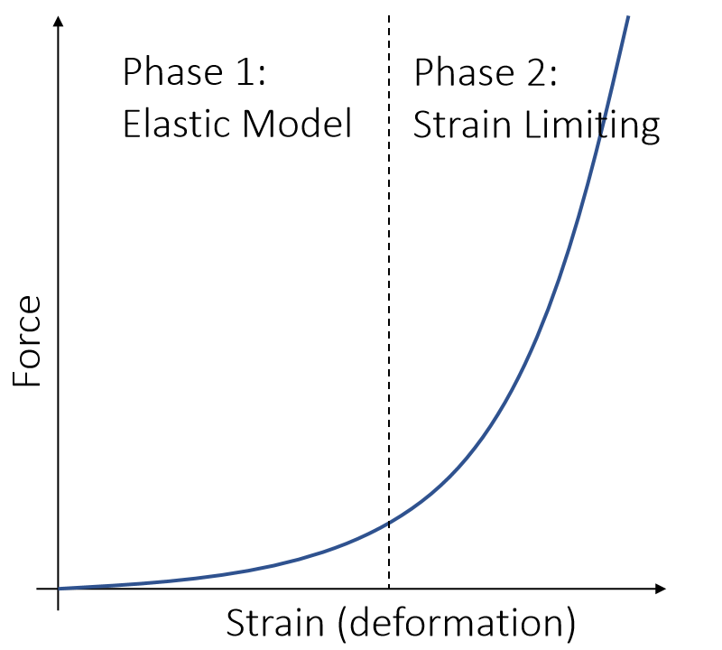    

P21    
## Projective Dynamics    

P22   
## Projective Dynamics     

Instead of blending projections in a Jacobi or Gauss-Seidel fashion as in PBD, projective dynamics uses <u>projection</u> to define a <u>quadratic</u> energy.      

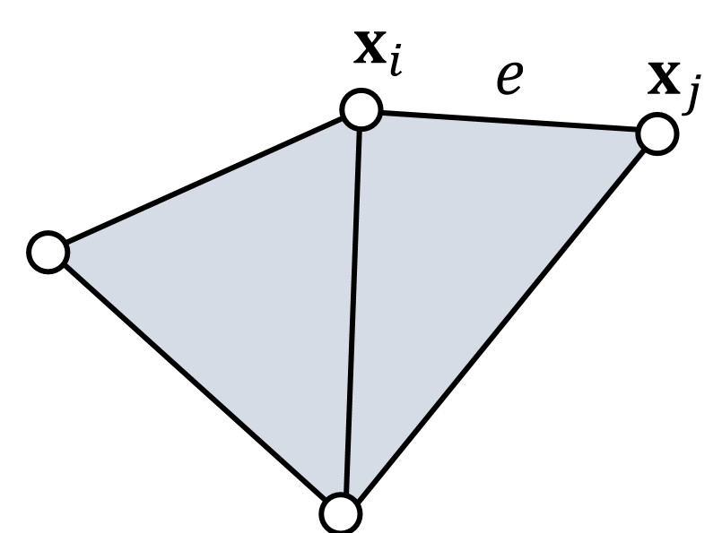    

$$
\quad
$$

\\(E(\mathbf{x} ) = {\textstyle \sum_{e = (i,j)}}\frac{1}{2} ||(\mathbf{x} _i−\mathbf{x} _j)−(\mathbf{x} _{e,i}^{\mathrm{new} }−\mathbf{x} _{e,j}^{\mathrm{new} })||^2\\)

{\\(\mathbf{x} _{e,i}^{\mathrm{new} },\mathbf{x} _{e,j}^{\mathrm{new} }\\)} = \\(\mathrm{Projection} _e(\mathbf{x}_i,\mathbf{x}_j)\\) for every edge \\(e\\)    

$$
\quad
$$

$$
\mathbf{f} _i=−\nabla_iE(\mathbf{x} )=−{\textstyle \sum _{e:i\in e}}(\mathbf{x} _i−\mathbf{x} _j)−(\mathbf{x} _{e,i}^{\mathrm{new}} −\mathbf{x} _{e,j}^{\mathrm{new} })
$$

> &#x2705; PBD:基于约束直接修改顶点位置    
本文 ① 基于约束定义能量、得到的结果与基于力的能量相同。   
$$ E(\mathbf{x})=\sum _{E=(i,j)}\frac{k}{2}(||\mathbf{x}_i-\mathbf{x}_j||-Le)^2 $$  
② 基于能量期望\\(\mathbf{x}_i\\)和 \\(\mathbf{x}_j\\)应该在的位置，但不真的移动\\(\mathbf{x}_i\\)和 \\(\mathbf{x}_j\\),论为\\(\mathbf{x}_i^{\mathrm{new} }\\)和 \\(\mathbf{x}_j^{\mathrm{new} }\\)    
③ 基于 \\(E(\mathbf{x})、\mathbf{x}_i^{\mathrm{new} } 、\mathbf{x}_j^{\mathrm{new} }\\) 计算力，此时假设\\(\mathbf{x}_i^{\mathrm{new} }\\)和 \\(\mathbf{x}_j^{\mathrm{new} }\\)都是定值，\\(\mathbf{x}_i\\)和 \\(\mathbf{x}_j\\)是变量。   
所得的力与基于弹簧力算出的力相同   
既然 \\(E\\) 和 \\(F\\) 是一样的，何必多此一举? 答：不同。   

P23   
## Projective Dynamics – Explained   

Instead of blending projections in a Jacobi or Gauss-Seidel fashion as in PBD, <u>projective</u> dynamics uses projection to define a <u>quadratic</u> energy.     

    

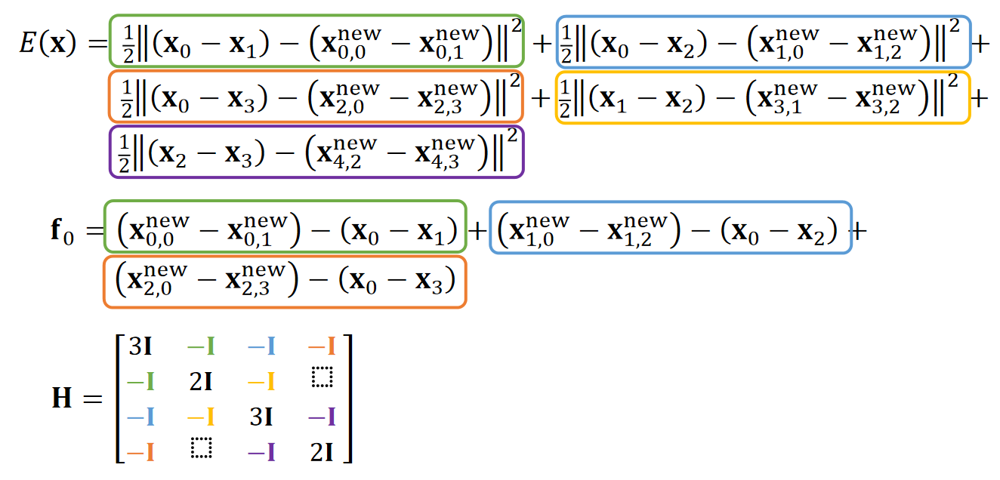    

> &#x2753; 为什么能简化\\(\mathbf{H}\\)的计算？答：在计算某一个端点时，假设另一个端点不动（常量），那么能量就是只关于这个端点的二次函数     

P24  
## Projective Dynamics – Shape Matching

Shape matching is also projective dynamics, if we view rotation as projection:    

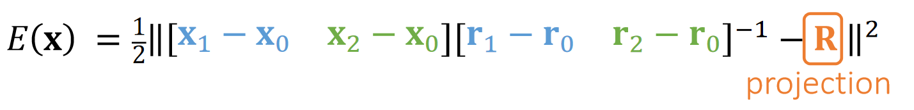    

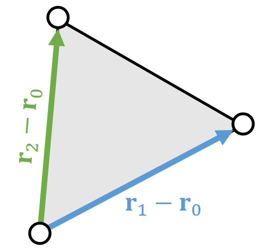    
**The 2D Space**    

\\(\quad\\)

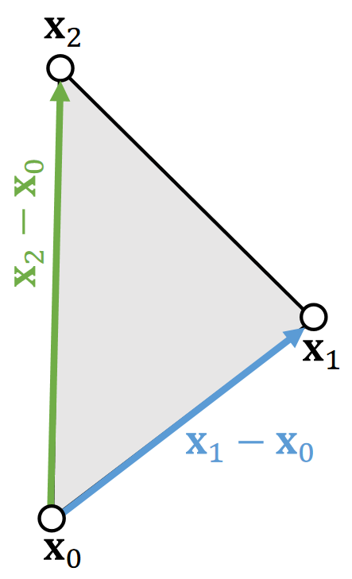    
**The 3D Space**    

\\(\quad\\)

Assuming that \\(\mathbf{{\color{Orange} R} }\\) is constant,     
$$
\begin{matrix}
 \mathbf{f} _0=−\nabla_0E(\mathbf{x} )\\\\
\mathbf{f} _1=−\nabla_1E(\mathbf{x} ) \\\\
\mathbf{f} _2=−\nabla_2E(\mathbf{x} )\\\\
\mathbf{H} =\frac{∂E^2(\mathbf{x} )}{∂x^2} \quad \text{is  a constant !}   
\end{matrix}
$$

\\(\mathbf{H} =\frac{∂E^2(\mathbf{x} )}{∂x^2}\\) is  a constant !   

P25   
## Simulation by Projective Dynamics   

 - According to implicit integration and Newton’s method, a projective dynamics simulator looks as follows, with matrix \\(\mathbf{A} =\frac{1}{∆t^2}\mathbf{M+}\mathbf{H} \\) being constant.    

 - We can use a direct solver with **only one factorization of A**.

$$
\quad
$$

Initialize  \\(\mathbf{x} ^{(0)}\\), often as\\( \mathbf{x} ^{[0]} \\)or \\(\mathbf{x} ^{[0]} +∆t\mathbf{v} ^{[0]} \\)    

For \\(k=0\dots K\\)     
Recalculate projection     
Solve \\((\frac{1}{∆t^2}\mathbf{M} +\mathbf{H} )∆\mathbf{x} =−\frac{1}{∆t^2}\mathbf{M} (\mathbf{x} ^{(k)}−\mathbf{x} ^{[0]}−∆t\mathbf{v} ^{[0]})+\mathbf{f} (\mathbf{x} ^{(k)})\\)    

\\(\mathbf{x} ^{(k+1)}\longleftarrow \mathbf{x} ^{(k)}+∆\mathbf{x} \\)      

If \\(||∆\mathbf{x}||\\) is small	\\(\quad\\) then break     

\\(\mathbf{x} ^{[1]}\longleftarrow \mathbf{x} ^{(k+1)}\\)    

\\(\mathbf{v} ^{[1]}\longleftarrow (\mathbf{x} ^{[1]}-\mathbf{x} ^{[0]})/∆t\\)

“Newton’s Method”    

$$
\quad
$$

> &#x2705; Recaculate projection 这一步实际上不需要，因为直接用弹簧系统的公式算力，得到的\\(f\\)是一样的。   
如果是做 shape matching, 还是需要这一步，用于算 \\(f\\)    
同一个顶点在三个不同边上的投影是不同的。   
模拟真正的时间开销不在计算 (虽然有很多计算公式) 而是在内存的访问上。   
PBD 的优点是内存访问少、因为它没有太多物理变量。    
因此，对追求效率的场景，主要优化内存访问而不是计算。   

P26  
## Preconditioned Steepest Descent

 - Mathematically, this approach is preconditioned steepest descent, in which:     

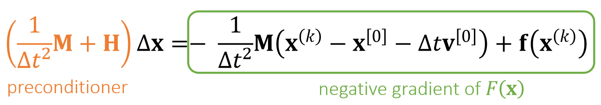    

$$
F(\mathbf{x} )=\frac{1}{2∆t^2} ||\mathbf{x} −\mathbf{x} ^{[0]}−∆t\mathbf{v} ^{[0]}||_\mathbf{M} ^2+E(\mathbf{x} )
$$

The performance depends on how well \\(\mathbf{{\color{Orange} H} }\\) approximates the real Hessian.     

P27  
## Pros and Cons of Projective Dynamics 

 - By building constraints into energy, the simulation now has a theoretical <u>solution</u> with **physical** meaning.    
 - **Fast on CPUs** with a direct solver. No more factorization!    
 - Fast convergence in the first few iterations.    
 - **Slow on GPUs**. (GPUs don’t support direct solver wells.)    
 - Slow convergence over time, as it fails to consider Hessian caused by projection.     
    - Still suffering from high stiffness    
 - Cannot easily handle **constraint changes**.    
    - Contacts    
    - Remeshing due to fracture, etc.      

> &#x2705; Fast on CPU,因为它只作一次\\(\mathbf{LU}\\)分解。   
Slow on GPU，因为\\(\mathbf{LU}\\)分解不适用于 \\(\mathbf{GPU}\\)   
constraint changes: 网格关系改变导至弹簧结构改变，原来的\\(\mathbf{H}\\)将不再适用。   

P28   
## After-Class Reading

Bouaziz et al. 2014. *Projective Dynamics: Fusing Constraint Projections for Fast Simulation. TOG (SIGGRAPH)*.    

P29   
## Constrained Dynamics    

P30   
## Constrained Dynamics   

A critical problem exists: what if constraints/forces are **very very stiff**? Or infinitely stiff?    

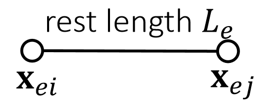    

$$
\mathbf{ϕ} _e(\mathbf{x} )=||\mathbf{x} _{ei}− \mathbf{x} _{ej}||−L_e
$$

Compliant constraint    

$$
E(\mathbf{x} )={\textstyle \sum_e}\frac{1}{2} k(||\mathbf{x} _{ei} −\mathbf{x} _{ej}||−L_e)^2=\frac{1}{2} \mathbf{\mathbf{ϕ}^T(x)C} ^{−1}\mathbf{ϕ} (\mathbf{x} )
$$

$$
\mathbf{f} (\mathbf{x} )=−∇E=-\begin{pmatrix}
 \frac{∂E}{∂\mathbf{ϕ}}  & \frac{∂\mathbf{ϕ}}{∂x}
\end{pmatrix}^\mathbf{T} =−\mathbf{J^TC} ^{−1}\mathbf{ϕ} =\mathbf{J^Tλ} 
$$

Let \\(N\\) be the number of vertices and E be the number of constraints,    

$$
\phi (\mathbf{x} )\in \mathbf{R} ^E
$$

$$
\mathbf{C} =\begin{bmatrix}
 1/k & \Box  & \Box\\\\
 \Box & 1/k & \Box \\\\
\Box  & \Box &\ddots 
\end{bmatrix}\in \mathbf{R} ^{E×E}
$$
Compliant matrix   

| \\(\mathbf{J} =\frac{∂\phi}{∂\mathbf{x} } \in \mathbf{R} ^{E×3N}\\)  Jacobian  |  
|----|  

\\(\quad\\)

|  \\(\mathbf{λ} =−\mathbf{C} ^{−1}\phi \in \mathbf{R} ^E\\)  Dual variables (Lagrangian multipliers)  |   
|----|  

> &#x2705; 此算法用于处理 very very stiff 的场景即约束必须严格满足，而前面算法需要做很多次迭代才能产生这种效果（计算量大）。   
此算法常用于衣服、刚体、人体。    \\(E(X)=\sum _ {e} \frac{1}{2}k( \phi _ e(x))^2  \quad\quad\\)
\\( \phi {m} = \begin{bmatrix} \phi _ 0\\\\ \phi _ 1 \\\\ \vdots  \\\\ \phi _ E  \end{bmatrix}\\)    
C称为软度矩阵、 stiffness:挺度   \\(\quad\quad\\) compliant:软度  
[？]为什么\\(f(x)\\)公式里有个转置？   
\\(\lambda \\) 是人为引入的变量，称为拉格朗日算子。   
\\(E\\) 和 \\(f\\) 变成了关于两个变量\\((x、\lambda )\\)的函数。   

P31  

By implicit integration, we get:   

$$
\mathbf{Mv} ^{\mathrm{new} }−∆t\mathbf{J^Tλ} ^{\mathrm{new} }=\mathbf{Mv} 
$$

Meanwhile,
$$
\mathbf{Cλ} ^{\mathrm{new} }=−\mathbf{ϕ} ^{\mathrm{new} }≈−\mathbf{ϕ} −\mathbf{J} (\mathbf{x} ^{\mathrm{new} }−\mathbf{x} )≈−\mathbf{ϕ} −∆t\mathbf{Jv} ^{\mathrm{new} }
$$

$$
\begin{bmatrix}
 \mathbf{M}  & −∆t\mathbf{J^T} \\\\
 ∆t\mathbf{J}  & \mathbf{C} 
\end{bmatrix}\begin{bmatrix}
\mathbf{v} ^{\mathrm{new} } \\\\
\mathbf{λ} ^{\mathrm{new} }
\end{bmatrix}\begin{bmatrix}
\mathbf{Mv}  \\\\
-\mathbf{ϕ} 
\end{bmatrix}
$$

> &#x2705; 动量守衡公式：\\(Mv'- Mv = Ft = \\)冲量   
此处新 \\(\lambda^{\mathrm{new}} \\)来计算 F. 说明是 Implicit    
对\\(-\phi ^{\mathrm{new}}\\) 的泰勒展开    
最后的矩阵公式由上面两个公式整理合并得到。   

P32    
 - Now we have a system with two sets of variables: the primal variable \\(\mathbf {x}\\) (or \\(\mathbf {v=x}\\) ̇) and the dual variable \\(\mathbf {λ}\\).   

 - Method 1: We can solve the two variables by a **direct solver** together, in a <u>primal-dual</u> fashion:   

$$
\begin{bmatrix}
\mathbf{M}  & −∆t\mathbf{J^T} \\\\
∆t\mathbf{J}  & \mathbf{C} 
\end{bmatrix}\begin{bmatrix}
\mathbf{v} ^{\mathrm{new} } \\\\
\mathbf{λ} ^{\mathrm{new} }
\end{bmatrix}\begin{bmatrix}
\mathbf{Mv}  \\\\
-\mathbf{ϕ} 
\end{bmatrix}
$$ 

 - Method 2: We can **reduce the system** by Schur complement and solve \\(\mathbf {λ}^{\mathrm{new} }\\) first.  

$$
(∆t^2\mathbf{JM} ^{−1}\mathbf{J} ^\mathbf{T} +\mathbf{C} )\mathbf{λ} ^{\mathrm{new} } =−\mathbf{ϕ} −∆t\mathbf{Jv} 
$$

$$
\mathbf{v} ^{\mathrm{new}}\longleftarrow \mathbf{v} +−∆t\mathbf{M} ^{−1}\mathbf{J^Tλ} ^{\mathrm{new}}
$$

 

 - Infinite stiffness? \\(\mathbf{C \longrightarrow 0}\\).    

> &#x2705; 用哪种方法取决于应用场景    
注意：Method 1 中的矩阵有可能不正定、因此很多数学方法用不了。    
Method 2 的消元过程不容易构造、尤其是当矩阵比较复杂时，   
此方法将软硬度量解耦出来，并用矩阵C来表示，使得可以方便控制软硬度，例如何\\(c=0\\) 来表示 infinite stiffness.   

P33  
## Constrained Dynamics   

 - Articulated Rigid Bodies (ragdoll animation)    

P34  
## Stable Constrained Dynamics    

From a mass-spring system, we know spring Hessian (tangent stiffness) is:    

$$
\mathbf{H} (\mathbf{x} )=∑_{e=(i,j)}\begin{bmatrix}
 \Box  & \Box  & \Box  & \Box  \\\\
 \Box  & \mathbf{H} _e & -\mathbf{H} _e & \Box   \\\\
  \Box & -\mathbf{H} _e &\mathbf{H} _e  & \Box   \\\\
  \Box &  \Box & \Box  & \Box  
\end{bmatrix}
$$

    

According to constrained dynamics:\\(\mathbf{f} (\mathbf{x} )=\mathbf{J^Tλ}\\)  and \\(\mathbf{λ} =−\mathbf{C} ^{−1}\\mathbf{ϕ} \\), so: 

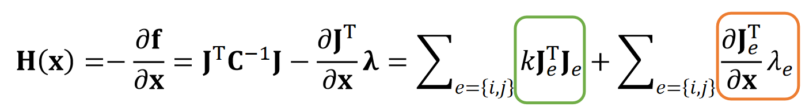   

$$
\mathbf{J}_e=\frac{∂\phi _e}{∂\mathbf{x} }=\begin{bmatrix}
\frac{\mathbf{x} _{ij}^\mathbf{T} }{||\mathbf{x} _{ij}||}   & -\frac{\mathbf{x} _{ij}^\mathbf{T} }{||\mathbf{x} _{ij}||}
\end{bmatrix}
$$

P35   
## Stable Constrained Dynamics

According Lecture 5, Page 16, implicit integration is:    

$$
(\frac{1}{∆t^2}\mathbf{M+H} (\mathbf{x} ^{[0]}))∆\mathbf{x} = \frac{1}{∆t^2}\mathbf{M} (∆t\mathbf{v} ^{[0]})+\mathbf{f} (\mathbf{x} ^{[0]})
$$

$$
\Downarrow 
$$

$$
(\mathbf{M} +∆t^2\mathbf{H} (\mathbf{x} ^{[0]}))\mathbf{v} ^{\mathrm{new} }= \mathbf{Mv} ^{[0]}+∆t\mathbf{f} (\mathbf{x} ^{[0]})
$$

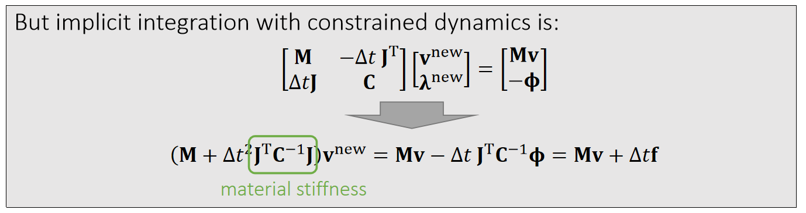    

Missing geometric stiffness matrix here…

P36  
## After-Class Reading (optional)   

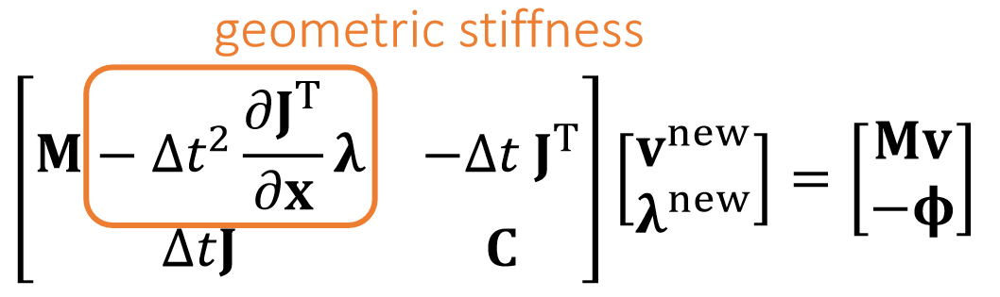    

Tournier et al. 2015. *Stable Constrained Dynamics. TOG (SIGGRAPH)*.    

> &#x2705; Method 2 Gauss 消元，如果把\\(\lambda\\)消掉，会得到一个基本上与隐式积分相似的公式，唯一的区别是\\(\mathbf{H}\\)上略有不同 —— 隐式积分多了一项。如果把用这一项加回去，会使constrain dynamic 变得稳定。   

P37  
## A Summary For the Day    

 - Position-based dynamics and strain limiting    
    - The key is to build a projection function for every constraint.    
    - Two approaches for integration: Jacobi and Gauss-Seidel.   
    - Fast in low resolutions, but problematic in high resolutions.    
    - Not physically correct.    
 - Projective Dynamics    
    - Also uses projection functions, but they are now built into energies.    
    - In every iteration, projections are first updated, and then treated as constants in implicit formulation.    
    - The matrix in the system becomes constant, can be pre-factorized for fast simulation.    
    - Converges fast only in the first few iterations, slow afterwards. CPU friendly.    
 - Constrained Dynamics   
    - Focused on very stiff constraints. Introduces dual variables.    
    - Also built upon implicit integration. Two methods: primal-dual, pure dual.    
    - Restrictions on the solvers.    