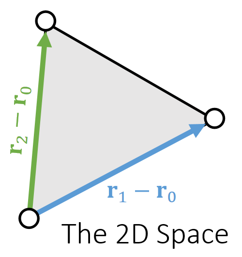
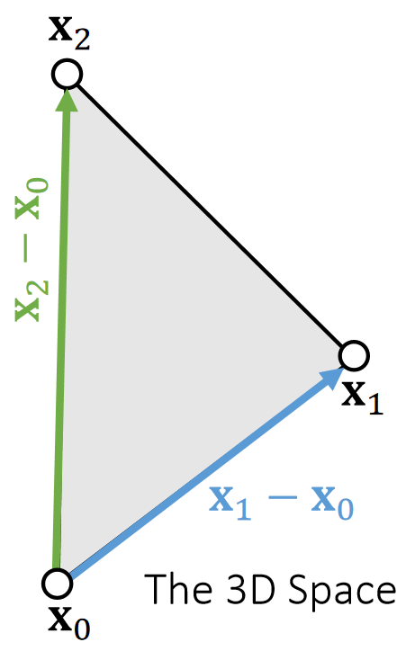

P3  
## Strain Limiting and Position Based Dynamics    

P4  
## The Stiffness Issue    

 - Real-world fabrics resist strongly to stretching, once they stretch beyond certain limits.   
 
 - But, increasing the stiffness can cause problems.  
     - Explicit integrators will be *unstable*    
       - Solution: smaller time steps and more **computational time**.    
     - The linear systems involved in Implicit integrators will be *ill-conditioned*.     
       - Solution: more iterations and **computational time**.   
 - Can we achieve high stiffness, with a low computational cost?    

P5   
## A Single Spring   

If a spring is infinitely stiff, we can treat the length as a constraint and define a projection function.      

    

\\(\phi (\mathbf{x} )=||\mathbf{x} _i− \mathbf{x} _j||−L=0\\)      
Constraint     

    

P6   
## A Single Spring    

If a spring is infinitely stiff, we can treat the length as a constraint and define a projection function.    

    

{\\(\mathbf{x} _i^{\mathbf{new},\mathbf{x} _j^{\mathbf{new} }\\)}}= argmin \\( \frac{1}{2}\\){\\(m_i||\mathbf{x} _i^{\mathbf{new} }−\mathbf{x} _i||^2+m_j||\mathbf{x} _j^{\mathbf{new}} −\mathbf{x} _j||^2\\)}    

such that  \\(\phi (\mathbf{x} )=0\\)

P7   
## A Single Spring     

$$
\mathbf{x} ^{\mathbf{new} } \longleftarrow  \mathrm{Projection} (\mathbf{x})
$$   

$$
\mathbf{x} _i^{\mathbf{new} }\longleftarrow \mathbf{x} _i−\frac{m_j}{m_i+m_j} (||\mathbf{x} _i−\mathbf{x} _j||−L)\frac{\mathbf{x} _i−\mathbf{x}_j}{||\mathbf{x} _i−\mathbf{x} _j||} 
$$
   
$$
\mathbf{x} _j^{\mathbf{new} }\longleftarrow \mathbf{x} _j−\frac{m_i}{m_i+m_j} (||\mathbf{x} _i−\mathbf{x} _j||−L)\frac{\mathbf{x} _i−\mathbf{x}_j}{||\mathbf{x} _i−\mathbf{x} _j||} 
$$

$$
\phi (\mathbf{x} ^{\mathbf{new} })=||\mathbf{x} _i^{\mathbf{new} }− \mathbf{x} _j^{\mathrm{new} }||−L=||\mathbf{x} _i−\mathbf{x} _j−\mathbf{x} _i+\mathbf{x} _j+L||−L=0
$$

By default, \\(m_i=m_j\\), but we can also set m_i=∞ for stationary nodes.   

P8   
## Multiple Springs – A Gauss-Seidel Approach    

What about multiple springs? The Gauss-Seidel approach **projects each spring sequentially in a certain order**. Imagine two springs with unit rest lengths…

    

P9   

> Projection (by Gauss-Seidel)     
\\(\quad\quad\\) For \\(k=0…K\\)    
For every edge \\(e\\)={\\(i,j\\0}    
$$
\mathbf{x} _i\longleftarrow \mathbf{x} _i−\frac{1}{2} (||\mathbf{x} _i−\mathbf{x} _j||−L_e)\frac{\mathbf{x} _i−\mathbf{x}_j}{||\mathbf{x} _i−\mathbf{x} _j||}   
$$
$$
\mathbf{x} _j\longleftarrow \mathbf{x} _j+\frac{1}{2} (||\mathbf{x} _i−\mathbf{x} _j||−L_e)\frac{\mathbf{x} _i−\mathbf{x}_j}{||\mathbf{x} _i−\mathbf{x} _j||} 
$$

 - We cannot ensure the satisfaction of every constraint. But the more iterations we use, the better those constraints are satisfied.    

 - Although the name is related to Gauss-Seidel, it differs from Gauss-Seidel. It is more relevant to stochastic gradient descent (in machine learning).    

 - The order matters. The order can cause bias and affect convergence behavior.     

P10  
## Multiple Springs – A Jacobi Approach   

 - To avoid bias, the Jacobi approach projects all of the edges simultaneously and then linearly blend the results.    

 - The problem is an even lower convergence rate. 

 - Again, the more iterations it uses, the better the constraints are enforced.    

Projection (by Jacobi)    
For \\(k = 0…K\\)    
For every vertex \\(i\\)    

$$
\mathbf{x} ^{\mathbf{new} }_i\longleftarrow 0
$$

$$
n _i\longleftarrow 0
$$

For every edge e={\\(i,j\\)}     

$$
\mathbf{x}^{\mathbf{new} } _i\longleftarrow \mathbf{x}^{\mathbf{new} } _i+\mathbf{x}_i−\frac{1}{2} (||\mathbf{x} _i−\mathbf{x} _j||−L_e)\frac{\mathbf{x} _i−\mathbf{x}_j}{||\mathbf{x} _i−\mathbf{x} _j||}    
$$

$$
\mathbf{x}^{\mathbf{new} } _j\longleftarrow \mathbf{x}^{\mathbf{new} } _j+\mathbf{x}_j+\frac{1}{2} (||\mathbf{x} _i−\mathbf{x} _j||−L_e)\frac{\mathbf{x} _i−\mathbf{x}_j}{||\mathbf{x} _i−\mathbf{x} _j||}    
$$

$$
n _i\longleftarrow n_i+1
$$

$$
n _j\longleftarrow n_j+1
$$

For every vertex \\(i\\）   
$$
\mathbf{x} _i⟵(\mathbf{x} _i^{\mathbf{new} }+α\mathbf{x} _i)/(n_i+α)
$$

P11   
## Position Based Dynamics (PBD)   

Position based dynamics (PBD) is based on the projection function.    

 - The stiffness behavior, i.e., how tightly constraints are enforced, is subject to non-physical factors. 
    - The number of iterations 
    - The mesh resolution
 - The velocity update following projection is important to dynamic effects. 
 
 - This method is applicable to other constraints as well, including triangle constraints, volume constraints, and collision constraints. 
    - To implement these constraints, simply define their
projection functions.    

> __________________
A PBD Simulator     
//Do Simulation, update \\(\mathbf{x}\\) and \\(\mathbf{v}\\)     
$$
\mathbf{v}\longleftarrow\dots
$$

$$
\mathbf{x}\longleftarrow\dots   
$$   

//Now PBD starts.    

$$
\mathbf{x} ^{\mathbf{new} } \longleftarrow \mathrm{Projection} (\mathbf{x} )
$$    

$$
\mathbf{v}\longleftarrow \mathbf{v} +(\mathbf{x} ^{\mathbf{new} }−\mathbf{x})/∆t
$$

$$
\mathbf{x}\longleftarrow \mathbf{x} ^{\mathbf{new}}
$$
> ___________

P12   
## Pros and Cons of PBD 

 - Pros    
    - Parallelable on GPUs (PhysX)    
    - Easy to implement    
    - Fast in low resolutions    
    - Generic, can handle other coupling and constraints, including fluids    
 - Cons    
     - Not physically correct    
     - Low performance in high resolutions    
       - Hierarchical approaches (can cause oscillation and other issues…)     
       - Acceleration approaches, like Chebyshev    
       
       

P13   
## After-Class Reading    

Muller. 2008. *Hierarchical Position Based Dynamics*. VRIPHYS.

P14  
## Strain Limiting    

Strain limiting aims at using the projection function for **correction** only. 

    

P15   
## Spring Strain Limit   

We can set the spring strain, i.e., the stretching ratio σ, to be within a limit.

    

$$
\sigma ^{min}≤\frac{1}{L}||\mathbf{x} _i− \mathbf{x} _j||≤\sigma^{max}
$$

Constraint

    

P16  

> ____________________
$$
\mathbf{x}^{\mathbf{new}}\longleftarrow \mathrm{Projection}  (\mathbf{x} )
$$

$$
\sigma\longleftarrow \frac{1}{L}||\mathbf{x}_i− \mathbf{x}_j||
$$

$$
\sigma _0\longleftarrow \mathrm{min} (\mathrm{max} (\sigma,\sigma^{\mathrm{min} }),\sigma^{\mathrm{max} })
$$

$$
\mathbf{x} _i^{\mathrm {new} }⟵\mathbf{x} _i−\frac{m_j}{m_i+m_j}(||\mathbf{x} _i− \mathbf{x} _j||−σ_0L)\frac{\mathbf{x} _i− \mathbf{x} _j}{||\mathbf{x} _i− \mathbf{x} _j||}
$$

$$
\mathbf{x} _j^{\mathrm {new} }⟵\mathbf{x} _j+\frac{m_j}{m_i+m_j}(||\mathbf{x} _i− \mathbf{x} _j||−σ_0L)\frac{\mathbf{x} _i− \mathbf{x} _j}{||\mathbf{x} _i− \mathbf{x} _j||}
$$

> ____________________

P17  
## Triangle Area Limit    

We can limit the triangle area as well. To do so, we define a scaling factor.     

{\\(\mathbf{x}_i^{\mathrm{new} },\mathbf{x}_i^{\mathrm{new} },\mathbf{x}_k^{\mathrm{new} }\\)}  = \\(\mathrm{argmin} \frac{1}{2} \\){\\(m_i||\mathbf{x}_i^{\mathrm{new} }−\mathbf{x}_i||^2+m_j||\mathbf{x}_j^{\mathrm{new} }−\mathbf{x}_j||^2+m_j||\mathbf{x}_k^{\mathrm{new} }−\mathbf{x}_k||^2\\)} 

such that the constraint is satisfied.   

    

P18   

$$
\mathbf{x} ^{\mathbf{new}} ⟵\mathrm{Projection} (\mathbf{x} )
$$

$$
\mathbf{A}\longleftarrow \frac{1}{2} ||(\mathbf{x} _j− \mathbf{x} _i)\mathbf{×} (\mathbf{x}_k− \mathbf{x} _i)||
$$

$$
\mathbf{s} \longleftarrow \sqrt{\mathrm{min} (\mathrm{max} (A,A^{min}),A^{max})/A}
$$

$$
\mathbf{c} \longleftarrow \frac{1}{m_i+m_j+m_k} (m_i\mathbf{x} _i+m_j\mathbf{x} _j+m_k\mathbf{x} _k)
$$

$$
\mathbf{x} _i^{\mathrm{new}}\longleftarrow \mathbf{c} +s(\mathbf{x} _i−\mathbf{c} )
$$

$$
\mathbf{x} _j^{\mathrm{new}}\longleftarrow \mathbf{c} +s(\mathbf{x} _j−\mathbf{c} )
$$

$$
\mathbf{x} _k^{\mathrm{new}}\longleftarrow \mathbf{c} +s(\mathbf{x} _k−\mathbf{c} )
$$

P19   
## Strain Limiting in Simulation   

 - Strain limiting is widely used in physics- based simulation, typically for avoiding instability and artifacts due to large deformation.     

 - Strain limiting is useful for nonlinear effects, in a biphasic way.     
 - Strain limiting also helps address the locking issue.   
 
 
    

P21    
## Projective Dynamics    

P22   
## Projective Dynamics     

Instead of blending projections in a Jacobi or Gauss-Seidel fashion as in PBD, projective dynamics uses projection to define a quadratic energy.      

    

$$
E (\mathbf{x} )=\sum_{e=（i,j）}\frac{1}{2} ||(\mathbf{x} _i−\mathbf{x} _j)−(\mathbf{x} ^{\mathrm{new} }_{e,i}−\mathbf{x} ^{\mathrm{new} }_{e,j})||^2
$$

{\\(\mathbf{x} _{e,i}^{\mathrm{new} }\mathbf{x} ^{\mathrm{new} }_{e,j}\\)}=\\(\mathrm{Projection} _e(\mathbf{x}_i,\mathbf{x}_j)\\) for every edge \\(e\\)    

$$
\mathbf{f} _i=−\nabla_iE(\mathbf{x} )=−\sum _{e:i\in e}(\mathbf{x} _i−\mathbf{x} _j)−(\mathbf{x} _{e,i}^{\mathrm{new}} −\mathbf{x} _{e,j}^{\mathbf{new} })
$$

P23   
## Projective Dynamics – Explained   

Instead of blending projections in a Jacobi or Gauss-Seidel fashion as in PBD, <u>projective</u> dynamics uses projection to define a <u>quadratic</u> energy.     

    

    

P24  
## Projective Dynamics – Shape Matching

Shape matching is also projective dynamics, if we view rotation as projection:    

    

    

    

Assuming that \\(\mathbf{{\color{Orange} R} }\\) is constant,     
$$
\begin{matrix}
 \mathbf{f} _0=−\nabla_0E(\mathbf{x} )\\\\
\mathbf{f} _1=−\nabla_1E(\mathbf{x} ) \\\\
\mathbf{f} _2=−\nabla_2E(\mathbf{x} )
\end{matrix}
$$

\\(\mathbf{H} =\frac{∂E^2(\mathbf{x} )}{∂x^2}\\) is  a constant !   

P25   
## Simulation by Projective Dynamics   

 - According to implicit integration and Newton’s method, a projective dynamics simulator looks as follows, with matrix \\(\mathbf{A} =\frac{1}{∆t^2}\mathbf{M+}\mathbf{H} \\) being constant.    

 - We can use a direct solver with **only one factorization of A**.

>————————————————
Initialize  \\(\mathbf{x} ^{(0)}\\), often as\\( \mathbf{x} ^{[0]} \\)or \\(\mathbf{x} ^{[0]} +∆t\mathbf{v} ^{[0]} \\)    

For \\(k=0\dots K\\)     
Recalculate projection     
Solve \\((\frac{1}{∆t^2}\mathbf{M} +\mathbf{H} )∆\mathbf{x} =−\frac{1}{∆t^2}\mathbf{M} (\mathbf{x} ^{(k)}−\mathbf{x} ^{[0]}−∆t\mathbf{v} ^{[0]})+\mathbf{f} (\mathbf{x} ^{(k)})\\)    

\\(\mathbf{x} ^{(k+1)}\longleftarrow \mathbf{x} ^{(k)}+∆\mathbf{x} \\)      

If \\(||∆\mathbf{x}||\\) is small	then break     

\\(\mathbf{x} ^{[1]}\longleftarrow \mathbf{x} ^{(k+1)}\\)    

\\(\mathbf{v} ^{[1]}\longleftarrow (\mathbf{x} ^{[1]}-\mathbf{x} ^{[0]})/∆t\\)

“Newton’s Method”    

>————————————————

P26  
## Preconditioned Steepest Descent

 - Mathematically, this approach is preconditioned steepest descent, in which:     

    

$$
F(\mathbf{x} )=\frac{1}{2∆t^2} ||\mathbf{x} −\mathbf{x} ^{[0]}−∆t\mathbf{v} ^{[0]}||_\mathbf{M} ^2+E(\mathbf{x} )
$$

The performance depends on how well \\(\mathbf{{\color{Orange} H} }\\) approximates the real Hessian.     

P27  
## Pros and Cons of Projective Dynamics 

 - By building constraints into energy, the simulation now has a theoretical <u>solution</u> with **physical** meaning.    
 - **Fast on CPUs** with a direct solver. No more factorization!    
 - Fast convergence in the first few iterations.    
 - **Slow on GPUs**. (GPUs don’t support direct solver wells.)    
 - Slow convergence over time, as it fails to consider Hessian caused by projection.     
    - Still suffering from high stiffness    
 - Cannot easily handle **constraint changes**.    
    - Contacts    
    - Remeshing due to fracture, etc.      

P28   
## After-Class Reading

Bouaziz et al. 2014. *Projective Dynamics: Fusing Constraint Projections for Fast Simulation. TOG (SIGGRAPH)*.    

P29   
## Constrained Dynamics    

P30   
## Constrained Dynamics   

A critical problem exists: what if constraints/forces are **very very stiff**? Or infinitely stiff?    

    

$$
\phi _e(\mathbf{x} )=||\mathbf{x} _{ei}− \mathbf{x} _{ej}||−L_e
$$

Compliant constraint    

$$
E(\mathbf{x} )=\sum_e\frac{1}{2} k(||\mathbf{x} _{ei} −\mathbf{x} _{ej}||−L_e)^2=\frac{1}{2} \mathbf{\phi^T(x)C} ^{−1}\phi (\mathbf{x} )
$$

$$
\mathbf{f} (\mathbf{x} )=−∇E=-\begin{pmatrix}
 \frac{∂E}{∂\phi}  & \frac{∂\phi}{∂x}
\end{pmatrix}^\mathbf{T} =−\mathbf{J^TC} ^{−1}\phi =\mathbf{J^Tλ} 
$$

Let N be the number of vertices and E be the number of constraints,    

$$
\phi (\mathbf{x} )\in \mathbf{R} ^E
$$

$$
\mathbf{C} =\begin{bmatrix}
 1/k & \Box  & \Box\\\\
 \Box & 1/k & \Box \\\\
\Box  & \Box &\ddots 
\end{bmatrix}\in \mathbf{R} ^{E×E}
$$
Compliant matrix   

| \\(\mathbf{J} =\frac{∂\phi}{∂\mathbf{x} } \in \mathbf{R} ^{E×3N}\\)  Jacobian  |  
|----|  
|  \\(\mathbf{λ} =−\mathbf{C} ^{−1}\phi \in \mathbf{R} ^E\\)  Dual variables (Lagrangian multipliers)  |   
|----|  

P31  

By implicit integration, we get:   

$$
\mathbf{Mv} ^{\mathrm{new} }−∆t\mathbf{J^Tλ} ^{\mathrm{new} }=\mathbf{Mv} 
$$

Meanwhile,
$$
\mathbf{Cλ} ^{\mathrm{new} }=−\phi ^{\mathrm{new} }≈−\phi −\mathbf{J} (\mathbf{x} ^{\mathrm{new} }−\mathbf{x} )≈−\phi −∆t\mathbf{Jv} ^{\mathrm{new} }
$$

$$
\begin{bmatrix}
 \mathbf{M}  & −∆t\mathbf{J^T} \\\\
 ∆t\mathbf{J}  & \mathbf{C} 
\end{bmatrix}\begin{bmatrix}
\mathbf{v} ^{\mathrm{new} } \\\\
\mathbf{λ} ^{\mathrm{new} }
\end{bmatrix}\begin{bmatrix}
\mathbf{Mv}  \\\\
-\phi 
\end{bmatrix}
$$

P32    
 -Now we have a system with two sets of variables: the primal variable \\(\mathbf {x}\\) (or \\(\mathbf {v=x}\\) ̇) and the dual variable \\(\mathbf {λ}\\).   

 -Method 1: We can solve the two variables by a **direct solver** together, in a <u>primal-dual</u> fashion:   

 -Method 2: We can **reduce the system** by Schur complement and solve \\(\mathbf {λ}^{\mathrm{new} }\\) first.  

$$
\begin{bmatrix}
\mathbf{M}  & −∆t\mathbf{J^T} \\\\
∆t\mathbf{J}  & \mathbf{C} 
\end{bmatrix}\begin{bmatrix}
\mathbf{v} ^{\mathrm{new} } \\\\
\mathbf{λ} ^{\mathrm{new} }
\end{bmatrix}\begin{bmatrix}
\mathbf{Mv}  \\\\
-\phi 
\end{bmatrix}
$$ 

$$
\mathbf{v} ^{\mathrm{new}}\longleftarrow \mathbf{v} +−∆t\mathbf{M} ^{−1}\mathbf{J^Tλ} ^{\mathrm{new}}
$$

 

 -Infinite stiffness? \\(\mathbf{C \longrightarrow 0}\\).    

P33  
## Constrained Dynamics   

 - Articulated Rigid Bodies (ragdoll animation)    

P34  
## Stable Constrained Dynamics    

From a mass-spring system, we know spring Hessian (tangent stiffness) is:    

$$
\mathbf{H} (\mathbf{x} )=∑_{e=(i,j)}\begin{bmatrix}
 \Box  & \Box  & \Box  & \Box  \\\\
 \Box  & \mathbf{H} _e & -\mathbf{H} _e & \Box   \\\\
  \Box & -\mathbf{H} _e &\mathbf{H} _e  & \Box   \\\\
  \Box &  \Box & \Box  & \Box  
\end{bmatrix}
$$

    

constrained dynamics:\\(\mathbf{f} (\mathbf{x} )=\mathbf{J^Tλ}\\)  and \\(\mathbf{λ} =−\mathbf{C} ^{−1}\phi \\), so: 

   

$$
\mathbf{J}_e=\frac{∂\phi _e}{∂\mathbf{x} }=\begin{bmatrix}
\frac{\mathbf{x} _{ij}^\mathbf{T} }{||\mathbf{x} _{ij}||}   & -\frac{\mathbf{x} _{ij}^\mathbf{T} }{||\mathbf{x} _{ij}||}
\end{bmatrix}
$$

P35   
## Stable Constrained Dynamics

According Lecture 5, Page 16, implicit integration is:    

$$
(\frac{1}{∆t^2}\mathbf{M+H} (\mathbf{x} ^{[0]}))∆\mathbf{x} = \frac{1}{∆t^2}\mathbf{M} (∆t\mathbf{v} ^{[0]})+\mathbf{f} (\mathbf{x} ^{[0]})
$$

$$
\Downarrow 
$$

$$
(\mathbf{M} +∆t^2\mathbf{H} (\mathbf{x} ^{[0]}))\mathbf{v} ^{\mathrm{new} }= \mathbf{Mv} ^{[0]}+∆t\mathbf{f} (\mathbf{x} ^{[0]})
$$

    

Missing geometric stiffness matrix here…

P36  
## After-Class Reading (optional)   

    

Tournier et al. 2015. *Stable Constrained Dynamics. TOG (SIGGRAPH)*.    

P37  
## A Summary For the Day    

 - Position-based dynamics and strain limiting    
    - The key is to build a projection function for every constraint.    
    - Two approaches for integration: Jacobi and Gauss-Seidel.   
    - Fast in low resolutions, but problematic in high resolutions.    
    - Not physically correct.    
 - Projective Dynamics    
    - Also uses projection functions, but they are now built into energies.    
    - In every iteration, projections are first updated, and then treated as constants in implicit formulation.    
    - The matrix in the system becomes constant, can be pre-factorized for fast simulation.    
    - Converges fast only in the first few iterations, slow afterwards. CPU friendly.    
 - Constrained Dynamics   
    - Focused on very stiff constraints. Introduces dual variables.    
    - Also built upon implicit integration. Two methods: primal-dual, pure dual.    
    - Restrictions on the solvers.    