P3    
## More About Prerequisites

 - The course is designed for    
    - Undergraduates in the 3rd or 4th year, or fresh graduates.     
 - Linear Algebra    
    - You Should know basic linear algebra concepts, such as vectors, matrices, linear systems, SVD...
 - Calculus     
    - You should know how to calculate basic derivatives and integrals; you should understand chain rules, gradients, etc.    
 - Programming Skills     
    - C, or C++, or C#, or Javascript    
 - Ready to <u>learn by yourself</u>    
 - The life will be much easier if you took    
    - Numerical methods (numerical linear algebra, numerical PDEs), finite element analysis, fluid dynamics...     

> 建议：说 paper 还不是教材，只读重点不读全又学知识而不是学用 Unity. 多读多写多想  

P10   
## Issues for Discussion Today      

 - What’s computer graphics?    
 - What’s computer graphics used for?    
 - What’s physics-based animation?    
 - What are the topics to be studied in this class?    

P11    
## Issues for Discussion Today     

 - What’s computer graphics?    
 - What’s computer graphics used for?    
 - What’s physics-based animation?    
 - What are the topics to be studied in this class?    
 
 
P14 
## Real-Time Graphics Pipeline     

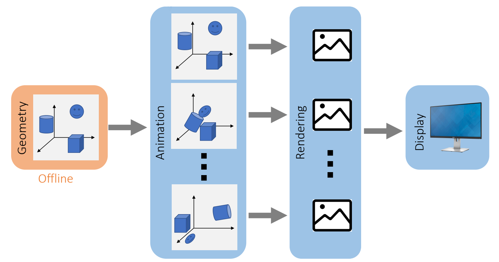   

P15  
The number of frames sent to display in a second is called the *frame rate*.    
For example, 24 FPS, 30 FPS, 60 FPS, …     

> 帧率要求主要取决于交互性，因此游戏要求比电­影高。  

P17
## Animation Playback

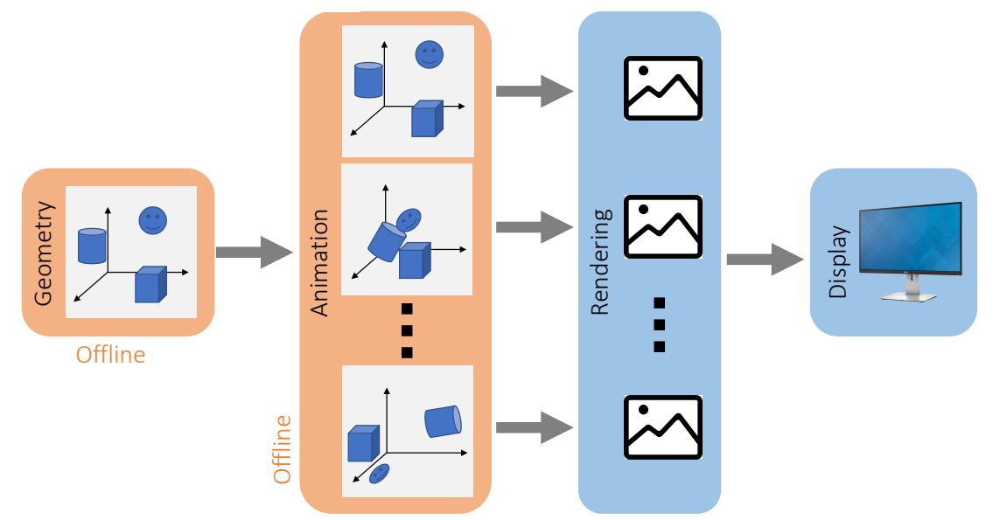 

> 由于实时比较难，可以把不需要交互的动画，例如过场动画做成离线    
同理，不需要交互的场景，例如 Movie,可以把 Rendering 也做­成离线。 

P18
## Movie

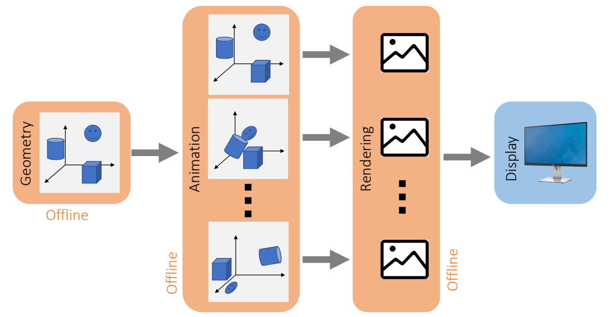 

P19
## Geometry: Three Representations     

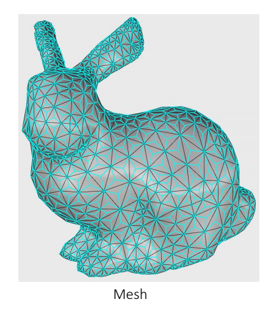   

 - A mesh contains:    
    - Vertices (nodes)    
    - Elements (triangles, polygons, tetrahedra…)    
 - Triangle mesh is the foundation of graphics.    
 - Problems:     
    - Meshing (Delaunay triangulation)    
    - Simplification/subdivision    
    - Mesh optimization (smoothing, flows…)     
    - Volume mesh    

> polygon 常用于 Maya,四面体常用于软体模拟三角形不只是 Mesh 的基础，也是渲染的基础    
[?] 什么是 flows?   
Volume Mesh 的处理比普通 Mesh 要难很多    

P20
## Geometry: Three Representations    

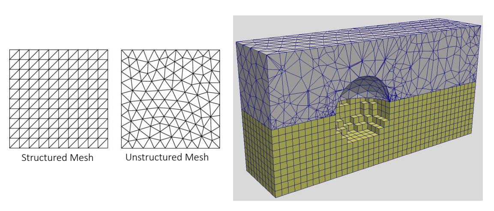    

> Structured：有规律的   
Unstructured：无规律的    
有些模拟算法或几何算法，可以利用 Structured 做简化或优化。Unstructured 算法通用性更好。    

P21
## Geometry: Three Representations    

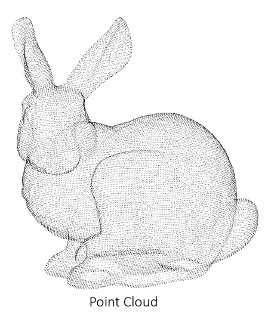    

 - A point cloud is simple.    
 - It can be raw data from surface scan.     
 - Problems:    
    - Mesh reconstruction from cloud    
    - (Re)-Sampling    
    - Neighborhood search    
    - …    

> 原始点云可能有疏有密，因些需要重采样。     

P22
## Geometry: Three Representations    

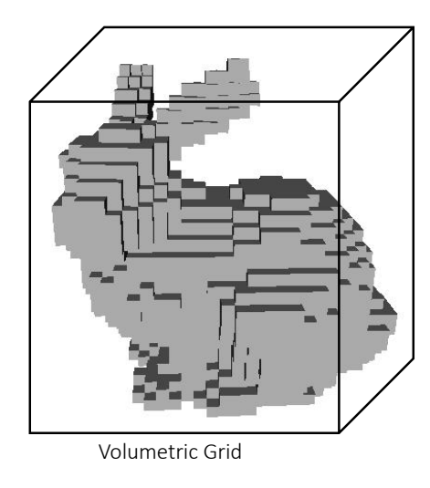 

 - A grid partitions the space; a cell stores the physical quantities at that spot.    
 - Don’t confuse it with structured mesh.     
 - It’s often acquired from volumetric scan, e.g., CT. 
 - Problems:    
    - Memory cost (octree?)    
    - Volumetric rendering?    
    - …    

P23

## Rendering: Non-Photorealistic vs. Photorealistic

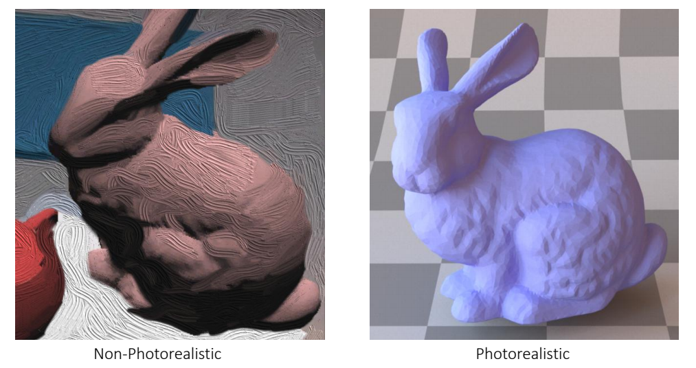   

> Non-Pho \\(\dots\\)：非真实感渲染，Pho \\(\dots\\)：真实感渲染   
后者更主流，又分为基于光线追踪和基于传统渲染管线。见 Games 101   

P27
## Character and Physics-Based Animation      

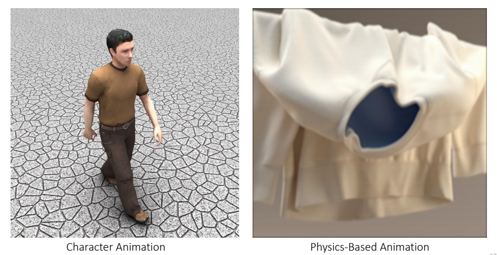 

> 本课程主要是后者，但通堂二者是结合的

P36
## Computer Graphics for Augmented Reality (AR)

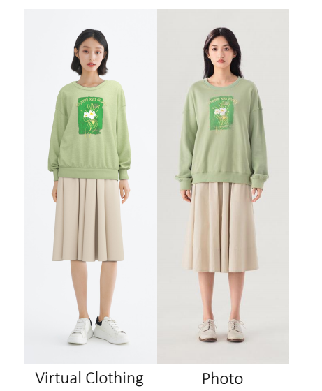    

P37
## Issues for Discussion Today    

 - What’s computer graphics?    
 - What’s computer graphics used for?    
 - What’s physics-based animation?    
 - What are the topics to be studied in this class?    
 
 
P38 
 
## Animation Paradigm

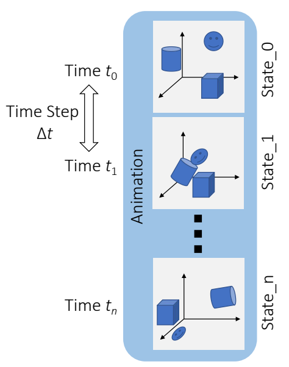   

 - The goal of animation is to **update the state in every time step**.    
 - The state can be:    
    - Position/orientation     
    - Velocity     
    - Appearance     
    - Density    
    - …     
 - The time step doesn’t have to match the frame rate.    
    - It’s common to animate multiple time steps then render one frame.    
    
    
P39
## Physics-Based Animation Topics    

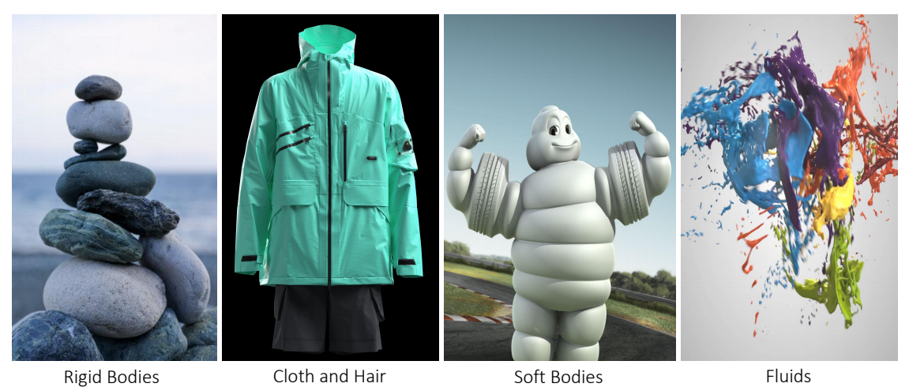    

> Cloth and Hair：细的窄的一类物体   
Soft Bodys：包括软体，弹性体   
Fluids：流体，包括液体和气体   

P54
## Physics-Based Animation Topics    

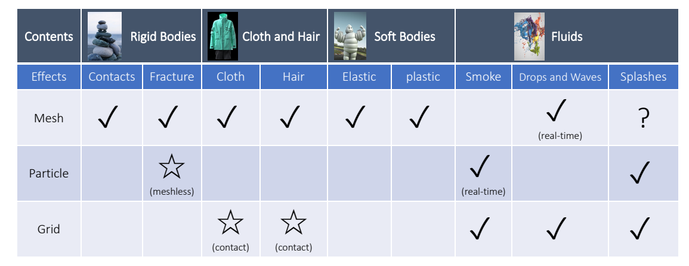   

P56
## Physics-Based Animation Topics

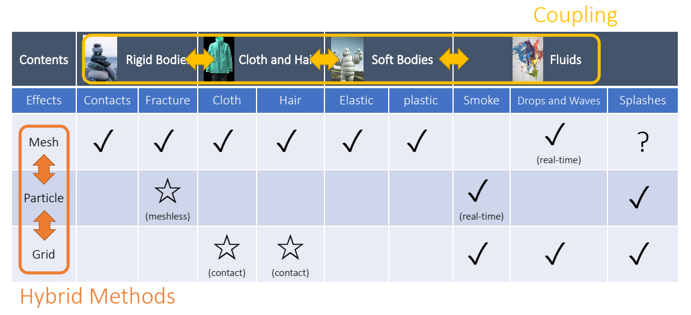    

> Mesh 适用于形态固定、不会剧烈拉扯或断裂的物体    
[1：09：41]  用粒子模拟会破碎的刚体    
用 Grid 模拟衣服和头发可以减少碰撞处理。但计算量大，且难以处理细节   
[1：3：17]水波可以看作是整体。因此能用 mesh.用 mesh的好处是可以做到实时，Grid 的好处是更真实。    
[1：14：37] Splashes水花，水花的问题是多变，因此不能实时。   
[1：18：02]： Hybrid 方法：(1) MPM = Particle + Grid,兼容二者优点，常用于模拟雪或粘滞物体   
[1：19:19] Coupling:场景中同时有不同类别的物体。怎样模拟它们的交互。   

P58
## Issues for Discussion Today     

 - What’s computer graphics?    
 - What’s computer graphics used for?    
 - What’s physics-based animation?    
 - What are the topics to be studied in this class?    
 
 
 
P59
## Topics in This Class    

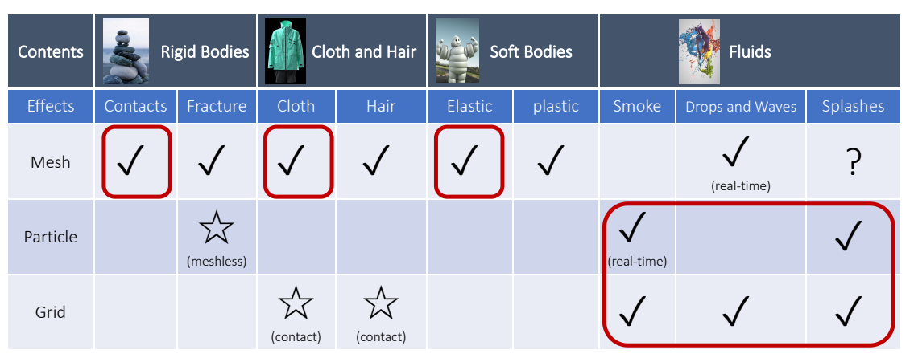   

> Fracture 有大量的 remesh   
游戏引擎中的 Fracture 通常通过预计算而不是模拟得到。     
Rigid 还是Soft,看有没有形变，   
Mesh 定义在物体上， Grid 定义在场景上   
水波 Mesh 也会讲     

P60
## My Own Expertise    

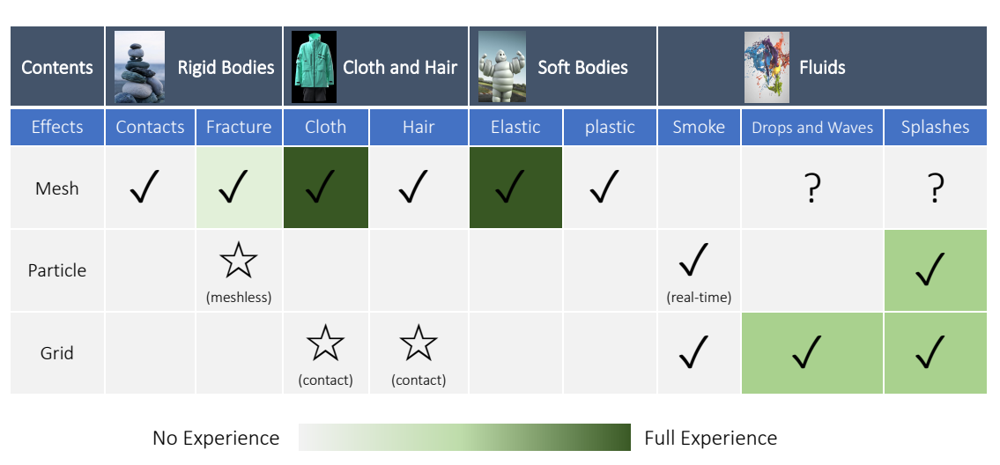   

