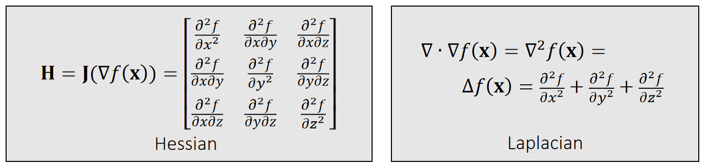

P2
## Vectors

P3
## Vector: Definition    

An (Euclidean) vector: *A geometric entity endowed with magnitude and direction*.

$$
\mathbf{P} =\begin{bmatrix}
 p_x\\\\ 
 p_y\\\\ 
p_z\\\\
\end{bmatrix}\in \mathbf{R} ^3
$$

$$
\mathbf{o} =\begin{bmatrix}
 0\\\\ 
 0\\\\ 
0\\\\
\end{bmatrix}
$$

The vector **p** is defined with respect to the origin **o**.

     

> &#x1F50E; 用黑来区分    
矢量：黑体小写   
标量：斜体    
矩阵：黑体大写   

P4
## Vector: Definition  

The choice of a right-hand or left-hand system is largely due to:    
**the convention of the screen space**.    

    

> &#x1F50E; 左手坐标系，E轴正方向朝屏幕内，好处是物体坐标 x、y、z 都是正直。右手系统的物体都在E轴负方向。   

P5
## Vector: Definition  

Vectors can be stacked up to form a high-dimensional vector, commonly used for describing the state of an object.     

    

Not a geometric vector,but a **stacked vector**.    

P6
## Vector Arithematic: Addition and Subtraction     

$$
\mathbf{p\pm q=} \begin{bmatrix}
 p_x\pm q_x\\\\
 p_y\pm q_y\\\\
p_z\pm q_z\\\\
\end{bmatrix}
$$

$$
\mathbf{p+q=q+p} 
$$

| Addition is commutative.|  
|----|

    

| Geometric Meanings|  
|----|

P7
## Example 1: Linear Representation     

A (geometric) vector can represent a position, a velocity, a force, or a line/ray/segment.    

    

    

> &#x1F50E; 右图。同一个公式，对\\(t\\)做不同的约束，可以定义不同的东西。    
\\(P(t)\\) 是 \\(P\\) 和 \\(q\\) 的 blend 

P8
## Vector Norm   

A vector norm measures the magnitude of a vector: its length. 

> &#x1F50E; LI-Norm 又称为曼哈顿的距离。没写下标一般默认L-Norm   

P9
## Vector Norm: Usage  

   

$$
\mathbf{||q-p||} 
$$

|  Distance between **q** and **p** |  
|----|
  

$$
\mathbf{||p||} =1
$$

|  A unit vector |  
|----|

$$
\mathbf{\bar{p} =p/||p||} 
$$

|  Normalization as |  
|----|

> &#x1F50E; 假设P点在三角形所在平面上  

P10
## Vector Arithematic: Dot Product     

A dot product, also called inner product, is:

 

|  Geometric Meanings |  
|----|

$$
\begin{array}{c} 
  \mathbf{p\cdot q}=p_xq_x+p_yq_y+p_zq_z=\mathbf{p^Tq}   \\\\
 =||\mathbf{p} ||||\mathbf{q} ||\cos \theta 
\end{array}
$$

 - \\(\mathbf{p\cdot q=q\cdot p} \\)    
 - \\(\mathbf{p\cdot (q+r)=p\cdot q+p\cdot r} \\)    
 - \\(\mathbf{p \cdot p = ||p||^2_2} \\), a different way to write norm.     
 - If \\(\mathbf{p·q} = 0\\) and  \\(\mathbf{p,q}\ne 0\\)  then  \\(\cos \theta = 0\\),then \\(\mathbf{p}\\) and \\(\mathbf{q}\\) are orthogonal.    

P11
## Example 2: Particle-Line Projection

P12
## Example 3: Plane Representation     

S: The <u>signed</u> distance to the plane     

Quiz: How to test if a point is within a box?    

P13
## Example 4: Particle-Sphere Collision    

If collision does happen, then:

$$
||\mathbf p(t) - \mathbf{c}||^2= r^2
$$

$$
(\mathbf p-\mathbf c+t\mathbf v)·(\mathbf p-\mathbf c +t\mathbf v) =r^2
$$

$$
(\mathbf v·\mathbf v)t^2+2(\mathbf p-\mathbf c)·\mathbf vt+ (\mathbf p-\mathbf c)·(\mathbf p-\mathbf c)-r^2=0
$$

 - Three possiblities:    
    - No root、无碰撞    
    - One root、擦边 if t > 0   
    - Two roots:自碰撞 if t > 0    

P14
## Vector Arithematic: Cross Product

The result of a cross product is a vector:

$$
\mathbf{r=p\times q} =\begin{bmatrix}
p_yq_z-p_zq_y \\\\
 p_zq_x-p_xq_z\\\\
p_xq_y-p_yq_x\\\\
\end{bmatrix}
$$

 - \\(\mathbf r·\mathbf p = 0; \mathbf r·\mathbf q = 0; ||\mathbf r|| = ||\mathbf p||||\mathbf q||   \sin \theta\\)          
 - \\(\mathbf p\times \mathbf q =-\mathbf q\times \mathbf p\\)   
 - \\(\mathbf p\times (\mathbf q +\mathbf r) = \mathbf p\times \mathbf q +\mathbf p\times \mathbf r\\)   
 - If \\( \mathbf p \times  \mathbf q =\mathbf 0\\) and \\(\mathbf p,\mathbf q\ne 0 \\) then \\(\sin \theta= 0\\), then \\(\mathbf p\\) and \\(\mathbf q \\) are parallel (in the same or opposite direction).      

P15
## Example 5: Triangle Normal and Area   

 - Cross product gives both the normal and the area.    
 - The normal depends on the triangle index order, also known as topological order.      

P16    
Quiz: How to test if three points are on the same line (co-linear)?     

P17   
## Example 6: Triangle Inside/Outside Test    

 

P18
## Example 6: Triangle Inside/Outside Test

\\(\left.\begin{matrix}
 \mathbf{(x_0-p)\times (x_1-p)\cdot n> 0}  \\\\ 
 \mathbf{(x_1-p)\times (x_2-p)\cdot n> 0}  \\\\ 
 \mathbf{(x_2-p)\times (x_0-p)\cdot n> 0} 
\end{matrix}\right\)\\) Inside of triangle      

Otherwise, outside.   

> &#x1F50E; 三个点的顺序很重要，不能搞反。

P19
## xample 7: Barycentric Coordinates

     

Note that:    

$$
\frac{1}{2} \mathbf{(x_0−p)×(x_1−p)\cdot n} =\begin{cases} 
  \frac{1}{2}||\mathbf{(x_0−p)×(x_1−p)} ||& \mathrm{inside}  \\\\  
  \frac{1}{2}||\mathbf{(x_0−p)×(x_1−p)} || & \mathrm{outside} 
  \end{cases} 
$$

Signed areas:   

$$
\mathbf{A_2=\frac{1}{2} (x_0−p)×(x_1−p)\cdot n}
$$

$$
\mathbf{A_0=\frac{1}{2} (x_1−p)×(x_2−p)\cdot n}
$$

$$
\mathbf{A_1=\frac{1}{2} (x_2−p)×(x_0−p)\cdot n}
$$

$$
\mathbf{A_0+A_1+A_2=A}
$$

Barycentric weights of **p** :    

$$
b_0=A_0/A   \quad  b_1=A_1/A   \quad  b_2=A_2/A 
$$

$$
b_0+b_1+b_2=1
$$

Barycentric Interpolation

$$
\mathbf{p} =b_0\mathbf{x} _0+b_1\mathbf{x} _1+b_2\mathbf{x} _2
$$

> &#x1F50E; 当P在三角形外面时，面积为负，但面积总和不变
\\(b_0,b_1,b_2\\) 为P在三角形重心坐标系下的坐标 

> &#x1F50E; P在三角形外部、重心坐标同样适用，不过权重有负数。  

P20
## Gouraud Shading    

 - Barycentric weights allows the interior points of a triangle to be interpolated.     
 - In a traditional graphics pipeline, pixel colors are calculated at triangle vertices first, and then interpolated within. This is known as *Gouraud shading*.    

 - It is hardware accelerated.    

 - It is no longer popular.     
 

> &#x1F50E; 由于硬件能力提升，已经可以做到逐像素。shading,不再需要此方法   
通常也不是逐像素计算重心坐标，而是扫描线算法例如要计算某一行，可以 ：  
(1)插值出行起点像素；  
(2)插值出行终点像素；
(3)起点与终点间批量插值；

 
P21
## Example 9: Tetrahedral Volume    

Edge vectors:    

$$
\mathbf{X_{10}=X_1-X_0   \quad X_{20}=X_2-X_0   \quad X_{30}=X_3-X_0} 
$$

Base triangle area:   

$$
A=\frac{1}{2} ||\mathbf{X} _{10}\times \mathbf{X} _{20}||
$$

Height:    
$$
h=\mathbf{x} _{30}\cdot\mathbf{n} =\mathbf{x} _{30}\cdot \frac{\mathbf{x} _{10}\times \mathbf{x} _{20}}{||\mathbf{x} _{10}\times \mathbf{x} _{20}||} 
$$

Volume:    

$$
\begin{align*}
 V&=\frac{1}{3} ℎA=\frac{1}{6} \mathbf{x} _{30}\cdot \mathbf{x} _{10}\times \mathbf{x} _{20}\\\\
&=\frac{1}{6}\begin{vmatrix}
 \mathbf{x} _1 & \mathbf{x} _2 & \mathbf{x} _3 &\mathbf{x} _0 \\\\
  1& 1 & 1 &1
\end{vmatrix}
\end{align*}
$$

> &#x1F50E; 四面体    
h是\\(X_{30}\\)在 normal 上的投影行列式是上面叉乘的另一种可马法。

P22
## Example 9: Tetrahedral Volume

Note that the volume \\(V =\frac{1}{3}h\mathit{A} =\frac{1}{6} \mathbf{x} _ {30}\cdot (\mathbf{x} _ {10}\times \mathbf{x}_{20})\\) **signed**.

> &#x1F50E; \\(X_3\\）的后面法线的同方向上，也正四面体，反之为负四面体，四点共面为零体积。

P23
## Example 10: Barycentric Weights (cont.)

   

 - **p** splits the tetrahedron into four sub-tetrahedra:    

 $$
 \begin{matrix}
 V_0=\mathrm{Vol} (\mathbf{x}_3,\mathbf{x}_2, \mathbf{x}_1, \mathbf{p} )\\\\
 V_1=\mathrm{Vol} (\mathbf{x}_2,\mathbf{x}_3, \mathbf{x}_0, \mathbf{p} )\\\\
 V_2=\mathrm{Vol} (\mathbf{x}_1,\mathbf{x}_0, \mathbf{x}_3, \mathbf{p} )\\\\ 
 V_3=\mathrm{Vol} (\mathbf{x}_0,\mathbf{x}_1, \mathbf{x}_2, \mathbf{p} )
 \end{matrix} 
 $$

 - **p** is inside if and only if: \\(V_0,V_1,V_2, V_3 > 0\\).    

 - Barycentric weights:    
 $$
 b_0=V_0/V   \quad   b_1=V_1/V   \quad b_2=V_2/V   \quad   b_3=V_3/V
 $$

 $$
 b_0+b_1+b_2+b_3=1
 $$

 $$
 \mathbf{p} =b_0\mathbf{x} _0+b_1\mathbf{x} _1+b_2\mathbf{x} _2+b_3\mathbf{x} _3
 $$

P24
## Example 11: Particle-triangle Intersection

 - First, we find t when the particle hits the plane:   

 $$
 (\mathbf{p} (t)−\mathbf{x} _0)\cdot  \mathbf{x} _{10}\times \mathbf{x} _{20}=0
 $$

 $$
 (\mathbf{p}-\mathbf{x} _0+t\mathbf{v})\cdot  \mathbf{x} _{10}\times \mathbf{x} _{20}=0
 $$

 $$
 t=\frac{(\mathbf{p}−\mathbf{x}_0)\cdot  \mathbf{x} _{10}\times \mathbf{x} _{20}}{\mathbf{v}\cdot \mathbf{x} _{10}\times \mathbf{x} _{20}} 
 $$
 
 
 - We then check if \\(\mathbf{p}(t)\\) is inside or not.   
    - See Example 6.    

> &#x1F50E; 代入体积公式，体积为0时发生碰撞

P25
## Matrices  

P26
## Matrix: Definition

A real matrix is a set of real elements arranged in rows and columns.    

$$
A=\begin{bmatrix}
 a_{00} & a_{01} & a_{02} \\\\
 a_{10}& a_{11} & a_{12} \\\\
 a_{20}& a_{21} & a_{22}
\end{bmatrix}=[a_{0} \quad a_{1} \quad  a_{2}]\in \mathbf{R}   ^{3\times 3}
$$

$$
\mathbf{A^T=A}    \quad  \mathrm{Symmetric} 
$$

P27
## Matrix: Multiplication    

How to do matrix-vector and matrix-matrix multiplication? (Omitted)    

 - \\(\mathbf{AB≠BA} 	 \quad \quad \quad \quad  	\quad  \quad \quad \quad \mathbf{(AB)x=A(Bx)} \\)     
 - \\(\mathbf{(AB)^T=B^TA^T}	 \quad \quad	\quad \quad \quad \quad \mathbf{(A^TA)^T=A^TA}\\)    
 - \\(\mathbf{Ix=x}		 \quad 	\quad \quad   \quad \quad \quad \quad \quad \quad \mathbf{AI=IA=A}\\)    
  \\(\quad\\) 	
 - \\(\mathbf{A^{−1}:  AA^{−1}=A^{−1}A=I}	 \quad \quad \mathrm{inverse}\\)     
 - \\(\mathbf{(AB)^{−1}=B^{−1}A^{−1}}\\)
 - Not every matrix is invertible, e.g., \\(\mathbf{A} =\begin{bmatrix}
 0 & 0 & 0\\\\
 0 & 0 & 0\\\\
 0 & 0 & 0
\end{bmatrix}\\)    

P28
## Matrix: Orthogonality

An orthogonal matrix is a matrix made of orthogonal **unit** vectors. 

$$
\mathbf{A} =[\mathbf{a} _0\quad \mathbf{a} _1\quad \mathbf{a} _2]\quad\mathrm{such \quad that
} \quad \mathbf{a}_i^\mathbf{T}\mathbf{a}_j =\begin{cases}
  1，& \text{ if } i= j\\\\
  0.& \text{ if } i\ne j
\end{cases}
$$

$$
\mathbf{A^TA}=\begin{bmatrix}
\mathbf{a}_0^\mathbf{T} \\\\
\mathbf{a}_1^\mathbf{T} \\\\
\mathbf{a}_2^\mathbf{T}
\end{bmatrix}\begin{bmatrix}
 \mathbf{a}_0 & \mathbf{a}_1 &\mathbf{a}_2
\end{bmatrix}=\begin{bmatrix}
 \mathbf{a}_0^\mathbf{T} \mathbf{a}_0 &  \mathbf{a}_0^\mathbf{T} \mathbf{a}_1 &  \mathbf{a}_0^\mathbf{T} \mathbf{a}_2\\\\
 \mathbf{a}_1^\mathbf{T} \mathbf{a}_0 &  \mathbf{a}_1^\mathbf{T} \mathbf{a}_1 &  \mathbf{a}_1^\mathbf{T} \mathbf{a}_2\\\\
  \mathbf{a}_2^\mathbf{T} \mathbf{a}_0 &  \mathbf{a}_2^\mathbf{T} \mathbf{a}_1 &  \mathbf{a}_2^\mathbf{T} \mathbf{a}_2
\end{bmatrix}=I
$$

$$
\mathbf{A^T=A^{-1}}
$$

P29   
## Matrix Transformation

A rotation can be represented by an orthogonal matrix.    

> &#x1F50E; x、y、z 是世界坐标系、 u、v、w 是局部坐标系，旋转矩阵是局部坐标系在世界坐标系中的状态的描述。 

P30    
A scaling can be represented by a diagonal matrix.  

P31    
## Singular Value Decomposition   

A matrix can be decomposed into:     
\\(\mathbf{A=UDV^T} \quad\\)such that \\(\mathbf {D}\\) is diagonal,and \\(\mathbf {U}\\) and \\(\mathbf {V}\\) are orthogonal.     
 \\(\quad \quad \quad  \quad\quad\\) D 的对角线元素是**singular values**   

Any **linear deformation** can be decomposed into three steps: rotation, scaling and rotation:    

> &#x1F50E; rotation \\(\longrightarrow\\) scaling \\(\longrightarrow\\) rotation 分别对应 \\(V_2^T,D, U\\).   
注意顺序！！！
所有 A 都能做 SVD   

P32   
## Eigenvalue Decomposition
A **symmetric** matrix can be decomposed into:     
\\(\mathbf{A=UDV^{-1}}\quad\\)such that \\(\mathbf {D}\\) is diagonal,and \\(\mathbf {U}\\) is orthogonal.     
\\(\quad \quad \quad  \quad\quad\\) D 的对角线元素是**eigenvalues**    

>**As in the textbook**     
Let \\(\mathbf{U} =\begin{bmatrix}
 \cdots  & \mathbf{u} _i &\cdots
\end{bmatrix}\\), we have:    
$$
\mathbf{Au} _i= \mathbf{UDU^T} \mathbf{u} _i=\mathbf{UD} \begin{bmatrix}
 \vdots \\\\
 0\\\\
 1\\\\
 0\\\\
\vdots 
\end{bmatrix}=\mathbf{U} \begin{bmatrix}
 \vdots \\\\
 0\\\\
 d_i\\\\
 0\\\\
\vdots 
\end{bmatrix}=d_i\mathbf{u} _i
$$
\\(\mathbf{U}\\): 是 the eigenvector of \\(d_i\\)     
\\(d_i\\): 是 eigenualue    

We can apply eigenvalue decomposition to <u>asymmetric</u> matrices too, if we allow eigenvalues and eigenvectors to be **complex**. **Not considered here**.

> &#x1F50E; ED 看作是SVD的特例，仅应用于对称矩阵，此时 U=V  
U 是正交矩阵，因此也可写成 \\(A = UVU^T\\)  
complex.复数    
图形学不考虑虚数，因此也不考虑非对称矩阵的 ED 

P33   
## Symmetric Positive Definiteness (s.p.d.)   

\\(\mathbf{A}\\)  is s.p.d. if only if: 		\\(\quad\quad\quad\quad\quad\quad\quad\quad	\\)	\\(\mathbf{v^TAv}>0\\), for any \\(\mathbf{v} ≠ 0. \\)

\\(\mathbf{A}\\) is symmetric semi-definite if only if: 	\\(\quad\quad	\\)	\\(\mathbf{v^TAv}≥0\\), for any \\(\mathbf{v}≠ 0\\). 

|  What does this even mean???   | 
|:----- |

\\(d>0   \quad\quad\quad\quad\Leftrightarrow \quad  \mathbf{v^T} d\mathbf{v} >0\\), for any \\(\mathbf{v} ≠ 0. \\)      

\\(d_0, d_1,…>0     \quad\Leftrightarrow \quad     \mathbf{v^TDv=v^T} \begin{bmatrix}
 \ddots  & \Box  & \Box\\\\
\Box  & d_i & \Box\\\\
\Box  &\Box  &\ddots 
\end{bmatrix}\mathbf{v} >0\\), for any \\(\mathbf{v} ≠0.\\)     

\\(d_0, d_1,…>0    \quad\Leftrightarrow \quad     \mathbf{v^T(UDU^T)v=v^TUU^T(UDU^T)UU^Tv}\\)   

\\(\mathbf{U}\\) **orthogonal** \\(\quad\quad\quad\quad\quad\quad\quad\quad=\mathbf{(U^Tv)^T(D)(U^Tv)>0 } \\), for any \\(\mathbf{v} ≠0 \\)     

> &#x1F50E; 一堆大于零的实数组成一个对角矩阵。公式1的扩展
公式3是公式2的扩展  

P34   
## Symmetric Positive Definiteness (s.p.d.)

 - **A** is s.p.d. if only if all of its eigenvalues are positive:     
 \\(\mathbf{A=UDU^T}\\)  and \\(d_o,d_1,\cdots > 0.\\)    

 - But eigenvalue decomposition is a stupid idea most of the time, since it takes lotsof time to compute.     
 - In practice, people often choose other ways to check  if **A** is sp.d. For example,    

> \\(a_{ii}>∑_{i≠j}|a_{ij}|\\) for all \\(i\\)          
 A diagonally dominant matrix is p.d.    

$$
\begin{bmatrix}
  4&3  & 0\\\\
  -1& 5 &3 \\\\
  -8& 0 &9
\end{bmatrix}\begin{matrix}\quad\quad
 \quad4>3+0\\\\
\quad\quad\quad 5>1+3 \\\\
 \quad\quad9>8
\end{matrix}
$$

 - Finally, a s.p.d.matrix must be invertible:   
 $$
 \mathbf{A^{-1} =(U^T)^{-1}D^{-1}U^{-1} = UD^{-1}U^T}.
 $$.

> &#x1F50E; 实际上不会通过 ED 来判断矩阵的正定性。
对角占优矩阵必定正定，正定不一定对角占优
计算矩阵的有限元或 Hession 时会用到正定性

P35
## Question   

Prove that if **A** is s.p.d., then \\(\mathbf{B} =\begin{bmatrix}
 \mathbf{A} &\mathbf{-A} \\\\
\mathbf{-A}  &\mathbf{A}
\end{bmatrix}\\)is symmetric semi-definite.     

For any \\( \mathbf{x}\\) and \\(\mathbf{y}\\), we know:

$$
\begin{bmatrix}
\mathbf{ x^T}&\mathbf{ y^T}
\end{bmatrix}\mathbf{B}\begin{bmatrix}
\mathbf{x} \\\\
\mathbf{y}
\end{bmatrix}=\begin{bmatrix}
\mathbf{ x^T}&\mathbf{ y^T}
\end{bmatrix}\begin{bmatrix}
 \mathbf{A} &\mathbf{-A} \\\\
\mathbf{-A}  &\mathbf{A}
\end{bmatrix}\begin{bmatrix}
\mathbf{x} \\\\
\mathbf{y}
\end{bmatrix}
$$

$$
\quad\quad\quad\quad\quad\quad\quad\quad\quad\quad\mathbf{=x^TA(x-y)-y^TA(x-y)=(x-y)^TA(x-y)} 
$$

Since **A** is sp.d., we must have:    

$$
\begin{bmatrix}
 \mathbf{ x^T} & \mathbf{y^T} 
\end{bmatrix}\mathbf{B} \begin{bmatrix}
 \mathbf{x} \\\\
\mathbf{y} 
\end{bmatrix}\ge 0
$$

P36
## Linear Solver    

Many numerical problems are ended up with solving a linear system:   

It's expensive to compute \\(\mathbf{A^{-1}} \\), especially if \\(\mathbf{A} \\) is large and sparse. So we cannot simplydo:\\(\mathbf{x = A^{-1}b}\\).     

There are two popular linear solver approaches: direct and iterative.   

> &#x1F50E; 当 A 是稀疏时. \\(A^{-1}\\)通常不是稀疏。 如果 A 很大，
\\(A^{-1}\\)会占用大量空间  

P37   
## Direct Linear Solver    

A direct solver is typically based LU factorization, or its variant: Cholesky, \\(\mathrm{LDL^\top } \\), etc…    

$$
\mathbf{A=LU=} \begin{bmatrix}
 l_{00} & \Box  & \Box \\\\
  l_{10} &  l_{11} & \Box \\\\
  \vdots & \cdots  &\ddots 
\end{bmatrix}\begin{bmatrix}
 \ddots  & \cdots  &\vdots  \\\\
  \Box&u_{n−1,n−1}  &u_{n−1,n} \\\\
 \Box & \Box &u_{n,n}
\end{bmatrix}
$$
\\(\quad\quad\quad\quad\quad\quad\quad\\)lower triangular   \\(\quad\quad\\) upper triangular

> &#x1F50E; LU 可用于非对称矩阵。  
Cholesky 和 \\( UVU^T\\) 仅用于对称矩阵，但内存消耗更少。  
这里不介绍如何做LU分解   

P38
## Direct Linear Solver    

 - When \\(\mathbf{A}\\)  is sparse, \\(\mathbf{L}\\) and \\(\mathbf{U}\\) are not so sparse. Their sparsity depends on the permutation.(See matlab)     
 - lt contains two steps: factorization and solving. lf we must solve many linear systems with the same \\(\mathbf{A}\\) , we can factorize it only once.        
 - Cannot be easily parallelized:Intel MKL PARDISO     

> &#x1F50E; L、U 和稀疏性与行列顺序有关，因此通常在LU分解之前做 permutation,使得到比较好的顺序。
LU 分解是计算量的大头，只做一次 LU 分解，能省去大量计算。 

P39
## Iterative Linear Solver    

An iterative solver has the form:   

Why does it work?    

$$
\begin{matrix}
 \mathbf{b−Ax} ^{[k+1]} =\mathbf{b−Ax} ^{[k]}−\mathbf{αAM} ^{−1}(\mathbf{b−Ax} ^{[k]}) \\\\
\quad\quad\quad\quad\quad\quad\quad\quad\quad\quad=(\mathbf{I−αAM} ^{−1})(\mathbf{b−Ax} ^{[k]}) =(\mathbf{I−αAM} ^{−1})^{k+1}(\mathbf{b−Ax} ^{[0]})
\end{matrix}
$$

So,

\\(\mathbf{b−Ax} ^{[k+1]}→0\\), if \\(ρ(\mathbf{I−αAM} ^{−1})<1.\\)    

\\(\rho\\):矩阵的spectral radius (the largest absolute value of the eigenvalues)     

> &#x1F50E; 不会真的去算 \\(\rho\\) 因为求特征值的代价比较大,而是调\\(\partial \\),试错   

 
P40     
\\(\mathbf{M}\\) must be easier to solve:    

| \\(\mathbf{M} =\mathrm{diag} (\mathbf{A} )\\)    Jacobi Method |
|---|    

\\(\quad\\)

| \\(\mathbf{M} =\mathrm{lower} (\mathbf{A} )\\)  Gauss-Seidel Method  |        
|---|    

The convergence can be accelerated: Chebyshev, Conjugate Gradient, … (Omitted here.)    

优点：

缺点：

P41
## Tensor Calculus   

P42
## Basic Concepts: 1st-Order Derivatives   

If  \\(f(\mathbf{x} )\in \mathbf{R} \\), then \\(df=\frac{∂f}{∂x}dx+\frac{∂f}{∂y}dy+\frac{∂f}{∂z}dz=\begin{bmatrix}
 \frac{∂f}{∂x} & \frac{∂f}{∂y} &\frac{∂f}{∂z}
\end{bmatrix}\begin{bmatrix}
dx \\\\
 dy\\\\
dz
\end{bmatrix}\\).

$$
\frac{∂f}{∂x}=\begin{bmatrix}
 \frac{∂f}{∂x} & \frac{∂f}{∂y} &\frac{∂f}{∂z}
\end{bmatrix}  
$$

$$
\mathrm{ or  }
$$

|  \\(\nabla f(\mathbf{x} )=\begin{bmatrix}\frac{∂f}{∂x} \\\\ \frac{∂f}{∂y}\\\\\frac{∂f}{∂z}\end{bmatrix}\\)    gradient  |    
|----|   

   

Gradient is the steepest direction for increasing  \\(f\\). It’s perpendicular to the isosurface.

P43    
## Basic Concepts: 1st-Order Derivatives    

If \\(f(\mathbf{x} )=\begin{bmatrix}
f(\mathbf{x} ) \\\\
 g(\mathbf{x} )\\\\
h(\mathbf{x} )
\end{bmatrix}\in \mathbf{R} ^3\\),then:

> &#x1F50E; 变量是矢量，值也是矢量
Divergence:散度，也是J(x)的 trace
怎么理解 curl?把微分算子\\(\nabla \\)看作是个向量，
让它与 f 做叉乘、在流体模拟中常用。 

P44   
## Basic Concepts: 2nd-Order Derivatives    

If \\(f\mathbf{(x)\in R} \\),then:   

秦勒展开    
①\\(x\in R,f(x)\in R\\)     
$$
f(x)=f(x_0)+{f}' (x_0)(x-x_0)+\frac{1}{2} {f}'' (x_0)(x-x_0)^2+\cdots 
$$

②\\(x\in R^n,f(x)\in R\\)

$$
f(x)=f(x_0)+\rhd {f}' (x_0)\cdot (x-x_0)+\frac{1}{2}(x-x_0)^TH(x-x_0)+\cdots 
$$

当**H**正定时, \\(f(x)\\)满足一些特殊的性质    

> &#x1F50E; 求导顺序不影响求导结果，因此 H 是对称的   

P45   
## Quiz:     

\\(\frac{∂||\mathbf{x}||}{∂\mathbf{x}} = ?\\)    

$$
\frac{∂||\mathbf{x}||}{∂\mathbf{x}  } =  \frac{∂(\mathbf{\mathbf{x^Tx} } )^{1/2}}{∂\mathbf{x} }=\frac{1}{2}(\mathbf{x^{T}x} )^{−1/2}
\frac{∂(\mathbf{x^Tx}  )}{∂\mathbf{x} }=\frac{1}{2||\mathbf{x} ||}2\mathbf{x^T} =\frac{\mathbf{x^T} }{||\mathbf{x} ||}
$$

| $$\frac{∂(\mathbf{\mathbf{x^Tx} } )}{∂\mathbf{x} }=\frac{∂(x^2+y^2+z^2)}{∂\mathbf{x} }= \begin{bmatrix}2x& 2y &2z \end{bmatrix}= 2\mathbf{x^T}$$|   
|----|   

> &#x1F50E; 向量梯度的物理意义，：向量沿什么方向变化能最快地少、大/短。答：沿它自己的当前方向。  

P46   
## Example: A Spring    

Choi and Ko. 2002. Stable But Responive Cloth. TOG (SIGGRAPH)    

> &#x1F50E; Eenergy：物理上的弹性势能
Force：物璭上的力，是 Eneryy 的 gradient 的反方向;
公式后面有个 T,来源于前面的\\(\nabla \\)，
直观解释，前面是力的大小，后面是力的方向，推荐论文为以上公式推导的详细过程 

P47   
## Example: A Spring with Two Ends    

> &#x1F50E; \\(\nabla\\)To 代表对\\(x_0\\)的求导    