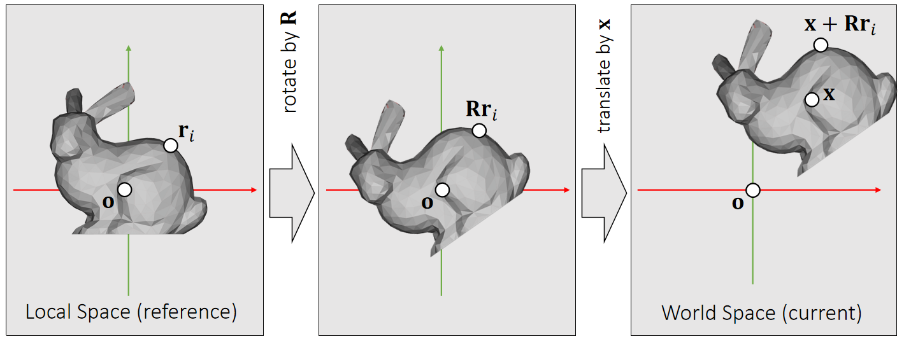
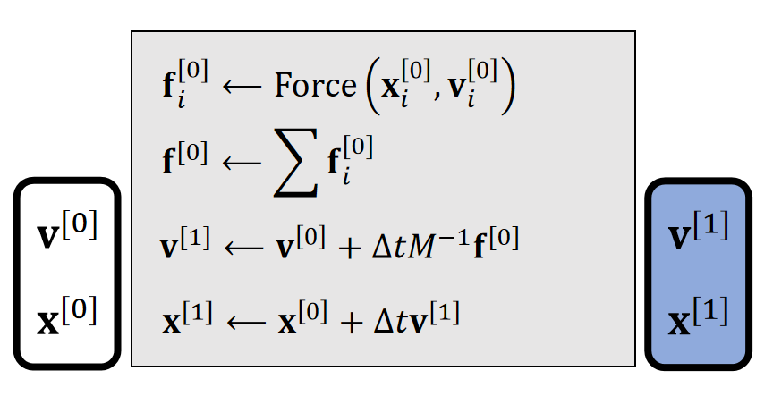
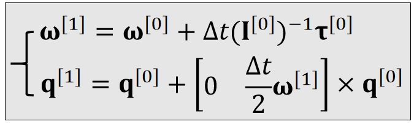

P2   
## What is rigid body dynamics?     

P3  
## Rigid Bodies    

Our living environment is stuffed with rigid objects.

> &#x2705; rigid：物体很硬，因此不考虑形变。

P6  
## Rigid Body Simulation   

The goal of simulation is to update the state variable \\(\mathbf{s} ^{[k]}\\) over time.     

     

P7   
## Rigid Body Motion  

If a rigid body cannot deform, its motion consists of two parts: translation and rotation.   

     

P9
## Translational Motion    

P10
## Translational Motion   

     

For translational motion, the state variablecontains the position \\(\mathbf{x}\\) and the velocity \\(\mathbf{v}\\).     

 

$$
\begin{cases}
 \mathbf{v} (t^{[1]})=\mathbf{v} (t^{[0]})+\mathbf{M} ^{−1}\int_{t^{[0]}}^{t^{[1]}} \mathbf{f} (\mathbf{x} (t), \mathbf{v} (t), t)dt\\\\
\mathbf{x} (t^{[1]})=\mathbf{x} (t^{[0]})+\int_{t^{[0]}}^{t^{[1]}} \mathbf{v} (t)dt
\end{cases}
$$

 

P11   
## Integration Methods Explained    

By definition, the integral \\(\mathbf{x} (t) = \int \mathbf{v}  (t) dt\\) is the area. Many methods estimate the area as a box.   

 

 

> &#x2705; 也可以用\\(\mathbf{\dot{x}} \\)表示速度\\(\mathbf{v} \\)    
速度是加速度的积分，因此\\( \Delta t=\int a=\int \frac{F}{M} =M^{-1}\int F\\).   
位置是速度的积分   
本质上是解积分   

> &#x2705; 假设\\(\mathbf{x} \\)和\\(\mathbf{v} \\)都是一维的速度的积分就是阴影区域的面积。 

P12   
## Integration Methods Explained    

 

 

> &#x2705; 使用 \\(t_0\\) 时刻的速度：显式积分  
使用 \\(t_1\\) 时刻的速度：隐式积分  
两种方法都只能一阶近似   

P13  
## Integration Methods Explained   

 

 

P14
## Integration Methods Explained   

By definition, the integral \\(\mathbf{x} (t)=∫\mathbf{v} (t) dt\\) is the area.  Many methods estimate the area as a box.    

|Explicit Euler (1st-order accurate) sets the height at \\(t^{[0]}\\).   \\(\int_{t^{[0]}}^{t^{[1]}} \mathbf{v} (t)dt≈∆t  \mathbf{v} (t^{[0]})\\)|   
|---|      
  

\\(\quad\\)

|  Implicit Euler (1st-order accurate) sets the height at \\(t^{[0]}\\).   \\(\int_{t^{[0]}}^{t^{[1]}} \mathbf{v} (t)dt≈∆t  \mathbf{v} (t^{[1]})\\) |  
|----|  
      
\\(\quad\\)

|  Mid-point (2nd-order accurate) sets the height at \\(t^{[0]}\\).   \\(\int_{t^{[0]}}^{t^{[1]}} \mathbf{v} (t)dt≈∆t  \mathbf{v} (t^{[0.5]})\\) |     
|----|

    

P15   
## Translational Motion    

$$
\begin{cases}
 \mathbf{v} (t^{[1]})=\mathbf{v} (t^{[0]})+\mathbf{M} ^{−1}\int_{t^{[0]}}^{t^{[1]}} \mathbf{f} (\mathbf{x} (t), \mathbf{v} (t), t)dt\\\\
\mathbf{x} (t^{[1]})=\mathbf{x} (t^{[0]})+\int_{t^{[0]}}^{t^{[1]}} \mathbf{v} (t)dt
\end{cases}
$$

> &#x2705; 在当前应用场景中，使用前面方法的混合   

P16 
## Leapfrog Integration    

    

In some literature, such a approach is called *semi-implicit*.  

It has a funnier name: the *leapfrog method*.

    

> &#x2705; 速度和位置是错开的  

P17  
## Types of Forces  

    

> &#x2705; 在做模拟时，如果不要求能量守衡，出于问题简化的目的，直接对速度做衰减，代替引入阻力  

P18  
## igid Body Simulation (Translation Only)    

    

    

The mass \\(M\\) and the time step \\(\Delta t\\) are user-specified variables.     

> &#x2705; 实际应用中，\\(\Delta t\\)要跟帧率匹配   
质量 M 可以是个对角矩阵或实数    

P19  
## Rotational Motion

P20   
## Rotation Represented by Matrix     

 - The matrix representation is widely used for rotational motion.    
 - It’s friendly for applying rotation to each vertex (by <u>matrix-vector multiplication</u>).    

 - But it is not suitable for dynamics:   
    - It has too much redundancy: 9 elements but only 3 DoFs.    
    - It is non-intuitive.     
    - Defining its time derivative (*rotational velocity*) is also difficult.   
    

P21  
## Rotation Represented by Euler Angles    

 - The Euler Angles representation is also popular, often in design and control.    
 - It is intuitive. It uses three axial rotations to represent one general rotation. Each axial rotation uses an angle.     
 - In Unity, the order is rotation-by-Z, rotation-by-X, then rotation-by-Y.     

 - But it is not suitable for dynamics either:    
    - It can lose DoFs in certain statuses: gimbal lock.    
    - Defining its time derivative (rotational velocity) is difficult.    
    

P22  
## Gimbal Lock   

The alignment of two or more axes results in a loss of rotational DoFs.     

    

P23  
## Rotation Represented by Quaternion    

    

In the complex system, two numbers represent a 2D point.   

>  What about a “complex” system for 3D point? **Quaternion**! Four numbers represent a 3D point (with multiplication and division).    

P24   
## Quaternion Arithematic    

Let \\(\mathbf{q}  = \begin{bmatrix}
\mathbf{s}   &\mathbf{v} 
\end{bmatrix} \\) be a quaternion made of two parts: a scalar part \\(s\\) and a 3D vector part \\(\mathbf{v}\\), accounting for \\(\mathbf{ijk}\\).

\\(\quad\\)    

\\(a\mathbf{q} =\begin{bmatrix}
 as  &a\mathbf{v} 
\end{bmatrix}\quad\\) Scalar-quaternion Multiplication    

\\(\mathbf{q} _1±\mathbf{q} _2 =\begin{bmatrix}
 \mathbf{s}_1±\mathbf{s}_2  & \mathbf{v} _1 ± \mathbf{v} _2
\end{bmatrix}\quad\quad\\) Addition/Subtraction    

\\(\mathbf{q} _1×\mathbf{q} _2= \begin{bmatrix}
 \mathbf{s} _1\mathbf{s} _2−\mathbf{v} _1\cdot \mathbf{v} _2 & \mathbf{s} _1\mathbf{v} _2+\mathbf{s} _2\mathbf{v} _1+\mathbf{v} _1×\mathbf{v} _2
\end{bmatrix}\quad\quad\\) Multiplication   

\\(||\mathbf{q} ||=\sqrt{\mathbf{s^2+v\cdot v} } \quad\quad\\)Magnitude    

\\(\quad\\)    

> &#x2705; 在有些库里面写作： \\(q = \begin{bmatrix}
 w & x & y &z
\end{bmatrix}\\)，w为实数部分  

P25   
## Rotation Represented by Quaternion    

 - To represent a rotation around \\(\mathbf{v}\\) by angle \\(0\\), we set the quaternion as:    

       

 - lt's very intuitive. lt's the built-in representation in Unity.     
 - Convertible to the matrix:   

$$
\mathbf{R}=\begin{bmatrix}
s^2+x^2-y^2-z^2  & 2(xy-sz) & 2(xz+sy)\\\\
 2(xy+sz) & s^2-x^2+y^2-z^2 & 2(yz-sx) \\\\
 2(xz-sy) & 2(yz+sx) & s^2-x^2-y^2+z^2  
\end{bmatrix}
$$

P27   
## Rotational Motion    

    

Now we choose quaternion \\(\mathbf{q}\\) to represent theorientation, i.e., the rotation from the *reference* to the *current*.    

We use a 3D vector \\(\mathbf{\omega}\\) to denote angularvelocity.    

$$ 
\begin{cases} \text{The direction of } \mathbf{\omega} \text{ is the axis.} \\\\    
\text{The magnitude of }  \mathbf{\omega} \text{ is the speed.}   
\end{cases}
$$ 

     

P28   
## Torque and Inertia

     

> &#x2705; Torque：力矩   
[?] 为会么力矩由叉差乘得到？力矩与为垂直？   
用于旋转的质量不再是实数，而是矩阵，称为 Inertia 矩阵，用 \\(\mathbf{I}\\) 来标记 Inertia 矩阵，其中 \\(\mathbf{I}_{ref}\\)为参考状态，\\(\mathbf{I}\\) 为当前状态，\\(\mathbf{I}\\) 是 \\(3\times 3\\) 矩阵。  

P29   
## Translational and Rotational Motion   

|    |Translational (linear)|Rotational (Angular)|
|---|---|---|
|Updafe|   |   |
|states| Velocity \\(\mathbf{v}\\)   Position \\(\mathbf{x}\\)|Angular velocity \\(\mathbf{ω} \\)    Quaternion \\(\mathbf{q}\\) |
| Physical Quantities |Mass \\(\mathbf{M}\\)   Force \\(\mathbf{f}\\) | Inertia \\(\mathbf{I} \\)   Torque \\(\mathbf{τ} \\) |

> &#x2705;  平移： \\(a = \frac{力}{质量}\\)     
旋转： \\(a =\frac{力矩}{\text{Inertia}}\\)   
\\(q\\)是四元数，代表物体的旋转状态   
\\(q_1\times q_2\\)不是叉乘，而是四元数普通乘法    
[ \\(\cdot\\) ]是有一个四元数，0为实部，后面为虚部   
算完\\(q^{[1]}\\)的之后要对它 Normalize     

P30 
## Rigid Body Simulation    

     

平移：   
     

旋转：   
     

P32   
## Some More lssues
 - Gravity doesn't cause any torque! lf your simulator does not contain any other force, there is no need to update \\(\mathbf{\omega}\\).    

P33
## After-Class Reading (Before Collision)

<https://graphics.pixar.com/pbm2001>     
Rigid Bdy Dyunis    

