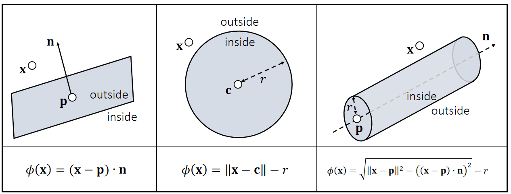

P2  
## Last week…  

In practice, we update the same state variable \\(\mathbf{s} =\\){\\(\mathbf{v,x,\omega ,q}\\)} over time.     

     

P3   
## What is a torque?   

A torque is the rotational equivalent of a force. It describes the rotational <u>tendency</u> caused by a force.    

     

\\(\mathbf{τ} _i\\) is perpendicular to both vectors: \\(\mathbf{Rr} _i\\) and \\(\mathbf{f} _i\\).    

\\(\mathbf{τ} _i\\) is porportional to ||\\(\mathbf{Rr} _i\\)|| and ||\\(\mathbf{f} _i\\)||.    

\\(\mathbf{τ} _i\\) is porportional to \\(\sin \theta\\).     
(\\(\theta\\)  is the angle between two vectors.)

|\\(\mathbf{τ} _i\longleftarrow (\mathbf{Rr} _i)\times \mathbf{f} _i\\)|   
|----|

> &#x2705; 力矩的方向为造成旋转的旋转轴方向。   

P6   

## What is an inertia tensor?    

Similar to mass, an inertia tensor describes the resistance to rotational tendency caused by torque. But different from mass, it’s not a constant.    

     

Which side receives greater resistance?     

> &#x2705; 两图的力矩大小相同，但产生的旋转不同   
inertia 看作是对运动的抵抗，其效果与力矩的方向有关，因此不是常数  

P7   
## What is an inertia tensor?   

It’s a matrix! The mass inverse is the resistance (just like mass).    

     

\\(\mathbf{I} _{\mathbf{ref} }=\sum m_i(\mathbf{r} _i^\mathbf{T} \mathbf{r} _i\mathbf{1} −\mathbf{r} _i\mathbf{r} _i^\mathbf{T} )\\)

\\(\mathbf{1}\\)  is the 3-by-3 identity.

     

What about the current inertia?      

\\(\mathbf{I} =\sum m_i(\mathbf{r} _i^\mathbf{T}\mathbf{R}  ^\mathbf{T}\mathbf{Rr}  _i\mathbf{1} −\mathbf{Rr} _i\mathbf{r} _i^\mathbf{T} \mathbf{R^T} )\\)   

\\(\quad=\sum m_i(\mathbf{Rr} _i^\mathbf{T}\mathbf{r}  _i\mathbf{1R}  ^\mathbf{T} −\mathbf{Rr} _i\mathbf{r} _i^\mathbf{T} \mathbf{R^T} )\\) 

\\(\quad=\sum m_i\mathbf{R}(\mathbf{r}_i^\mathbf{T}\mathbf{r}_i\mathbf{1}−\mathbf{r}_i\mathbf{r}_i^\mathbf{T} ) \mathbf{R^T}\\)   

\\(\quad=\mathbf{RI_{ref}R^T}\\)    

> &#x2705; inertia 也与自身的状态相关，但不需要每次都根据当前状态计算，而是基于一个已经算好的ref状态的 inertia快速得出。  

   

P10  
## Particle Collision Detection and Response    

P11  
## Signed Distance Function   

A <u>signed</u> distance function \\(\phi (\mathbf{x} )\\) defines the distance from \\(\mathbf{x}\\) to a surface with a signThe sign indicates on which side \\(\mathbf{x}\\) is located.     

     

P12   
## Signed Distance Function Examples    

     

> &#x2705; 圆柱SD=基于勾股定理，\\(\sqrt{\cdot }\\) 内第一项为斜边长，
第二项为底边长，得出点到中轴的距离。  

P13   
## Intersection of Signed Distance Functions    

     

> If \\(\phi _0(\mathbf{x} )<0\\) and \\(\phi_1(\mathbf{x} )<0\\) and \\(\phi_2(\mathbf{x} )<0\\)      
then inside    
\\(\phi (\mathbf{x} )\\)=max \\(⁡(\phi_0(\mathbf{x}),\phi_1(\mathbf{x}),\phi_2(\mathbf{x}))\\)     
Else outside    
\\(\phi (\mathbf{x})=?\\)   

P14  
## Union of Signed Distance Functions   

     

Intuitively, we can consider collision detection with the union of two objects as **collision detection with two separate objects**.     

> &#x2705; 有时候此公式不成立，例如图中\\(\mathbf{x}\\) 点  

P15   
## Quadratic Penalty Method    

A penalty method applies a penalty force in the next update. When the penalty potential is quadratic, the force is linear.     

     

     

> &#x2705; 存在的问题：只有\\(\mathbf{x}\\) 进入 mesh 内部了，才会有力，但此时穿透的 artifacts 已经产生了。解决方法：使用buffor  

P16   
## Quadratic Penalty Method with a Buffer   

A buffer helps lessen the penetration issue. But it cannot strictly prevent penetration, no matter how large \\(k\\) is.      

     
     

> &#x2705; 如果 \\(k\\) 太小，快速的碰撞仍会产生 artifacts   
如果 \\(k\\) 太大，碰撞的反弹过于强烈(overshooting)  
解决方法：不用常数 \\(k\\) ，而是 \\(k\\) 与距离相关  

P17   
## Log-Barrier Penalty Method     

A log-barrier penalty potential ensures that the force can be large enough. But it assumes \\(\phi (\mathbf{x} ) < 0\\) will never happen!!! To achieve that, it needs to adjust \\(\Delta t\\).     

     

     

> &#x2705; 1.当\\(\mathbf{x}\\) 靠近物体表面时，仍然会 overshooting   
 2.\\(\mathbf{x}\\) 穿透表面后，会越陷越深。  
 3.本算法要求保证穿透永远不会发生，因此要仔细调节 \\(\Delta t\\).  

P18  
## A Short Summary of Penalty Methods    

 - The use of step size adjustment is a must.     
    - To avoid overshooting.    
    - To avoid penetration in log-barrier methods.    

 - Log-barrier method can be limited within a buffer as well.    
    - Li et al. 2020. *Incremental Potential Contact: Intersection- and Inversion-free Large Deformation Dynamics*. TOG.    
    - Wu et al. 2020. *A Safe and Fast Repulsion Method for GPU-based Cloth Self Collisions*. TOG.   

 - Frictional contacts are difficult to handle.    
 

> &#x2705; Penalty 方式难以模拟摩擦    
好处：易实现  
隐式积分比显式积分好，因为显式不稳定。  

 
P19   
## Impulse Method    

An impulse method assumes that collision changes the position and the velocity all of sudden.      

    

    

> &#x2705; Penalty 方法先碰撞再惩罚，效果滞后。   
Impulse方法碰撞时立即更新速度和位置   

P20    
Changing the position is not enough, we must change the velocity as well.      

    

> &#x2705; \\(\mathbf{v}\cdot \mathbf{N}\ge 0\\)：当前速度想要让物体越陷越深, 这种情况下才需要更新速度   
把\\(\mathbf{v}\\)分解为\\(\mathbf{V_T}\\)和\\(\mathbf{V_N})\\).  
\\(\mathbf{V_T}\\)方向速度反弹， \\(\mu _\mathbf{N}\\) 为反弹系数，[0.]   
\\(\mathbf{V_N}\\)方向不变或由于摩擦再衰减  
[?]库仑定律的物理意义是什么？  
优点：可以精确控制摩擦力和反弹位置，但计算比 Penalty 复杂   
刚体常见于 Impulse； 弹性体常见于Pealty.   

P21   
## Rigid Body Collision Detection and Response   

P23   
## Rigid Body Collision Detection   

    

When the body is made of many vertices, we can detect its collision by testing each vertex:     

$$
\mathbf{x}_i\longleftarrow  \mathbf{x} +\mathbf{Rr} _i
$$

No a perfect solution, but acceptable (will come back to this weeks later…)     

> &#x2705; 遍历 mesh 上的每个点，依次做碰撞检测。  

P24   
## Rigid Body Collision Response by Impulse

    

Vertex *i*:    

    

Problem: **we cannot directly modif**y \\(\mathbf{x}_i\\) or \\(\mathbf{v}_i\\) **isince they not state variables**. They areindirectly determined.     

Solution: we will find a way to modify \\(\mathbf{v}\\) and \\(\mathbf{\omega}\\).     

   
> &#x2705; \\(\mathbf{x}_i\\)和\\(\mathbf{v}_i\\)都是根据中间量算出来的，无法直接修改   
通过修改\\(\mathbf{v}\\)和\\(\mathbf{\omega}\\)实现    

P25   
思考过程：   
What happens to \\(\mathbf{V}_i\\) when an impulse \\(\mathbf{j}\\) is appliedat vertex \\(i\\)?      

    

> &#x2705; \\(\mathbf{j}\\) 是一个未知的冲量。  
[?] 什么是冲量？和力什么区别？   
\\(\mathbf{v}_i\\) 是点速度、\\(\mathbf{v}\\)是线速度     

P27    

$$
\mathbf{v_i^{new}} = \mathbf{v} _i+\frac{1}{M}\mathbf{j} −(\mathbf{Rr} _i)×(\mathbf{I} ^{−1}(\mathbf{Rr} _\mathbf{i}\times \mathbf{j} ))
$$

$$
\mathbf{v_i^{new}} = \mathbf{v} _i+\frac{1}{M} \mathbf{j} −(\mathbf{Rr} _i)^∗\mathbf{I} ^{−1} (\mathbf{Rr} _i)^∗\mathbf{j} 
$$

> 
>$$
>\mathbf{v_i^{new}}-\mathbf{v}_i=\mathbf{Kj}
>$$
>$$
>\mathbf{K} \longleftarrow \frac{1}{M} \mathbf{1} −(\mathbf{Rr} _i)^{∗}\mathbf{I} ^{−1}(\mathbf{Rr} _i)^{∗}
>$$
> 

> &#x2705; 已知 \\(\mathbf{v}_i^{new},\mathbf{v}_i,\mathbf{K}\\),求 \\(\mathbf{j}\\)     
冲量=时间 \\(\cdot\\)力  

P26   
## Cross Product as a Matrix Product    

We can convert the cross product \\(\mathbf{r}\times\\) into a matrix product \\(\mathbf{r}^*\\).    

    

> &#x2705; \\(\mathbf{r}^*\\) 是 \\(\mathbf{r}\\) 的 cross matrix.   
目的：用矩阵形式代替叉乘形式，方便公式化简   

P28  
## Rigid Body Collision Response by Impulse    

    

> &#x2753; 如果有多个顶点发生碰撞呢？  
回答在 ？29   

P29  
## Some Implementation Details    

 - If there are many vertices in collision, we use their position average.     

 - We can decrease the restitution \\(\mathbf{\mu_N} \\) to reduce oscillation.     

 - We don't update the position here. Why?      
    - Because the problem is nonlinear.     
    - We will come back to this later when we talk about constraints.      

> &#x2705; Oscillation 问题  
原因：重力让它往下，冲量让它往上   
解决方法：接近静止时衰减 \\(\mathbf{\mu_N} \\)      

P30   
## Rigid Body Collision Response by Impulse    

    

Relative velocity at joints     

$$
\begin{cases}
 \mathbf{v} _0 ^{\mathbf{new} }− \mathbf{v} _0=\mathbf{K} _{a00 }\mathbf{j} _0+\mathbf{K} _{a01 }\mathbf{j} _1 −(−\mathbf{K} _{b00 }\mathbf{j} _0 +\mathbf{K} _{b02}\mathbf{j} _2 )\\\\
 \mathbf{v} _1 ^{\mathbf{new} }− \mathbf{v} _1=\mathbf{K} _{a10 }\mathbf{j} _0+\mathbf{K} _{a11 }\mathbf{j} _1 −(−\mathbf{K} _{c11 }\mathbf{j} _0 +\mathbf{K} _{c13 }\mathbf{j} _3 )\\\\
 \mathbf{v} _2 ^{\mathbf{new} }− \mathbf{v} _2=\mathbf{K} _{b20 }\mathbf{j} _0+\mathbf{K} _{b22 }\mathbf{j} _2\\\\
\mathbf{v} _3 ^{\mathbf{new} }− \mathbf{v} _3=\mathbf{K} _{c31 }\mathbf{j} _1+\mathbf{K} _{c33 }\mathbf{j} _3
\end{cases}
$$

$$
\Downarrow
$$

$$
\begin{bmatrix}
 \mathbf{K} _{a00 }+\mathbf{K} _{b00 } & \mathbf{K} _{a01 } & -\mathbf{K} _{b02 } & \Box \\\\
 \mathbf{K} _{a10 } & \mathbf{K} _{a11 }+\mathbf{K} _{c11 } & \Box  & -\mathbf{K} _{c13 }\\\\
 -\mathbf{K} _{b20 } & \Box  & \mathbf{K} _{b22} & \Box \\\\
 \Box  & -\mathbf{K} _{c31 } & \Box  & \mathbf{K} _{c33 } 
\end{bmatrix}\begin{bmatrix}
 \mathbf{j} _{0 }\\\\
 \mathbf{j} _{1}\\\\
 \mathbf{j} _{2}\\\\
\mathbf{j} _{3}
\end{bmatrix}=\begin{bmatrix}
 \bigtriangleup \mathbf{v} _{0}\\\\
 \bigtriangleup \mathbf{v} _{1}\\\\
 \bigtriangleup \mathbf{v} _{2}\\\\
\bigtriangleup \mathbf{v} _{3}
\end{bmatrix}
$$

\\(\mathbf{K} _{a01}\mathbf{j} _1\\) stands for the velocity change of bunny \\(a\\) at joint 0, caused by impulse \\(\mathbf{j}_1\\).

P31  
## After-Class Reading (Before Collision)    

<https://graphics.pixar.com/pbm2001>     
Rigid Body Dynamics

P32    
## Shape Matching    

P33  
## Basic Idea    

We allow each vertex to have its own velocity, so it can move by itself.     

    

First, move vertices **independently** by its velocity, with collision and friction being handled.     

Second, enforce the **rigidity** constraint to become a rigid body again.      

> &#x2705; 第二步是 Shape Matching 的关键   

P34  
## Mathematical Formulation    

Now \\(\mathbf{c}\\) and \\(\mathbf{R}\\) are unknowns we want to find out from:

    

> &#x2705; \\(\mathbf{c}\\) 代表质心，即前面的 \\(\mathbf{x}\\)    
约束前后质心位置不变   

P35  
## Mathematical Formulation   

    

> &#x2705; 先假设 \\(\mathbf{R}\\) 是任意矩阵 \\(\mathbf{A}\\),再从中提取旋转成分   

P36   
## Remember that…   

Singular value decomposition says any matrix can be decomposed into: rotation,scaling and rotation: \\(\mathbf{A = UDV} ^T\\).    

    

We can rotate the object back before the final rotation: \\(\mathbf{A}  = (\mathbf{UV} ^T)(\mathbf{VDV} ^T)\\).    

    

> &#x2705; \\(\mathbf{A} = （\mathbf{UV}^T）(\mathbf{VDV}^T) =\mathbf{RS}\\)   
\\(\mathbf{R}\\) 代表全局旋转，\\(\mathbf{S}\\)代表本地形变    

P37   
We can rotate the object back before the final rotation: \\(\mathbf{A}  = (\mathbf{UV} ^T)(\mathbf{VDV} ^T)\\).    

    

P38  
## Polar Decomposition     

    

$$
\mathbf{A=RS} 
$$

$$
\mathbf{A} ^T\mathbf{A}  = \mathbf{S} ^T\mathbf{S}  = \mathbf{S} ^2
$$

分解结果:unique   

P39  
## Shape Matching    

| Independent Update   For every vertex  \\(\mathbf{f} _i\longleftarrow   \mathbf{Force}  (\mathbf{x} _i, \mathbf{v} _i)\\) \\(\mathbf{v} _i\longleftarrow \mathbf{v} _i + \bigtriangleup tm_i^{-1}\mathbf{f} _i\\) \\(\mathbf{y} _i \longleftarrow  \mathbf{x}_i + \bigtriangleup t\mathbf{v} _i\\)|   
|----|

\\( \\)  

|Rigidify the vertices \\(\mathbf{c} =\frac{1}{N}\sum_i\mathbf{y} _i\\) \\(\mathbf{A} =(∑ _i(\mathbf{y} _i−\mathbf{c} ) \mathbf{r} _i^\mathbf{T} )(∑_i\mathbf{r} _i \mathbf{r} _i^\mathbf{T} )^{−1}\\) \\(\mathbf{R} =\mathrm{Polar} (\mathbf{A} )\\)|   
|----|

\\( \\) 

|Update \\(\mathbf{v}_i\\) and \\(\mathbf{x}_i\\) For every vertex \\(\mathbf{v}_i\longleftarrow (\mathbf{c} +\mathbf{Rr}_i−\mathbf{x}_i)/∆t\\) \\(\mathbf{x}_i\longleftarrow \mathbf{c} +\mathbf{Rr}_i\\)|
|---|   

Physical quantities are attached to each vertex, not to the entire body.   

P40  
## Shape Matching    

 - Easy to implement and compatible with other nodal systems, i.e., cloth, soft bodies and even particle fluids.    

 - Difficult to strictly enforce friction and other goals.     
    - The rigidification process will destroy them.    

 - More suitable when the friction accuracy is unimportant, i.e., buttons on clothes.    
 
 
 P41   
## After-Class Reading    

Muller et al. 2005.    
*Meshless Deformations Based on Shape Matching*. TOG (SIGGRAPH).     

---------------------------------------
> 本文出自CaterpillarStudyGroup，转载请注明出处。
>
> https://caterpillarstudygroup.github.io/GAMES103_mdbook/