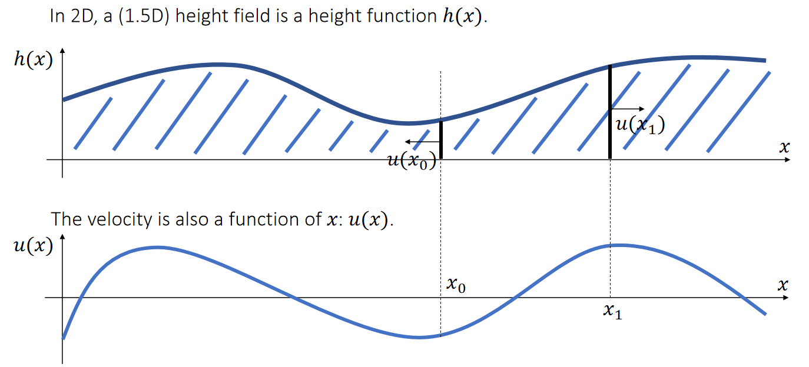
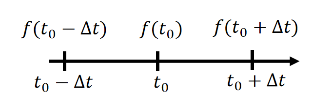

P1   
## Fluid Effects    

Unlike other bodies, Fluids exhibit highly volatile behaviors. As a result, it’s difficult to come up with a single, efficient way for simulating all of fluid effects.     

P3   
## Two Types of Simulation Approaches  

|     |    |  
|---|----|
| Lagrangian Approach  (dynamic particles or mesh)  Node movement carries physical quantities (mass, velocity, …). |  Eulerian Approach   (static grid or mesh)   Grid/Mesh doesn’t move.  Stored physical quantities change.  |
  

P4   
## A Height Field Model   

P5   
## Height Field    

    

P6   
## Height Field   

 

P7   
## Height Field   

    

P8   
## Height Field

Ignoring advection and external acceleration, we get a simple form:   

$$
\begin{matrix}
\frac{du(x)}{dt}=−\frac{1}{ρ} \frac{dP(x)}{dx} \quad \quad & ρ: \text{density} \quad \quad & P(x):\text{pressure}
\end{matrix}
$$

   

P9   
## Shallow Wave Equation   

We now have two equations:   

 

We can then eliminate \\(u\\) and formulate the shallow wave equation:    

| $$\frac{d^2ℎ}{dt^2} =\frac{ℎ}{ρ} \frac{d^2P}{dx^2} $$ |
|----|  

P10  
## Discretization

We discretize a continuous height field into a discrete set of height columns.    

  

P11   

## Finite Differencing   

The idea of finite differencing is to use the difference to approximate the derivative.     

  

$$
f(t_0+∆t)=f(t_0)+∆t\frac{df(t_0)}{dt} +\frac{∆t^2}{2} \frac{d^2f(t_0)}{dt^2} +…
$$

Forward differencing (first-order)   

| $$\frac{df(t_0)}{dt} ≈\frac{f(t_0+∆t)−f(t_0)}{∆t}$$ | 
|---|

  

$$
f(t_0−∆t)=f(t_0)−∆t\frac{df(t_0)}{dt}+\frac{∆t^2}{2}\frac{d^2f(t_0)}{dt^2} +…
$$

Backward differencing (first-order)     

| $$ \frac{df(t_0)}{dt}≈\frac{f(t_0)−f(t_0−∆t)}{∆t} $$ | 
|---|

P12   
## Finite Differencing

The idea of finite differencing is to use the difference to approximate the derivative.    

|||  
|---|---|
|| $$f(t_0+∆t)=f(t_0)+∆t\frac{df(t_0)}{dt}+\frac{∆t^2}{2}\frac{d^2f(t_0)}{dt^2} +… \\\\\quad\\\\ f(t_0-∆t)=f(t_0)+∆t\frac{df(t_0)}{dt}+\frac{∆t^2}{2}\frac{d^2f(t_0)}{dt^2} +…$$  |

Central differencing (second-order)   

| $$ \frac{df(t_0)}{dt}≈\frac{f(t_0+∆t)−f(t_0−∆t)}{2∆t} $$ | 
|---|

P13   
## Second-Order Derivatives   

We apply central differencing twice to estimate \\(d^2ℎ_i/dt^2\\).    

$$
\begin{matrix}
 \frac{dℎ_i(t_0+0.5∆t)}{dt}≈\frac{ℎ_i(t_0+∆t)−ℎ_i(t_0)}{∆t}  \quad\quad& \frac{dℎ_i(t_0−0.5∆t)}{dt}≈\frac{ℎ_i(t_0)−ℎ_i(t_0−∆t)}{∆t} 
\end{matrix}
$$

| $$\frac{d^2ℎ_i(t_0)}{dt^2}≈\frac{\frac{dℎ_i(t_0+0.5∆t)}{dt}−\frac{dℎ_i(t_0−0.5∆t)}{dt} }{∆t} ≈\frac{ℎ_i(t_0+∆t)+ℎ_i(t_0−∆t)−2ℎ_i(t_0)}{∆t^2}$$ |
|---|

   

P14    
## Second-Order Derivatives   

Similarly, we apply central differencing twice to estimate \\(d^2P/dx^2\\).      

$$
\begin{matrix}
 \frac{dP_{i+0.5}}{dt} ≈\frac{P_{i+1}−P_i}{∆x} \quad\quad & \frac{dP_{i−0.5}}{dx} ≈\frac{P_i−P_{i−1}}{∆x} 
\end{matrix}
$$

|  $$\frac{d^2P_i}{dx^2}≈\frac{\frac{dP_{i+0.5}}{dx}−\frac{dP_{i−0.5}}{dx}}{∆x} ≈\frac{P_{i+1}+P_{i−1}−2P_i}{∆x^2}$$ |
|---|   

   

P15   
## Discretized Shallow Wave Equation    

We can now discretize the shallow wave equation \\(\frac{d^2ℎ}{dt^2}=\frac{ℎ}{ρ}\frac{d^2P}{dx^2}\\).     

 
> \\(\begin{matrix}\\
 \frac{d^2ℎ_i(t_0)}{dt^2}≈\frac{ℎ_i(t_0+∆t)+ℎ_i(t_0−∆t)−2ℎ_i(t_0)}{∆t^2}\quad  &\frac{d^2P_i}{dx^2 }≈\frac{P_{i+1}+P_{i−1}−2P_i}{∆x^2}\\\\
\end{matrix}\\)

> \\(\Rightarrow \frac{ℎ_i(t_0+∆t)+ℎ_i(t_0−∆t)−2ℎ_i(t_0)}{∆t^2}=\frac{ℎ_i}{ρ} (\frac{P_{i+1}+P_{i−1}−2P_i}{∆x^2})\\)

>\\(\Rightarrow ℎ_i(t_0+∆t)=2ℎ_i(t_0)−ℎ_i(t_0−∆t)+\frac{∆t^2ℎ_i}{∆x^2ρ}(P_{i+1}+P_{i−1}−2P_i)\\)

P16    
## Volume Preservation     

We want the volume to stay the same. Suppose that \\(\sum ℎ_i(t)=\sum ℎ_i(t−∆t)=V\\). But,    

$$
ℎ_i(t_0+∆t)=2ℎ_i(t_0)−ℎ_i(t_0−∆t)+\frac{∆t^2ℎ_i}{∆x^2ρ}(P_{i+1}+P_{i−1}−2P_i)
$$

   

P17    
## Volume Preservation – Solution 1    

    

P18  
## After-Class Reading    

Kass and Miller. 1990. *Rapid, Stable Fluid Dynamics for Computer Graphics*. Computer Graphics.    

P19   
## Volume Preservation – Solution 2

An easier way to preserve volume is to **simply assume** \\(h_i\\) in the right term is constant.     

    

P20   
## Pressure    

 

P21   
## Viscosity   

Like damping, viscosity tries to slow down the waves. 

 

P22   
## Algorithm  

> $$\text{A Shallow Wave Simulator}$$
For every cell \\(i\\)
$$ℎ_i^{new}←ℎ_i+β(ℎ_i−ℎ_i^{old})\\\\
ℎ_i^{new}←ℎ_i^{new}+α(ℎ_{i−1}−ℎ_i)\\\\
ℎ_i^{new} ←ℎ_i^{new}+α(ℎ_{i+1}−ℎ_i)\\\\$$
For every cell \\(i\\)
$$ℎ_i^{old}←ℎ_i\\\\    
ℎ_i←ℎ_i^{new}$$

P23  
## Boundary Conditions   

 

A Dirichlet boundary assumes that the boundary height \\(H_{i+1}\\) is constant.  It’s considered as an open boundary.    

$$
ℎ_{i+1}−ℎ_i+ℎ_{i−1}−ℎ_i=H_{i+1}−ℎ_i+ℎ_{i−1}−ℎ_i
$$

 

A Neumann boundary specifies the boundary derivatives.  For example, a zero-derivative boundary means \\(ℎ_{i+1}≡ℎ_i\\).  It’s considered as a closed boundary.   

$$
ℎ_{i+1}−ℎ_i+ℎ_{i−1}−ℎ_i=ℎ_{i−1}−ℎ_i
$$

P24   
## Algorithm with Neumann Boundaries

> $$\text{A Shallow Wave Simulator}$$    
For every cell \\(i\\)   
$$ℎ_i^{new}←ℎ_i+β(ℎ_i−ℎ_i^{old})\\\\\text{If } ℎ_{i−1}\text{ exists, then  }ℎ_i^{new}←ℎ_i^{new}+α(ℎ_{i−1}−ℎ_i)\\\\ \text{If } ℎ_{i+1} \text{ exists,  then } ℎ_i^{new}←ℎ_i^{new}+α(ℎ_{i+1}−ℎ_i)$$
For every cell \\(i\\)    
$$ℎ_i^{old}←ℎ_i\\\\ℎ_i←ℎ_i^{new}  $$

P25   
## Algorithm with Neumann Boundaries   

Extending the simulator to 3D is also straightforward.   

> $$\text{A Shallow Wave Simulator}$$      
For every cell \\(i, j\\)    
$$ℎ_{i,j}^{new}←ℎ_{i,j}+β(ℎ_{i,j}−ℎ_{i,j}^{old})\\\\\text{If } ℎ_{i−1,j} \text{ exists, then  } ℎ_{i,j}^{new}←ℎ_{i,j}^{new}+α(ℎ_{i−1,j}−ℎ_{i,j})\\\\ \text{If } ℎ_{i+1,j} \text{ exists, then  } ℎ_{i,j}^{new}←ℎ_{i,j}^{new}+α(ℎ_{i+1,j}−ℎ_{i,j})\\\\  \text{If } ℎ_{i,j−1} \text{ exists, then  } ℎ_{i,j}^{new} ←ℎ_{i,j}^{new}+α(ℎ_{i,j−1}−ℎ_{i,j})\\\\ \text{If } ℎ_{i,j+1} \text{ exists, then  } ℎ_{i,j}^{new}←ℎ_{i,j}^{new}+α(ℎ_{i,j+1}−ℎ_{i,j})$$
For every cell \\(i, j\\)    
$$ℎ_{i,j}^{old}←ℎ_{i,j}\\\\ℎ_{i,j}←ℎ_{i,j}^{new}$$

P26   
## Two-Way Coupling    

The coupling between a solid and a liquid should be two-way, i.e., liquid->solid and solid->liquid.    

   

P27   
## Two-Way Coupling

The coupling between solid and water should be two-way, i.e., water>solid and solid- >water.     

The key question is how to expel water out of the gray cell regions???    

    

P28   
## Virtual Height    

The idea is to set up a virtual height \\(v_i\\), so that  \\(ℎ_i^\text{real_new}=ℎ_i−e_i\\).    

$$
ℎ_i−e_i=ℎ_i+β(ℎ_i−ℎ_i^{old})+α(v_{i+1}+ℎ_{i+1}+ℎ_{i−1}−2v_i−2{ℎ_i})=ℎ_i^{new}+α(v_{i+1}−2v_i)
$$

$$
ℎ_{i+1}−e_{i+1}=ℎ_{i+1}+β(ℎ_{i+1}−ℎ_{i+1}^{old})+α(ℎ_{i+2}+v_i+ℎ_i−2v_{i+1}−2ℎ_{i+1})=ℎ_{i+1}^{new}+α(v_i−2v_{i+1})
$$

    

P29   
## Poisson’s Equation    

The outcome is Poisson’s equation, with \\(v_i\\) and \\(v_{i+1}\\) being unknowns.    

$$
2v_i−v_{i+1}=\frac{1}{α}(ℎ_i^{new}−ℎ_i+e_i)=b_i
$$

$$
−v_i+2v_{i+1}=\frac{1}{α}(ℎ_{i+1}^{new}−ℎ_{i+1}+e_{i+1})=b_{i+1}
$$

    

P30   
## Poisson’s Equation   

The outcome is Poisson’s equation, with \\(v_i\\) and \\(v_{i+1}\\) being unknowns.    

    

P31  
## Algorithm with Coupling    

    

P32   
## Rigid Body Update   

We estimate the floating force by the actual water expelled in every column.      

    

$$
f_i=ρg∆x(ℎ_i−ℎ_i^{new})
$$

Or in 3D,   

$$
f_{i,j}=ρg∆A(ℎ_{i,j}−ℎ_{i,j}^{new})
$$

P33   
## A Summary For the Day

 - The shallow wave model simulates waves over a height field.    

 - It’s based on a lot of simplification. We will discuss what fluid dynamics really looks like without simplification.    
 
 - The strength of the shallow wave model is its **simplicity** and **efficiency**. It can easily simulate water-solid coupling too.  
 
 - See Lab 4 for more details.    
